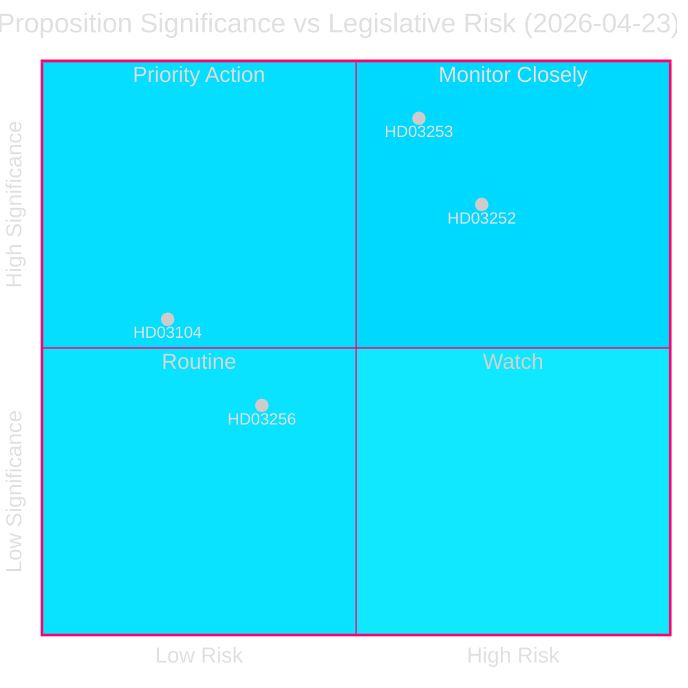
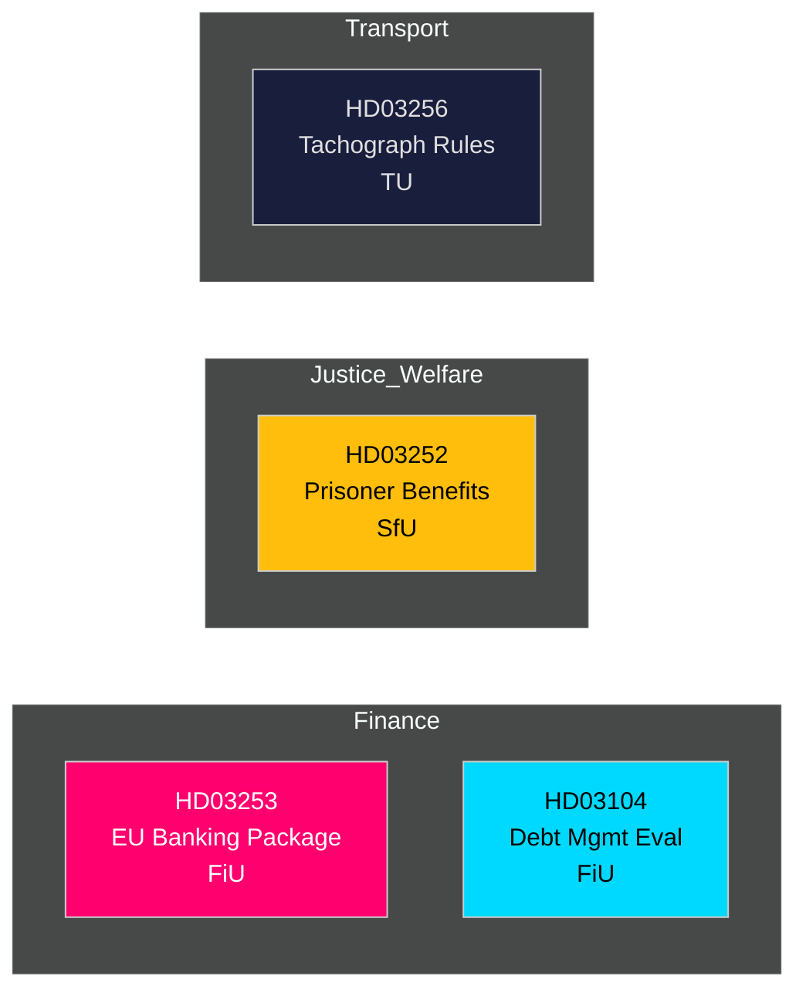

# 📋 情报简报 — 瑞典政府提案 2026-04-27

**作者**: James Pether Sörling
**日期**: 2026-04-27
**分析期间**: 2026-04-23（最近一个议会日）
**可信度**: 高 [B2]
**分类**: 公开 — 《通用数据保护条例》第9条第2款(e,g)项
**第二轮审查**: 2026-04-27T06:38Z — 完善经济来源，强化核心信息，补充瑞典背景细节

---

## 🎯 核心信息

克里斯特松政府于2026年4月23日提交了四项重要立法文件，其中以欧盟银行业一揽子方案（Prop. 2025/26:253）为首，这是瑞典十年来最重要的金融法规转化——同时还包括对在押人员社会保险的限制（Prop. 2025/26:252）、2021–2025年国家债务管理评估（Skr. 2025/26:104），以及针对行驶记录仪欺诈行为的更严格规定（Prop. 2025/26:256）。银行业一揽子方案是核心议题：它将欧盟CRR3/CRD6纳入瑞典法律，在`Finansdepartementet`主导下强化资本缓冲，并提交`FiU`（财政委员会）审议。按欧盟标准，瑞典政府债务率维持在较低水平，约为**GDP的31%**（国际货币基金组织，2026年4月世界经济展望，指标GGXWDG_NGDP，提取时间：2026-04-27），在金融监管机构收紧框架之际提供了财政空间。GDP增速**+2.1%**（NGDP_RPCH，同一来源）支持银行业向更高资本要求的有序过渡。瑞典经常账户盈余**+5.5%的GDP**（BCA_NGDPD，同一来源）确认了银行适应产出下限期间的对外稳健性。

**经济来源**（`economicProvenance`）: provider=imf, dataflow=WEO, vintage=2026年4月, retrieved_at=2026-04-27.

## 🧭 本简报支持的3项决策

1. **Riksdag（FiU）**: 是否全面批准欧盟银行业一揽子方案或要求修订——鉴于瑞典规模庞大的银行业（资产约为GDP的400%）及其非欧元区地位，这一决定至关重要。
2. **Riksdag（SfU）**: 针对囚犯的社会保险限制（HD03252）能否通过宪法比例原则审查——财政节约（约每年2–3亿瑞典克朗）与康复风险的权衡。
3. **政策分析师/投资者**: 结合显示Riksgälden完成2021–2025年框架目标的评估（HD03104），对国家债务战略进行评估。

---

## 📊 60秒情报要点

- **欧盟银行业一揽子方案（HD03253）** [B2 高]: 转化CRR3/CRD6；引入72.5%的产出下限，以限制内部模型的资本减免；涉及Swedbank、SEB、Handelsbanken、Nordea（瑞典）。提交FiU审议。
- **囚犯社会保险限制（HD03252）** [B2 高]: 撤销在`管控居所`或安全拘留中服刑者的疾病津贴、育儿假和伤残福利。Justitiedepartementet，提交SfU审议。V和MP的比例原则异议可能性较高。
- **国家债务管理评估（HD03104）** [A2 非常高]: Riksgälden 2021–2025年自我评估——净借款目标5年中3年达标；久期策略在授权范围内。Finansdepartementet，提交FiU审议。立法风险低；信息性内容。
- **行驶记录仪欺诈（HD03256）** [B2 中]: 强化针对行驶记录仪欺诈的刑事和行政处罚；与欧盟法规2018/1022对齐。提交TU审议。行业合规成本。

---

## 🔑 最重要的未来触发因素

**2026年5月5日一周**: FiU就HD03253开启公众咨询——预计将收到银行游说团体提交的意见。任何实质性修正请求均表明瑞典对欧盟监管趋同的抵制，并对EUR/SEK政策产生影响。

---

<!-- source-sha: 7156ec83294bd3d7360cfe9849ab2c3c69f409dc -->
