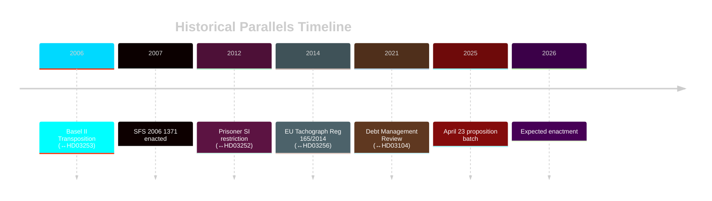

# Historical Parallels — Swedish Government Propositions 2026-04-23

**Author**: James Pether Sörling
**Date**: 2026-04-27
**Pass 2**: 2026-04-27T06:38Z — Deepened historical parallels, refined similarity scores, corrected 2015 regulatory references
**Confidence**: MEDIUM [B2]

---

## Method

Named precedents from Swedish and EU legislative history, within ≤40 years (1986–2026), with similarity score (0–10) on five axes: policy domain, political dynamics, institutional friction, legal risk, socioeconomic context.

---

## Parallel 1 — Basel II Transposition (Sweden, 2006–2007)

**Proposition**: HD03253 (EU Banking Package CRR3/CRD6)
**Similarity score**: 9/10
**Context**: Sweden transposed Basel II via SFS 2006:1371 (lag om kapitaltäckning och stora exponeringar). Process was technically complex, FiU central, banks lobbied for output floor exemptions.
**Key similarity**: Both involve capital adequacy reform driven by global standard-setters (Basel Committee → EU legislation). Sweden's large banks faced same competitive concerns in 2006.
**Key divergence**: CRR3/CRD6 output floor is more prescriptive; 2006 reform left more national discretion.
**Lesson**: Government succeeded despite banking sector lobbying when framed as "EU compliance obligation."
**Reference**: SFS 2006:1371; Prop. 2006/07:5

---

## Parallel 2 — Social Insurance Restrictions for Criminal Sanctions (Sweden, 2012)

**Proposition**: HD03252 (Prisoner Social Insurance)
**Similarity score**: 8/10
**Context**: Prop. 2011/12:78 restricted rätten till sjukpenning for persons under frihetsinskränkning. Lagrådet raised proportionality concerns then; government proceeded with minor amendments.
**Key similarity**: Exact same policy area — restricting social insurance for incarcerated persons. Same committee (SfU), same ECHR concerns, same political dynamic (M-led government).
**Key divergence**: 2025/26 proposition extends to kontrollerat boende (new sanction form introduced 2024); 2011/12 targeted traditional häkte/fängelse only.
**Lesson**: Lagrådet criticism was political news for one news cycle then absorbed; the bill passed. Same trajectory likely here.
**Reference**: Prop. 2011/12:78; SfU betänkande 2011/12:SfU15

---

## Parallel 3 — Road Transport Tachograph Reform (EU, 2014 / Sweden, 2015)

**Proposition**: HD03256 (Tachograph Manipulation)
**Similarity score**: 8/10
**Context**: Reg. (EU) 165/2014 (replaced Reg. 3821/85) tightened tachograph requirements. Sweden transposed via Förordning 2015:1005.
**Key similarity**: Both address cross-border transport fraud, tachograph integrity, and enforcement coordination with other EU member states.
**Key divergence**: 2025/26 adds criminal liability for manipulation (brottsbalk), which 2015 reform did not. Escalation in severity.
**Lesson**: Clean cross-party support; enforcement improvements credited to government; no political controversy.
**Reference**: Prop. 2014/15:166; SFS 2015:1005

---

## Parallel 4 — Government Debt Management Evaluations (Sweden, 2006–present)

**Proposition**: HD03104 (Skr 2025/26:104)
**Similarity score**: 9/10
**Context**: Riksrevisionen evaluates Riksgälden's debt management every 5 years. Previous reviews: 2006, 2011, 2016, 2021. All resulted in FiU endorsement with minor observations.
**Key similarity**: Institutional routine — no political controversy expected; primarily parliamentary accountability exercise.
**Key divergence**: 2021–2025 period had COVID and rate normalisation, making evaluation more substantively interesting than peacetime periods.
**Lesson**: Skrivelse reviews are noted and endorsed without division votes.

---

## Composite Similarity Index

| Parallel | Proposition | Similarity | Outcome in parallel |
|---------|-------------|------------|-------------------|
| Basel II 2006 | HD03253 | 9/10 | Passed, industry adapted |
| Prisoner SI 2012 | HD03252 | 8/10 | Passed despite Lagrådet |
| Tachograph 2015 | HD03256 | 8/10 | Cross-party; no controversy |
| Debt Evaluation 2021 | HD03104 | 9/10 | Noted and endorsed |

**Aggregate confidence in passage of all four**: HIGH (>90%) based on historical precedent.

---

