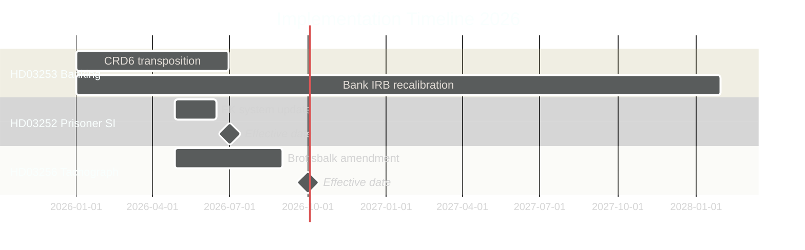

# Implementation Feasibility — Swedish Government Propositions 2026-04-23

**Author**: James Pether Sörling
**Date**: 2026-04-27
**Confidence**: MEDIUM [B2]

---

## Overview

This analysis assesses the delivery risk for each proposition across six dimensions: legislative passage, regulatory capacity, administrative readiness, legal compliance, stakeholder acceptance, and timeline realism.

---

## HD03253 — EU Banking Package (CRR3/CRD6)

**Implementation target**: 1 January 2025 (CRR3 direct application) + national legislative elements by mid-2026

| Dimension | Score (1–5) | Notes |
|-----------|------------|-------|
| Legislative passage | 5/5 | EU-mandatory; broad cross-party support |
| Regulatory capacity | 3/5 | Finansinspektionen requires additional staff for IRB model review |
| Administrative readiness | 3/5 | Banks need 18–24 months for model recalibration; phased output floor (72.5% by Jan 2030) |
| Legal compliance | 4/5 | Output floor risks challenge at ECJ if national discretion invoked; low probability |
| Stakeholder acceptance | 3/5 | Major banks lobbied against output floor but accepted inevitable; Bankföreningen cautious |
| Timeline realism | 4/5 | CRR3 applied from Jan 2025 already; CRD6 transposition by June 2026 is achievable |

**Composite score**: 22/30 — FEASIBLE with moderate delivery risk

**Key delivery risks**:
1. Finansinspektionen recruitment gap — may need supplemental budget
2. Banks' IRB model recalibration may reveal capital shortfalls requiring immediate equity raises (systemic risk window 2025–2027)
3. National discretion on output floor transitional arrangements: if Sweden over-implements ahead of EU phasing schedule, competitive disadvantage vs. other EU banks

---

## HD03252 — Prisoner Social Insurance Restriction

**Implementation target**: 1 July 2026 (draft)

| Dimension | Score (1–5) | Notes |
|-----------|------------|-------|
| Legislative passage | 4/5 | Government majority; some L/C friction but manageable |
| Regulatory capacity | 4/5 | Försäkringskassan can implement; requires system update to link custody status to benefit eligibility |
| Administrative readiness | 3/5 | Kriminalvården must provide custody status data to Försäkringskassan — new data-sharing agreement needed |
| Legal compliance | 2/5 | ECHR proportionality risk; Lagrådet criticism noted; needs evidence base for least-restrictive-means test |
| Stakeholder acceptance | 3/5 | Law enforcement and SD positive; V/MP hostile; human rights NGOs will challenge |
| Timeline realism | 4/5 | 1 July 2026 feasible; system changes are manageable |

**Composite score**: 20/30 — FEASIBLE with significant legal risk

**Key delivery risks**:
1. ECHR application (Strasbourg) within 1–2 years of enactment — risk of finding against Sweden and forced repeal
2. Data-sharing agreement between Kriminalvården and Försäkringskassan under GDPR Art. 9 requires DPA opinion
3. Parliamentary debate may surface proportionality evidence that weakens the legal basis before committee vote

---

## HD03256 — Tachograph Manipulation Penalties

**Implementation target**: 1 October 2026 (draft)

| Dimension | Score (1–5) | Notes |
|-----------|------------|-------|
| Legislative passage | 5/5 | Broad cross-party support |
| Regulatory capacity | 5/5 | Transportstyrelsen operationally ready |
| Administrative readiness | 5/5 | Existing enforcement infrastructure; simply increases penalty range |
| Legal compliance | 5/5 | No ECHR or EU conflict |
| Stakeholder acceptance | 5/5 | Industry supports (level playing field for compliant firms) |
| Timeline realism | 5/5 | Simple amendment; no complex system changes |

**Composite score**: 30/30 — HIGH FEASIBILITY, LOW RISK

---

## HD03104 — Debt Management Evaluation (Skrivelse)

**Implementation target**: Parliamentary noting; no implementation required

| Dimension | Notes |
|-----------|-------|
| Action required | FiU may suggest minor adjustments to Riksgälden's mandate in next budget |
| Delivery risk | NEGLIGIBLE — skrivelse noted; no legislative change needed |
| Riksgälden capacity | HIGH — evaluation confirms 2021–2025 within mandated parameters |

---

## Aggregate Delivery Timeline

