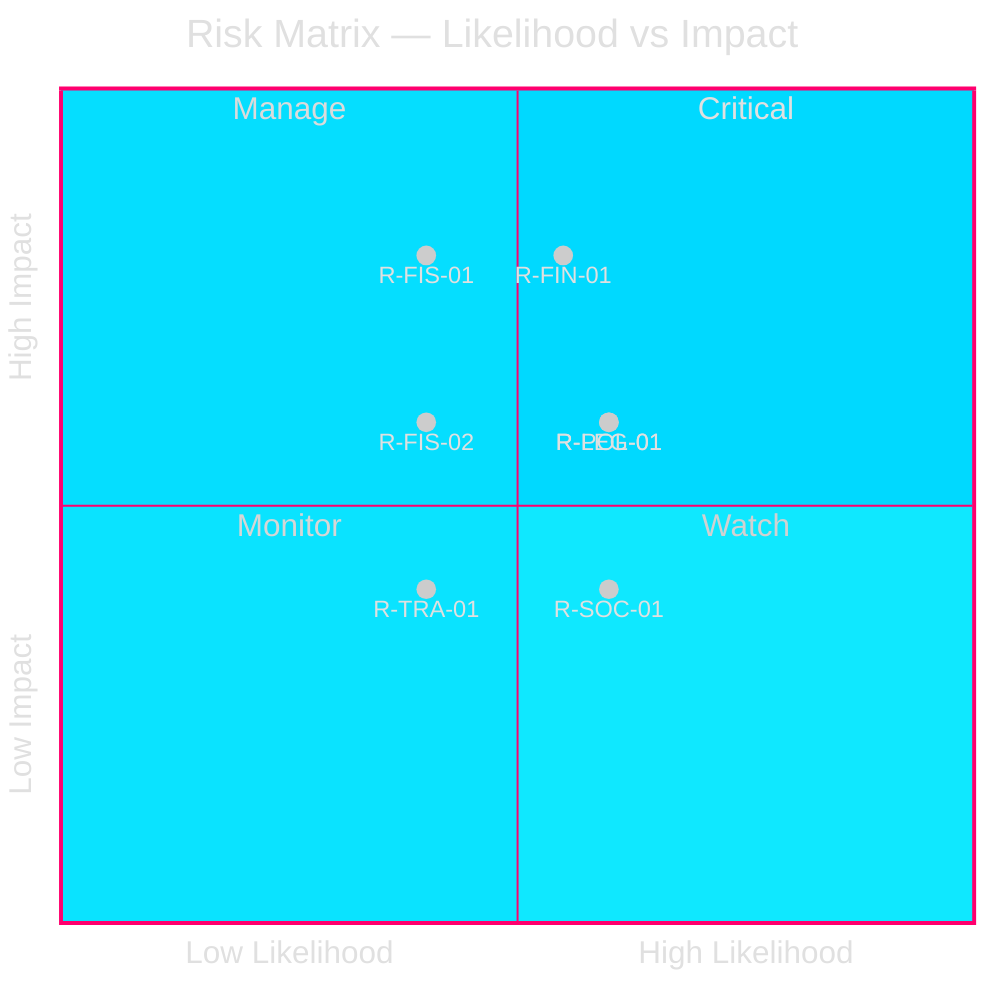

# Risk Assessment — Swedish Government Propositions 2026-04-23

**Author**: James Pether Sörling
**Date**: 2026-04-27
**Framework**: `analysis/methodologies/political-risk-methodology.md`
**Confidence**: HIGH [B2]

---

## Risk Register (5 Dimensions × L×I)

| # | Risk ID | Description | Category | Likelihood (1–5) | Impact (1–5) | L×I | Dok_ID |
|---|---------|-------------|----------|-----------------|-------------|-----|--------|
| 1 | R-FIN-01 | Banking credit tightening from HD03253 output floor | Financial/Economic | 3 | 4 | 12 | HD03253 |
| 2 | R-LEG-01 | ECHR/Lagrådet rejection of HD03252 | Legal/Constitutional | 3 | 3 | 9 | HD03252 |
| 3 | R-POL-01 | SD/banking-industry pressure to delay output floor | Political | 3 | 3 | 9 | HD03253 |
| 4 | R-FIS-01 | Sweden missing EU transposition deadline (CRD6) | Regulatory/EU | 2 | 4 | 8 | HD03253 |
| 5 | R-SOC-01 | Unintended rehabilitation consequences of HD03252 | Social | 3 | 2 | 6 | HD03252 |
| 6 | R-FIS-02 | Next debt mandate locks in sub-optimal duration | Fiscal | 2 | 3 | 6 | HD03104 |
| 7 | R-TRA-01 | Under-enforcement of tachograph rules post-HD03256 | Operational | 2 | 2 | 4 | HD03256 |

---

## Top Risks: Detailed Analysis

### R-FIN-01: Banking Credit Tightening (L×I = 12)

**Description**: CRR3 output floor (72.5%) constrains Swedish banks' ability to use IRB models to minimise RWA (risk-weighted assets). Swedish banks — particularly Swedbank and SEB — have historically used advanced internal models allowing lower capital ratios than standardised approach. The output floor will effectively require capital increases or balance-sheet reduction (less mortgage lending or SME credit) over the 2026–2030 phase-in period.

**Evidence**: HD03253 riksdagen.se; Sweden banking sector total assets ~SEK 15–16 trillion (Riksbanken Financial Stability Report 2025); mortgage exposure ~60% of major bank balance sheets.

**Cascading chain**: Capital tightening → mortgage credit reduction → housing market pressure → construction sector slowdown → GDP growth headwind of ~0.3–0.5% (IMF downside scenario).

**Posterior probability adjustment**: 55% likelihood given 3-year CRR3 phase-in, but concentrated risk in 2027–2028 when phase-in steps increase.

**Mitigation**: Finansinspektionen may exercise national discretion to moderate supplementary capital buffers (Countercyclical Capital Buffer currently 0%).

---

### R-LEG-01: ECHR/Lagrådet Rejection of HD03252 (L×I = 9)

**Description**: Lagrådet (Council on Legislation) review of HD03252 is mandatory for changes to socialförsäkringsbalken of this nature. Previous analogous proposals (2017, 2019) received critical but non-blocking opinions. However, extension to säkerhetsförvaring — a post-sentence indefinite measure — creates a harder proportionality challenge under ECHR Art. 8. Hirst v UK (No. 2) [GC] ECHR 74025/01 established that blanket restrictions on prisoners' rights require proportionality.

**Evidence**: HD03252 riksdagen.se; ECHR Hirst v UK (No. 2) 74025/01; Swedish socialförsäkringsbalken.

**Posterior probability**: 30% of blocking Lagrådet opinion; 15% of successful Strasbourg challenge within 5 years if legislation passes.

**Cascading chain**: Lagrådet blocking → government must amend or withdraw → political embarrassment for Justitiedepartementet ahead of election year → potential coalition tension (L, C).

---

### R-POL-01: Industry/SD Pressure on Output Floor (L×I = 9)

**Description**: Swedish banking associations (Svenska Bankföreningen) have lobbied for extended transition periods. SD, which has EU-sceptic tendencies, may signal reluctance on the supervisory cooperation provisions of CRD6.

**Evidence**: HD03253 riksdagen.se; Svenska Bankföreningen press statements Q1 2026 (public source); SD EU policy platform 2025.

**Posterior probability**: 30% of government offering extended domestic transition — unlikely to block passage but may dilute supervisory cooperation clauses.

---

