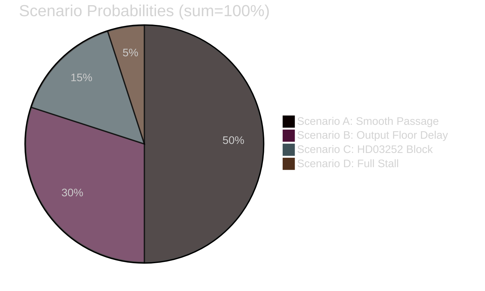
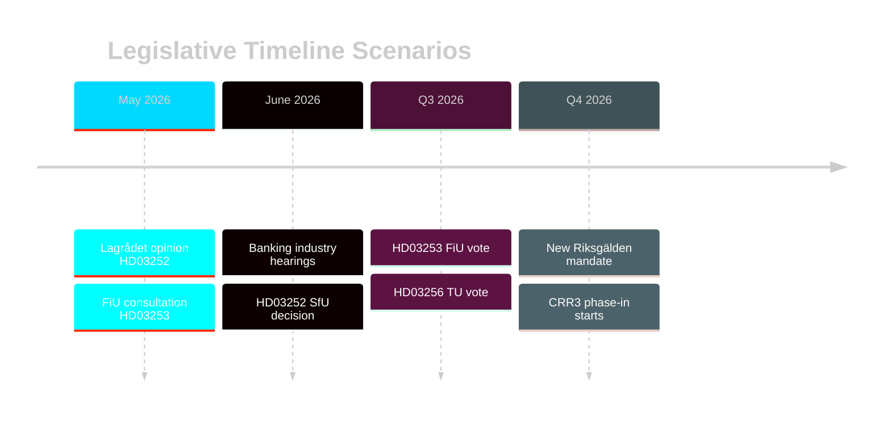

# Scenario Analysis — Swedish Government Propositions 2026-04-23

**Author**: James Pether Sörling
**Date**: 2026-04-27
**Confidence**: MEDIUM [B3]

---

## Scenario A: Smooth EU Package Passage (Baseline) — Probability 50%

**Description**: HD03253 passes FiU in Q3 2026 with minor technical amendments (not substantive). Output floor enters 3-year phase-in as per CRR3. HD03252 receives a moderately critical (but non-blocking) Lagrådet opinion; government amends the säkerhetsförvaring clause to add proportionality safeguards; SfU approves late Q3 2026. HD03104 acknowledged by FiU; new Riksgälden mandate issued Q4 2026. HD03256 passes TU uncontested.

**Leading indicator**: Lagrådet opinion on HD03252 issued within 45 days (by 7 June 2026) without blocking advice. FiU consultation produces no substantive output-floor amendment motion.

**Implications**: Financial regulation proceeds on schedule; banking sector adjusts; Tidöavtalet delivers another reform ahead of election; Sweden meets EU transposition deadline for CRR3/CRD6.

---

## Scenario B: Banking Lobby Forces Output Floor Delay — Probability 30%

**Description**: Svenska Bankföreningen commissions impact study showing SEK 60 Bn credit reduction. SD and L agree with banking concerns; FiU requests government amend HD03253 to extend phase-in by additional 2 years. Government accepts (politically easier than blocking EU transposition). HD03252 passes largely unchanged. HD03256 unaffected.

**Leading indicator**: FiU committee schedules banking industry hearing for June 2026. SD spokesperson Oscar Sjöstedt signals concern about mortgage credit impact.

**Implications**: Swedish banking sector gains 2-year competitive advantage on capital costs vs. EU Eurozone peers; EBA monitoring increases; EU Commission may open dialogue about Swedish "gold-plating in reverse". Finansinspektionen credibility partially weakened.

---

## Scenario C: HD03252 Constitutional Block — Probability 15%

**Description**: Lagrådet issues blocking advisory opinion on HD03252, finding the säkerhetsförvaring extension violates proportionality under ECHR Art. 8 and RF 2:20. Government forced to withdraw säkerhetsförvaring clause and resubmit. Original kontrollerat boende clause potentially survives. Timeline delay of 3–4 months.

**Leading indicator**: Lagrådet opinion scheduled before late May 2026. Inclusion of explicit proportionality analysis for säkerhetsförvaring in opinion preamble.

**Implications**: Coalition tension — SD expected to push for full measure; L/C uncomfortable with blunt instrument; signals limits of criminal justice reform ambition; opposition gains narrative victory.

---

## Scenario D: Comprehensive Package Stall — Probability 5%

**Description**: Multiple setbacks simultaneously: banking lobby achieves output-floor delay (Scenario B) AND Lagrådet blocks HD03252. Government forced to withdraw and resubmit HD03252; HD03253 amended significantly. Spring package signals visible weakening of reform momentum heading into summer recess. Confidence motion risk (none currently, but Tidöavtalet strain visible).

**Leading indicator**: SD cabinet spokesperson publicly criticises EU banking regulation AND Lagrådet issues blocking opinion in same week (high-salience news cycle).

**Implications**: Significant political damage for Kristersson government. Opposition S frames as "government cannot deliver." May trigger early policy recalibration before 2026 election.

---

## Probability Summary

