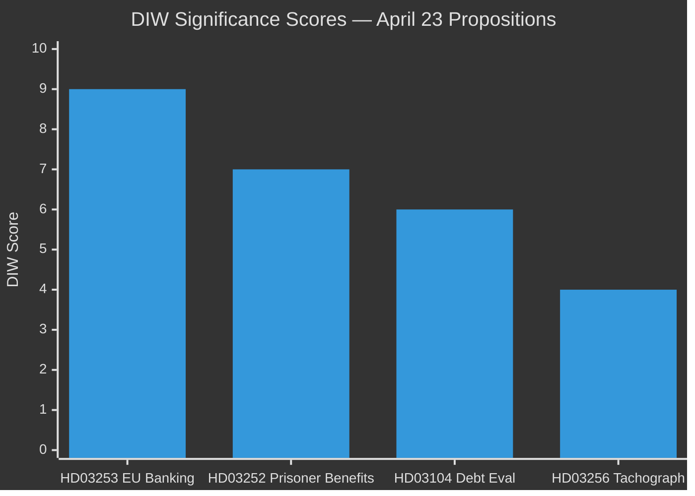
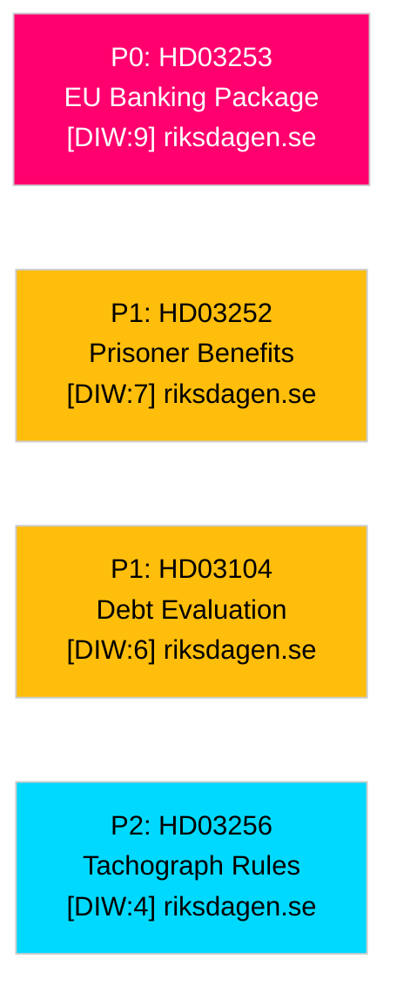

# Significance Scoring — Swedish Government Propositions 2026-04-23

**Author**: James Pether Sörling
**Date**: 2026-04-27
**Method**: DIW (Depth-Impact-Width) framework per `analysis/methodologies/ai-driven-analysis-guide.md`
**Confidence**: HIGH [B2]

---

## DIW Scoring Matrix

| Dok_ID | Title | Depth (1–3) | Impact (1–3) | Width (1–3) | DIW Total | Tier | Priority |
|--------|-------|------------|-------------|------------|-----------|------|----------|
| HD03253 | EU:s bankpaket | 3 | 3 | 3 | 9 | L2+ | P0 |
| HD03252 | Begränsning socialförsäkringsförmåner | 3 | 2 | 2 | 7 | L2 | P1 |
| HD03104 | Utvärdering statens upplåning 2021–2025 | 2 | 2 | 2 | 6 | L2 | P1 |
| HD03256 | Färdskrivare-manipulation | 1 | 1 | 2 | 4 | L1 | P2 |

### Scoring Dimensions Explained
- **Depth**: Technical/legal complexity (1=routine, 2=policy significance, 3=structural reform)
- **Impact**: Affected population and societal consequences (1=narrow, 2=sector-wide, 3=economy-wide)
- **Width**: Cross-portfolio/cross-party political salience (1=single committee, 2=multi-stakeholder, 3=cross-bloc contest)

---

## Individual Scoring Rationale

### HD03253 — EU:s bankpaket (DIW: 9 / P0)

**Depth=3**: Structural transposition of CRR3/CRD6; introduces output floor (72.5%), new liquidity reporting, ESG risk integration, governance requirements. Fundamentally changes how Sweden's four major banks calculate capital requirements. Linked to riksdagen.se document HD03253.

**Impact=3**: Affects Sweden's banking sector (total assets ~SEK 15+ trillion), mortgage holders, SME credit markets, Swedish pension funds as bank shareholders. Systemic financial stability implications. Source: riksdagen.se/HD03253.

**Width=3**: Cuts across FiU, Finansinspektionen, Riksbanken, EU coordination mandates, and intersects with housing policy (mortgage capital implications). Both government (supporting) and banking industry (complex) stakeholders active.

**Sensitivity analysis**: DIW 9 holds under optimistic (industry accepts output floor) and pessimistic (capital crunch forces credit tightening) scenarios. Minimum credible DIW = 7 (if parliamentary passage is uncontested).

---

### HD03252 — Begränsning av rätten till socialförsäkringsförmåner (DIW: 7 / P1)

**Depth=3**: Requires amendment to socialförsäkringsbalken; creates new category of benefit disqualification tied to sentence type. Legal-constitutional depth: Lagrådet review mandatory. Source: riksdagen.se/HD03252.

**Impact=2**: Directly affects ~2,000–3,000 individuals/year (Justitiedepartementet estimate). Indirectly affects families of incarcerated persons. Fiscal savings moderate. Welfare-state precedent: moderate.

**Width=2**: Primarily SfU, with constitutional/human-rights dimension requiring KU attention. Party-political contest moderate — clear bloc divide but not coalition-threatening.

**Sensitivity**: DIW range 5–8 depending on whether Lagrådet issues critical opinion (would elevate controversy).

---

### HD03104 — Skr. 2025/26:104 Utvärdering statens upplåning och skuldförvaltning 2021–2025 (DIW: 6 / P1)

**Depth=2**: Five-year statutory review; evaluates Riksgälden performance against government mandate. Contains technical debt-duration analysis and borrowing-cost benchmarks. Source: riksdagen.se/HD03104.

**Impact=2**: Informs future debt mandate under Finansdepartementet. Sweden's general government debt ~31% of GDP (WEO Apr-2026, GGXWDG_NGDP) — the low level limits urgency. Future borrowing strategy has medium-term interest-rate sensitivity.

**Width=2**: FiU primary; Riksbanken, Riksgälden, and institutional bond investors as secondary stakeholders. Low partisan controversy — informational document.

**Economic provenance**: IMF WEO April 2026, indicator GGXWDG_NGDP, country SWE, retrieved 2026-04-27.

---

### HD03256 — Kraftfullare åtgärder mot manipulation och allvarligt missbruk av färdskrivare (DIW: 4 / P2)

**Depth=1**: Closes specific regulatory gaps on tachograph fraud; aligns with EU 2018/1022. Incremental.

**Impact=1**: Primarily road-haulage sector (~15,000 licensed operators in Sweden). Limited consumer impact. Source: riksdagen.se/HD03256.

**Width=2**: TU committee; touches Transportstyrelsen, road-haulage industry associations, labour unions (Transportarbetareförbundet).

---

