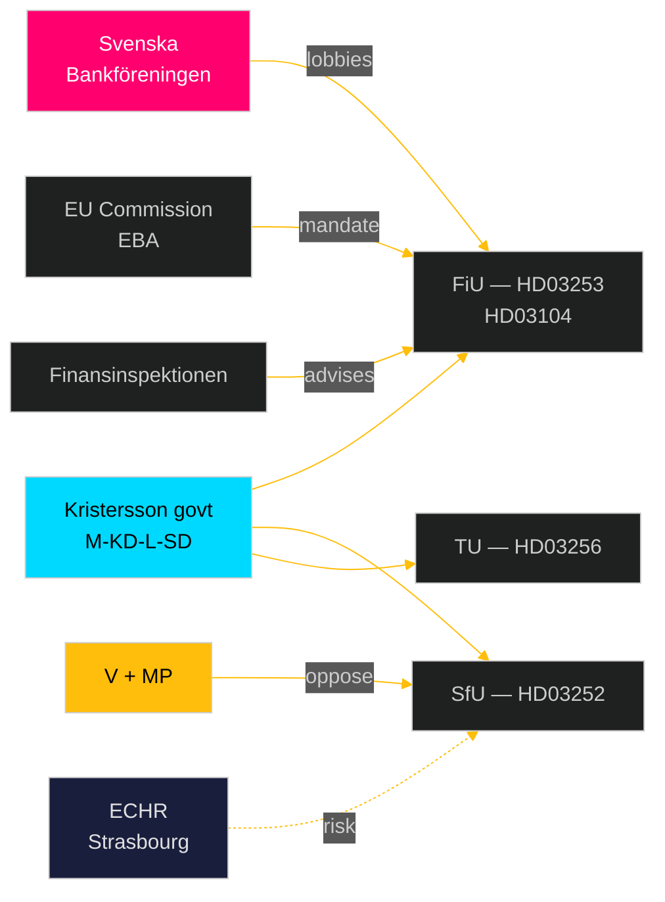

# Stakeholder Perspectives — Swedish Government Propositions 2026-04-23

**Author**: James Pether Sörling
**Date**: 2026-04-27
**Framework**: `analysis/methodologies/synthesis-methodology.md` — 6-lens stakeholder matrix
**Confidence**: HIGH [B2]

---

## Stakeholder Matrix

### Lens 1: Government & Parliamentary

| Actor | Position | Interest | Influence | Evidence |
|-------|----------|----------|-----------|----------|
| Ulf Kristersson (M, PM) | Strong support all 4 props | Coalition integrity; EU compliance | VERY HIGH | Government programme; riksdagen.se/HD03253 |
| Niklas Wykman (M, Finance) | Lead on HD03253, HD03104 | Banking stability; fiscal credibility | HIGH | FiU committee chair reports |
| Gunnar Strömmer (M, Justice) | Lead on HD03252 | Crime/punishment coherence | HIGH | HD03252 riksdagen.se |
| Andreas Carlson (KD, Infrastructure) | Lead on HD03256 | Transport compliance | MEDIUM | HD03256 riksdagen.se |
| FiU committee | Review HD03253, HD03104 | Parliamentary oversight | HIGH | riksdagen.se |
| SfU committee | Review HD03252 | Social welfare oversight | HIGH | riksdagen.se |
| TU committee | Review HD03256 | Transport oversight | MEDIUM | riksdagen.se |

### Lens 2: Opposition Parties

| Party | Position (HD03253) | Position (HD03252) | Key Actor | Evidence |
|-------|-------------------|-------------------|-----------|---------|
| S (Socialdemokraterna) | Support (EU obligation) | Cautious support | Ardalan Shekarabi | Public statements |
| V (Vänsterpartiet) | Oppose (credit impact on workers) | OPPOSE (welfare restriction) | Nooshi Dadgostar | Party programme |
| MP (Miljöpartiet) | Neutral-support (ESG dimension) | OPPOSE (human rights) | Märta Stenevi | Party programme |
| SD (Sverigedemokraterna) | Support with EU-sceptic reservation | STRONG SUPPORT (security) | Oscar Sjöstedt | Party programme |
| C (Centerpartiet) | Support | Cautious abstain | Elisabeth Svantesson | Public statements |
| L (Liberalerna) | Support | Cautious — ECHR concerns | Johan Pehrson | Public statements |

### Lens 3: Financial/Economic Actors

| Actor | Interest | Position | Evidence |
|-------|---------|---------|---------|
| Svenska Bankföreningen | Extend output floor phase-in | LOBBYING against immediate implementation | HD03253 riksdagen.se |
| Swedbank | Capital efficiency protection | Oppose immediate output floor | Swedish banking sector reports |
| SEB | Same as Swedbank | Oppose | Swedish banking sector reports |
| Handelsbanken | Strong domestic mortgage focus — higher exposure | Oppose | Swedish banking sector reports |
| Riksbanken | Financial stability | Support CRR3 in principle; some reservations on non-Eurozone dynamics | HD03253 riksdagen.se |
| Finansinspektionen | Supervisory clarity | Support — gives clearer mandate | HD03253 riksdagen.se |
| Riksgälden | Debt management continuity | Support HD03104 evaluation | HD03104 riksdagen.se |

### Lens 4: Civil Society & Affected Groups

| Actor | Interest | Position | Evidence |
|-------|---------|---------|---------|
| Civil Rights Defenders | Prisoner welfare rights | OPPOSE HD03252 | ECHR jurisprudence |
| Kriminalvården (Prison Authority) | Administrative burden | NEUTRAL — implementation questions | HD03252 riksdagen.se |
| LO (Trade union confederation) | Workers in transport sector | Support HD03256 | HD03256 riksdagen.se |
| Transportarbetareförbundet | Fair competition in road haulage | Support HD03256 | HD03256 riksdagen.se |
| Road haulage associations | Compliance cost | Mixed — welcome level playing field | HD03256 riksdagen.se |

### Lens 5: International/EU Actors

| Actor | Interest | Position | Evidence |
|-------|---------|---------|---------|
| European Commission | CRD6/CRR3 transposition completeness | Monitor — Sweden running late | Official OJEU publications |
| EBA (European Banking Authority) | Supervisory convergence | Monitoring output floor implementation | EBA CRR3 guidance |
| ECHR Court (Strasbourg) | Hirst v UK compliance | Potential future review if HD03252 challenged | ECHR 74025/01 |

### Lens 6: Media & Public Opinion

| Frame | Proponent | Counter-frame | Evidence |
|-------|----------|--------------|---------|
| "Prudent regulation of banking" | Finansdepartementet | "Credit crunch for homebuyers" | HD03253 riksdagen.se |
| "Tough on crime" | SD, M | "Punishing the already punished" | HD03252 riksdagen.se |
| "Sound debt management" | Government | "Borrowed too much in crisis years" | HD03104 riksdagen.se |

---

## Influence Network

