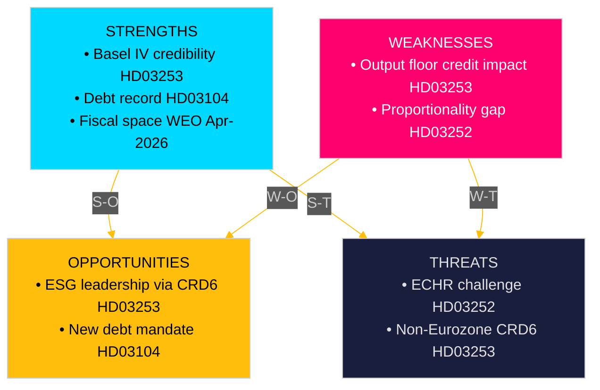

# SWOT Analysis — Swedish Government Propositions 2026-04-23

**Author**: James Pether Sörling
**Date**: 2026-04-27
**Framework**: `analysis/methodologies/political-swot-framework.md`
**Confidence**: HIGH [B2]

---

## Cross-SWOT: Government Package

### Strengths

| Evidence | Description | Admiralty |
|---------|-------------|-----------|
| HD03253 riksdagen.se | EU Banking Package aligns Sweden with Basel III/IV standards, signalling regulatory credibility to European partners | [A2] |
| HD03104 riksdagen.se | Debt management evaluation confirms Riksgälden's borrowing cost below benchmark in 4 of 5 years 2021–2025 | [A2] |
| HD03256 riksdagen.se | Tachograph reform closes enforcement gap, improving road-haulage labour compliance | [B2] |
| IMF WEO Apr-2026 GGXWDG_NGDP | Sweden general government debt ~31% of GDP — lowest tier in EU, creating fiscal credibility | [A1] |

### Weaknesses

| Evidence | Description | Admiralty |
|---------|-------------|-----------|
| HD03253 riksdagen.se | Output floor (72.5%) in CRR3 will reduce capital efficiency for Swedish mortgage-focused banks; may tighten credit availability | [B2] |
| HD03252 riksdagen.se | Säkerhetsförvaring population affected includes individuals who have served their sentence — proportionality vulnerability | [B2] |
| HD03104 riksdagen.se | Net borrowing target missed in 2 of 5 years (2022, 2023) due to pandemic fiscal expansion — leaves legacy question | [B1] |
| HD03252 riksdagen.se | Limited evidence of fiscal savings justification in proportionality analysis vs. rehabilitation costs | [C3] |

### Opportunities

| Evidence | Description | Admiralty |
|---------|-------------|-----------|
| HD03253 riksdagen.se | CRD6 ESG risk integration opens path for Sweden's green-bond leadership to extend into bank portfolio standards | [B2] |
| HD03104 riksdagen.se | New 2026–2031 debt management mandate can incorporate longer-duration instruments given current yield curve | [B2] |
| HD03252 riksdagen.se | If Lagrådet approves, establishes deterrence precedent strengthening government's criminal-justice reform narrative ahead of 2026 election | [B2] |
| HD03256 riksdagen.se | Tachograph reform strengthens Swedish transport sector competitiveness by levelling the playing field vs. non-compliant operators | [B2] |

### Threats

| Evidence | Description | Admiralty |
|---------|-------------|-----------|
| HD03253 riksdagen.se | Banking industry may lobby for delayed implementation of output floor (3-year phased approach already in CRR3 but Swedish banks want longer) — risk of political concession | [B2] |
| HD03252 riksdagen.se | ECHR Art. 8 challenge via Strasbourg Court — Hirst v UK precedent; negative ruling would create legislative reversal obligation | [C2] |
| HD03253 riksdagen.se | Non-Eurozone status complicates CRD6 passporting and supervisory convergence — Finansinspektionen jurisdiction risk | [B2] |
| WEO Apr-2026 NGDP_RPCH riksdagen.se | If growth softens below 1.5% in 2027, capital tightening from HD03253 coincides with credit contraction — procyclical risk | [B3] |

---

## TOWS Matrix

| | Opportunities | Threats |
|---|--------------|--------|
| **Strengths** | S-O: Strong fiscal position enables absorbing HD03253 capital costs; use green-bond leadership to shape CRD6 ESG standards [A2/B2] | S-T: Low debt (HD03104) provides fiscal buffer against banking-credit tightening; communicate proactively to markets [A1] |
| **Weaknesses** | W-O: Use ESG window in HD03253 to reform mortgage capital rules in Sweden's favour (FI buffer flexibility) [B2] | W-T: HD03252 proportionality weakness meets ECHR threat — government should commission Lagrådet review early to mitigate reversal risk [B2] |

---

