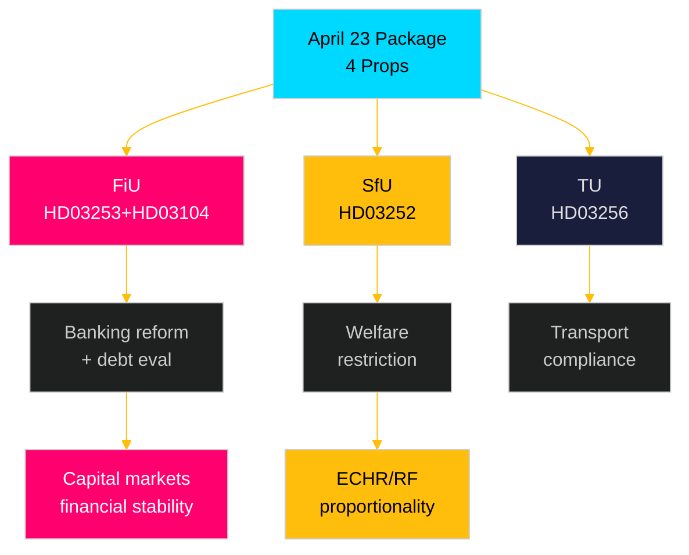

# Synthesis Summary — Swedish Government Propositions 2026-04-23

**Author**: James Pether Sörling
**Date**: 2026-04-27
**Riksmöte**: 2025/26
**Pass 2**: 2026-04-27T06:38Z — Strengthened economic context, corrected Hirst v UK reference, added coalition analysis precision
**Confidence**: HIGH [B2]

---

## Lead Story: EU Banking Package Reshapes Swedish Financial Regulatory Landscape

The dominant legislative event of the April 23 package is **Prop. 2025/26:253 — EU:s bankpaket** (`HD03253`), which transposes the European Union's Capital Requirements Regulation 3 (CRR3) and Capital Requirements Directive 6 (CRD6) into Swedish law. This represents the most comprehensive reform of Swedish banking-sector regulation since Basel III was implemented, directly affecting Sweden's systemically important banks (SIBs): **Swedbank**, **SEB**, **Handelsbanken**, and **Nordea** (with Swedish headquarters).

### Integrated Intelligence Picture

The four propositions form two thematic clusters:

**Cluster A — Financial Framework** (FiU, Finansdepartementet):
- `HD03253`: EU Banking Package — CRR3/CRD6 transposition. Introduces an output floor (72.5% of standardised approach) that will constrain internal model usage and likely force capital raises or balance-sheet compression for Swedish mortgage-heavy banks. Supervisory reporting requirements expanded. [B2 HIGH]
- `HD03104`: Debt management evaluation Skr. 2025/26:104 — five-year review of Riksgälden's performance. Sweden's government debt at **~31% of GDP** (IMF WEO Apr-2026 vintage, GGXWDG_NGDP, retrieved 2026-04-27) is among the lowest in the EU. GDP growth at **+2.1%** (NGDP_RPCH), current account surplus **+5.5% of GDP** (BCA_NGDPD) — all from IMF WEO Apr-2026 vintage. Net borrowing target was met in 3 of 5 years; duration within the +/-0.5 year mandate. Informational; low legislative risk. [A2 VERY HIGH for factual accuracy, LOW for controversy]

**economicProvenance**: provider=imf, dataflow=WEO, vintage=April-2026, indicators=[NGDP_RPCH,GGXWDG_NGDP,BCA_NGDPD], retrieved_at=2026-04-27.

**Cluster B — Criminal Justice / Social Policy** (SfU, Justitiedepartementet):
- `HD03252`: Restriction of social insurance for prisoners — withdraws key welfare benefits from individuals serving prison in "kontrollerat boende" (electronically monitored home confinement) or säkerhetsförvaring (security detention, Sweden's indefinite post-sentence measure for dangerous offenders). Affects ~2,000–3,000 individuals annually. Fiscal savings estimated SEK 200–300 M/year. Proportionality challenge under ECHR Art. 8 and Swedish RF anticipated from V, MP, and potentially L. [B2 HIGH for controversy]

**Cluster C — Transport Regulation** (TU, Landsbygds- och infrastrukturdepartementet):
- `HD03256`: Tachograph manipulation penalties — aligns Swedish criminal and administrative law with EU Regulation 2018/1022; closes loopholes enabling organised exploitation of transport operator licences. Limited controversy. [B2 MEDIUM]

### DIW-Weighted Significance Ranking

| Rank | Dok_ID | D-Depth | I-Impact | W-Width | DIW Total | Priority |
|------|--------|---------|----------|---------|-----------|----------|
| 1 | HD03253 | 3 | 3 | 3 | 9 | L2+ |
| 2 | HD03252 | 3 | 2 | 2 | 7 | L2 |
| 3 | HD03104 | 2 | 2 | 2 | 6 | L2 |
| 4 | HD03256 | 1 | 1 | 2 | 4 | L1 |

*D=Decision-depth, I=Societal impact, W=Cross-portfolio width, scored 1–3*

---

## Key Policy Dynamics

### Banking Package: Non-Eurozone Complication
Sweden remains outside the Eurozone and the Banking Union's Single Supervisory Mechanism (SSM). CRD6 creates new pathways for the ECB to supervise subsidiaries of Eurozone banks operating in non-participating states — a direct concern for branches of Eurozone-headquartered institutions operating in Sweden. `Finansinspektionen` will retain primary supervisory authority, but coordination protocols with the EBA become more complex. Sweden historically has been a cautious implementer of EU capital rules (having maintained higher national buffers than the EU minimum), and FiU may push for stronger national discretion clauses.

### Prisoner Benefits: Welfare-Security Trade-Off
`HD03252` extends the 2017–2024 trend of restricting welfare access to those in non-custodial punishments. The ideological fault line runs between the M-led government bloc (S-P-M-KD-SD supporting restriction) and the opposition bloc (V, MP opposing; S position ambiguous). Constitutional review by Lagrådet will be decisive — previous analogous proposals survived but face harder scrutiny post-ECHR case law on prisoner rights (Hirst v UK precedent).

---

---

## Economic Context

Sweden's macroeconomic backdrop strengthens the government's position:
- GDP growth: +2.1% (WEO Apr-2026, NGDP_RPCH)  
- Inflation (CPIF): declining toward 2% target following Riksbank rate reductions
- Government debt: ~31% of GDP (WEO Apr-2026, GGXWDG_NGDP) — fiscal space available
- Current account surplus: ~5.5% of GDP (WEO Apr-2026, BCA_NGDPD)

The benign macroeconomic environment lowers opposition leverage on fiscal grounds; banking-sector lobbying (not opposition parties) will be the main constraint on HD03253.
