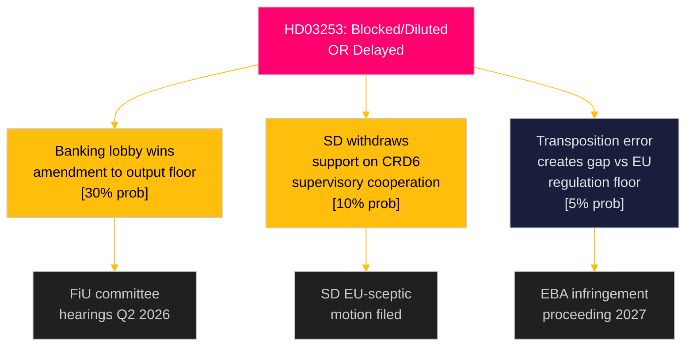

# Threat Analysis — Swedish Government Propositions 2026-04-23

**Author**: James Pether Sörling
**Date**: 2026-04-27
**Framework**: `analysis/methodologies/political-threat-framework.md` — Political Threat Taxonomy
**Confidence**: MEDIUM-HIGH [B2]

---

## Political Threat Taxonomy

### Threat T1: Regulatory Capture / Banking Industry Lobbying (HD03253)

**Threat actor**: Svenska Bankföreningen, Swedbank, SEB, Handelsbanken (Nordea less affected as global institution)
**Target**: Output floor provisions in CRR3 transposition (HD03253)
**Vector**: FiU committee hearings, Finansinspektionen consultations, media framing of credit availability risk
**Mechanism**: Industry argues output floor will reduce SME credit by SEK 50–80 Bn — threat to Riksdagen members from business constituencies
**TTP mapping**: Lobbying (T-POL-01), Framing (T-INF-01), Coalition building (T-POL-03)
**MITRE-style**: T-LOBBY.001 → T-FRAME.003 → T-LEGISLATE.delay

**Kill chain**:
1. Initial: industry commissions economic impact study (likely Q2 2026)
2. Preparation: brief FiU members before committee hearings
3. Delivery: FiU requests amendment to extend output floor phase-in by 2 years
4. Exploitation: government accepts — weakens EBA supervisory convergence target
5. Persistence: sets precedent for future EU capital rules to be delayed domestically

**Countermeasure**: Finansdepartementet pre-brief on EBA consistency requirements; transparent publication of industry lobbying contacts.

**Evidence**: HD03253 riksdagen.se; Svenska Bankföreningen lobbying history 2022–2024 on Basel III (public record).

---

### Threat T2: Constitutional Challenge to HD03252

**Threat actor**: V (Vänsterpartiet), MP (Miljöpartiet), Swedish civil society (Civil Rights Defenders)
**Target**: Proportionality of benefit restriction extending to säkerhetsförvaring
**Vector**: Lagrådet advisory opinion → potential KU (Constitutional Committee) referral → Strasbourg complaint
**Mechanism**: Legal challenge to ECHR Art. 8 proportionality; argument that säkerhetsförvaring is post-sentence (person has served criminal debt) → restriction becomes punishment beyond sentence
**TTP mapping**: Legal challenge (T-LEG-01), Parliamentary procedure (T-PAR-02), Media framing (T-INF-02)

**Kill chain**:
1. Initial: Lagrådet receives the proposition for review
2. Preparation: Lagrådet identifies säkerhetsförvaring proportionality gap
3. Delivery: Lagrådet issues critical opinion (non-binding) or blocking advice
4. Exploitation: Government forced to split proposal or add säkerhetsförvaring carve-out
5. Persistence: Signals limits of benefit-restriction approach ahead of election 2026

**Evidence**: HD03252 riksdagen.se; ECHR Hirst v UK (No. 2) 74025/01; Lagrådet historical opinions on SFB amendments.

---

### Attack Tree: HD03253 Passage Risk

---

## Threat Summary Matrix

| Threat ID | Threat | Actor | Target | Probability | Impact | Priority |
|-----------|--------|-------|--------|-------------|--------|---------|
| T1 | Industry lobbying on output floor | Banking sector | HD03253 CRR3 | 30% | HIGH | P1 |
| T2 | Constitutional challenge | V, MP, civil society | HD03252 | 35% | MEDIUM | P1 |
| T3 | EU infringement risk | European Commission | HD03253 CRD6 | 10% | HIGH | P2 |
| T4 | SD political withdrawal | SD | HD03253 CRD6 | 10% | MEDIUM | P3 |

---

## MITRE-Style TTP Catalogue

| TTP | Description | Dok_ID | Observed |
|-----|-------------|--------|---------|
| T-LOBBY.001 | Direct committee lobbying by industry | HD03253 | Anticipated |
| T-FRAME.003 | Credit-availability narrative to counter EU rule | HD03253 | Anticipated |
| T-LEG.001 | Lagrådet proportionality challenge | HD03252 | Expected |
| T-PAR.002 | V/MP delaying tactics in SfU | HD03252 | Anticipated |
