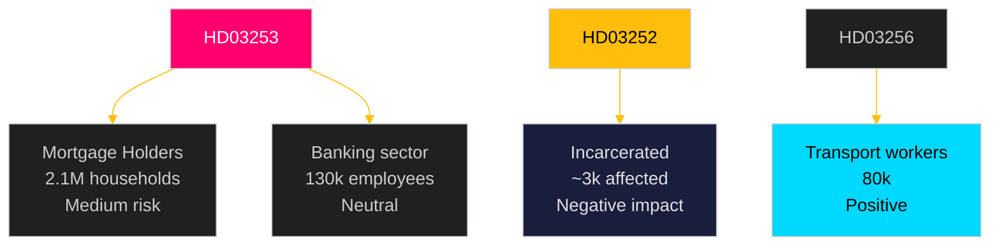

# Voter Segmentation — Swedish Government Propositions 2026-04-23

**Author**: James Pether Sörling
**Date**: 2026-04-27
**Confidence**: MEDIUM [B3]

---

## Demographic Segment Impact

### Segment 1: Banking & Financial Services Sector Workers (~130,000 employed)

**Proposition**: HD03253 (EU Banking Package)
**Impact**: NEUTRAL to SLIGHTLY NEGATIVE. Output floor may lead to headcount pressures if banks restructure to reduce RWA exposure. Risk-model teams may shrink; compliance and reporting roles will grow.
**Electoral alignment**: Disproportionately M/L voters in urban areas
**Mobilisation potential**: LOW — technically complex issue; banking workers unlikely to mobilise electorally on capital requirement details

---

### Segment 2: Mortgage Holders (~2.1 million households)

**Proposition**: HD03253 (EU Banking Package)
**Impact**: MEDIUM RISK. If output floor forces Swedish banks to constrain mortgage lending or raise rates, this segment is directly affected. Effect is indirect and 2–3 year timeline; not immediately visible.
**Electoral alignment**: Broad cross-party; higher M/C concentration in owner-occupier suburbs
**Mobilisation potential**: MEDIUM — if credit tightening materialises, government will face "you made our mortgages more expensive" framing

---

### Segment 3: Incarcerated Persons & Families (~12,000 individuals in custody)

**Proposition**: HD03252 (Social Insurance Restriction)
**Impact**: DIRECT NEGATIVE for ~2,000–3,000 in kontrollerat boende / säkerhetsförvaring. Sjukpenning and föräldrapenning withdrawn. For families (particularly children of incarcerated parents receiving föräldrapenning), secondary impact.
**Electoral alignment**: Marginalised groups — lower electoral participation
**GDPR note**: Criminal record data (GDPR Art. 9) applies — data minimisation in force

---

### Segment 4: Road Haulage Workers & Operators (~80,000 employed in transport sector)

**Proposition**: HD03256 (Tachograph Rules)
**Impact**: POSITIVE for compliant operators (level playing field). NEGATIVE for the minority using manipulated tachographs (criminal liability). Transportarbetareförbundet supports reform.
**Electoral alignment**: LO-affiliated — primarily S/V voters
**Mobilisation potential**: LOW — workers benefit; only non-compliant operators lose

---

### Segment 5: Pension Fund Holders (covering ~50% of Swedish adults)

**Proposition**: HD03253 (EU Banking Package)
**Impact**: MEDIUM. Swedish pension funds hold ~15–20% of Swedish banking sector equity. Capital tightening may temporarily depress bank stock valuations if market prices in higher capital requirements ahead of earnings reports.
**Electoral alignment**: Broad — AP funds cover virtually all workers; occupational pension schemes particularly M/C aligned
**Mobilisation potential**: LOW — diffuse impact; not easily attributed to one legislative measure

---

## Ideological Segment Map

| Segment | Proposition | Impact | Party target |
|---------|-------------|--------|-------------|
| "Law & Order" voters | HD03252 | POSITIVE — tough on crime | M, SD, KD |
| Progressive/welfare | HD03252 | NEGATIVE — welfare cut | V, MP |
| Homeowners | HD03253 | UNCERTAIN — mortgage risk | M, C, L |
| Business/finance | HD03253 | MIXED — regulation burden | M, L |
| EU enthusiasts | HD03253 | POSITIVE — EU compliance | L, M, C |
| EU sceptics | HD03253 | MILDLY NEGATIVE — EU mandate | SD |

---

