```mermaid
%%{init: {'theme': 'dark', 'themeVariables': {'primaryColor': '#1a1e3d', 'primaryTextColor': '#e0e0e0', 'primaryBorderColor': '#00d9ff'}}}%%
graph LR
    subgraph "Tidö Bloc (176)"
    M["M: 68"]
    SD["SD: 73"]
    KD["KD: 19"]
    L["L: 16"]
    end
    subgraph "Opposition (173)"
    S["S: 107"]
    V["V: 24"]
    C["C: 24"]
    MP["MP: 18"]
    end
    style M fill:#1a1e3d,stroke:#00d9ff
    style SD fill:#1a1e3d,stroke:#ff006e
    style KD fill:#0a0e27,stroke:#00d9ff
    style L fill:#0a0e27,stroke:#00d9ff
    style S fill:#0a0e27,stroke:#ff006e
    style V fill:#0a0e27,stroke:#ff006e
    style C fill:#1a1e3d,stroke:#ffbe0b
    style MP fill:#1a1e3d,stroke:#00d9ff
```

# Coalition Mathematics — Committee Reports 28 April 2026

**Author**: James Pether Sörling | **Date**: 2026-04-28 | **Confidence**: MEDIUM [B2]

---

## Current Riksdag Seat Distribution (2022-2026 Parliament)

| Party | Seats | Bloc | Government Role |
|-------|-------|------|----------------|
| Socialdemokraterna (S) | 107 | Opposition | Largest opposition party |
| Sverigedemokraterna (SD) | 73 | Tidö support | External support |
| Moderaterna (M) | 68 | Tidö | Prime Minister's party |
| Vänsterpartiet (V) | 24 | Opposition | Left opposition |
| Centerpartiet (C) | 24 | Opposition/HC01FiU20 reservation | Liberal |
| Kristdemokraterna (KD) | 19 | Tidö | Coalition partner |
| Miljöpartiet (MP) | 18 | Opposition | Green |
| Liberalerna (L) | 16 | Tidö | Coalition partner |
| **Total** | **349** | | |

*Majority threshold: 175 seats*

## Government Support Arithmetic

| Coalition component | Seats | Notes |
|---------------------|-------|-------|
| Moderaterna | 68 | PM Ulf Kristersson's party |
| Kristdemokraterna | 19 | |
| Liberalerna | 16 | |
| **Government parties total** | **103** | Well below majority |
| Sverigedemokraterna (support) | 73 | External support — not in cabinet |
| **Tidö coalition total** | **176** | +1 majority threshold |

## HC01FiU20 Vote Analysis (FiU Committee)

The Finance Committee (FiU) voted to approve HC01FiU20 with four reservations from S, V, C, and MP. This committee vote structure:

| Vote | Ja | Nej | Avstår | Frånvarande |
|------|----|----|--------|-------------|
| FiU20 approval | Coalition majority | — | 4 parties reservation | — |

Note: Committee vote details not fully available — reservation structure confirmed from document text.

## Pivotal Vote Analysis

| Actor | Seats | Pivot role | HC01FiU20 position |
|-------|-------|------------|-------------------|
| SD | 73 | Critical kingmaker | Supports government |
| C | 24 | Swing actor (opposition reservation) | Filed reservation on FiU20 |
| L | 16 | Coalition weak link | Government party |

## Sainte-Laguë Scenarios (2026 Election)

**If S gains 10 seats from M**: S bloc reaches ~183, Tidö falls to ~166 → Opposition majority government possible
**If SD gains 5 seats**: SD 78, but opposition bloc still dominant without centre cooperation
**If MP clears threshold (currently 18 seats, threshold 4%)**: MP retention keeps opposition arithmetic viable

---

