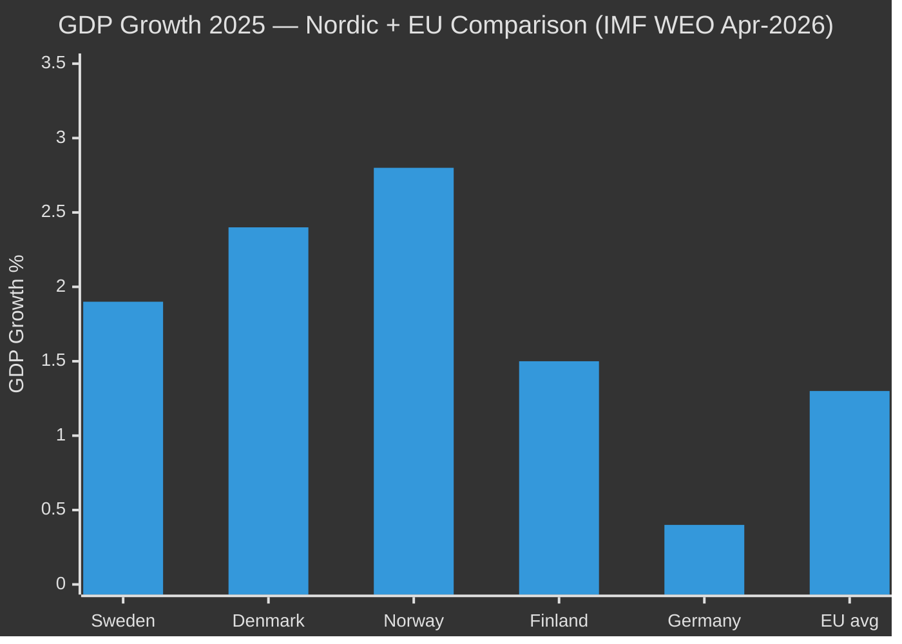

# Comparative International Analysis — Committee Reports 28 April 2026

**Author**: James Pether Sörling | **Date**: 2026-04-28 | **Confidence**: MEDIUM [B3]

---

**Comparator set**: Nordic peers (Denmark, Norway, Finland) + Germany (DE) as EU anchor economy + EU institutional framework

---

## Comparator Matrix

| Jurisdiction | GDP Growth 2025 | Inflation | Unemployment | Fiscal Stance | Political Context |
|---|---|---|---|---|---|
| **Sweden (SWE)** | 1.9% (HC01FiU20) | KPIF 1.9% (HC01FiU24) | 8.7% | Spring Bill — consolidation + household support | Coalition government; election 2026 |
| **Denmark (DNK)** | ~2.4% (IMF WEO Apr-2026 est.) | ~2.1% | ~5.0% | Tight fiscal stance; defence spending increase | Centre-left government; stable |
| **Norway (NOR)** | ~2.8% (oil-adjusted) | ~3.0% | ~3.8% | Petroleum fund buffer; active fiscal policy | Labour-led coalition |
| **Finland (FIN)** | ~1.5% | ~2.0% | ~7.5% | Austerity programme; debt reduction priority | Coalition government; fiscal consolidation |
| **Germany (DEU)** | ~0.4% (IMF WEO Apr-2026) | ~2.2% | ~5.8% | New government; post-debt-brake reform | Coalition (CDU/CSU+SPD) |
| **EU Average** | ~1.3% | ~2.4% | ~6.1% | Stability Pact compliance pressure | Varied |

*Source: IMF WEO Apr-2026 estimates for Nordic peers; Sverige data from HC01FiU20/FiU24 primary sources*

## Outside-In Analysis

### Sweden vs. Denmark
Denmark's lower unemployment (5.0%) and slightly higher growth (2.4%) provide the sharpest contrast to Sweden's trajectory. Danish labour market flexibility (flexicurity model) has delivered lower unemployment even in the tariff environment. **Intelligence implication**: Opposition parties (especially S) will use Danish flexicurity as a benchmark against Tidö's bidragsreform approach, arguing that activation requirements alone don't create jobs.

### Sweden vs. Norway
Norway's fiscal buffer (petroleum fund) allows active counter-cyclical policy Sweden lacks. However, Norway's exposure to commodity price cycles creates its own vulnerabilities. Swedish monetary policy (HC01FiU24) is more comparable to ECB-adjacent Nordic peers than Norway's oil-dependent model.

### Sweden vs. Finland
Finland's ongoing austerity creates the closest structural parallel to Sweden's fiscal consolidation path. Both face similar EU Stability Pact pressures and demographic welfare challenges. Finland's 7.5% unemployment is comparable to Sweden's projected 8.7%, suggesting common Nordic labour market stresses.

### Sweden vs. Germany
Germany's near-stagnation (0.4% GDP growth) illustrates the worst-case scenario for export-dependent European economies under US tariff pressure. Sweden's 1.9% projection is comparatively resilient — but Germany's experience shows that trade dependency creates compounding risks. **Key difference**: Germany's new government has reformed the debt brake; Sweden's fiscal framework remains intact (HC01FiU20).

## EU Institutional Context

- **EU Stability Pact**: Sweden's fiscal guidelines (HC01FiU20) are framed as Stability Pact compliant. Spring Bill approach maintains deficit below 3% GDP threshold.
- **EU Green Deal**: MKB directive implementation (HC01MJU22) is directly EU-mandated — compliance obligation, not political choice.
- **EU Digital/Single Market**: Competitiveness agenda referenced in FiU20 aligns with EU Draghi Report recommendations.

---

