```mermaid
%%{init: {'theme': 'dark', 'themeVariables': {'primaryColor': '#1a1e3d', 'primaryTextColor': '#e0e0e0', 'primaryBorderColor': '#00d9ff'}}}%%
graph LR
    FiU20["HC01FiU20<br/>Economic Policy"] -- amends --> SkU18["HC01SkU18<br/>F-Tax"]
    FiU24["HC01FiU24<br/>Monetary Policy"] -- context --> FiU20
    KU20["HC01KU20<br/>Scrutiny"] -- committee-routed --> FiU20
    SoU29["HC01SoU29<br/>Fritidskort"] -- budget --> FiU20
    FiU30["HC01FiU30<br/>State Accounts"] -- baseline --> FiU20
    FiU20 -- thematic --> UbU17["HC01UbU17<br/>10-year school"]
    SoU29 -- thematic --> UbU17
    style FiU20 fill:#0a0e27,stroke:#ffbe0b
    style FiU24 fill:#1a1e3d,stroke:#00d9ff
    style KU20 fill:#1a1e3d,stroke:#ff006e
    style SoU29 fill:#1a1e3d,stroke:#00d9ff
    style SkU18 fill:#0a0e27,stroke:#00d9ff
    style FiU30 fill:#0a0e27,stroke:#00d9ff
    style UbU17 fill:#1a1e3d,stroke:#00d9ff
```

# Cross-Reference Map — Committee Reports 28 April 2026

**Author**: James Pether Sörling | **Date**: 2026-04-28 | **Confidence**: MEDIUM [B2]

---

## Policy Clusters

### Cluster 1: Economic Governance (High-Coherence)
- **HC01FiU20** ↔ **HC01FiU24** ↔ **HC01FiU30**: Fiscal guidelines + Monetary policy review + State accounts form a coherent economic governance cluster. FiU20 sets direction; FiU24 validates monetary tool; FiU30 provides baseline accountability.
- Cross-reference: Both FiU20 and FiU24 reference Sweden's economic trajectory in 2024-2025; FiU30 provides the retrospective accounts underpinning both forward-looking documents.

### Cluster 2: Constitutional Accountability
- **HC01KU20**: Standalone scrutiny cluster — no direct sibling in this batch, but thematic predecessor KU reports from earlier sessions form the longitudinal constitutional chain.
- Connects forward to: Any ministerial censure motions triggered by KU20 findings.

### Cluster 3: Social Policy
- **HC01SoU29** (fritidskort) ↔ **HC01UbU17** (tioårig grundskola): Both represent social investment in children/youth. Complementary policy signals — government's youth inclusion agenda.
- Bundle type: Thematic (social investment cluster)

### Cluster 4: Economic Regulatory
- **HC01SkU18** (F-tax) ↔ **HC01FiU20** (economic guidelines): F-tax reform implements one aspect of the labour market reform agenda in FiU20.
- Edge label: amends (HC01SkU18 implements HC01FiU20's regulatory reform agenda)

## Legislative Chains

| From | To | Edge Label | Rationale |
|------|----|-----------|-----------|
| HC01FiU20 | HC01SkU18 | amends | F-tax reform operationalises labour market reform in Spring Bill |
| HC01FiU24 | HC01FiU20 | context | Monetary policy context supports/constrains fiscal space in FiU20 |
| HC01KU20 | HC01FiU20 | committee-routed | KU scrutiny covers some FiU20-adjacent government decisions |
| HC01SoU29 | HC01FiU20 | budget | Fritidskort has fiscal cost implications within Spring Bill envelope |

## Coordinated Filing Patterns

- **FiU20 + FiU24 + FiU33** filed same day (2025-06-12) — Finance Committee batch filing at session end
- **KU20 + MJU22 + TU15** cluster around 2025-06-10 — committee report sprint at parliamentary session close
- Four-party reservation (S+V+C+MP) in FiU20 = coordinated opposition activity signal

## Sibling Folder Citations (Cross-Run Intelligence)

- **month-ahead analysis** (analysis/daily/2026-04-28/month-ahead/): Contains May/June 2026 forecasting context — FiU20's GDP trajectory feeds into month-ahead economic forecasting.
- **Future reference**: week-ahead (analysis/daily/next-week/week-ahead/) will track FiU20 chamber vote timing.

---

