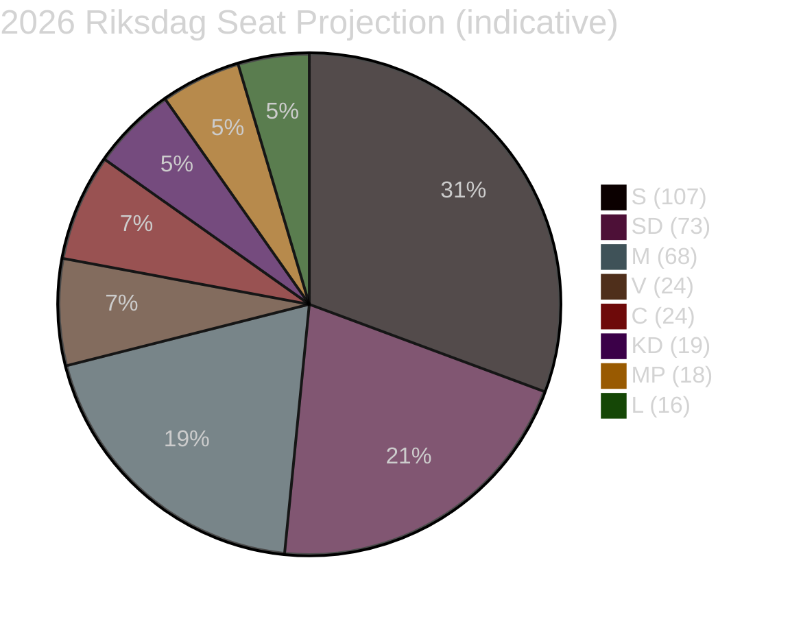

# Election 2026 Analysis — Committee Reports 28 April 2026

**Author**: James Pether Sörling | **Date**: 2026-04-28 | **Confidence**: MEDIUM [C2]

---

## Electoral Context

Sweden's next general election is September 2026. These committee reports — particularly HC01FiU20 (economic guidelines) and HC01KU20 (constitutional scrutiny) — are primary electoral battleground documents.

## Current Seat Projection (Based on Available Data)

| Party | Current Seats | Trend | Coalition |
|-------|--------------|-------|-----------|
| Sverigedemokraterna (SD) | 73 | Stable | Tidö support |
| Moderaterna (M) | 68 | Declining | Tidö |
| Socialdemokraterna (S) | 107 | Rising | Opposition |
| Vänsterpartiet (V) | 24 | Stable | Opposition |
| Centerpartiet (C) | 24 | Stable | Opposition (reservation) |
| Liberalerna (L) | 16 | Declining | Tidö |
| Kristdemokraterna (KD) | 19 | Stable | Tidö |
| Miljöpartiet (MP) | 18 | Rising | Opposition |

*Note: Projections based on available polling context; exact current polling not available in this analysis session*

## Coalition Mathematics

### Current Tidö Government Support
- M (68) + SD (73) + KD (19) + L (16) = **176 seats** (needs 175 for majority in 349-seat Riksdag)
- Majority margin: 1 seat — extremely vulnerable

### Potential Opposition Bloc (2026 formation signal from HC01FiU20 reservations)
- S (107) + V (24) + C (24) + MP (18) = **173 seats** — short of majority
- Requires: C or L crossing over, or new parties reaching threshold

## Committee Reports Impact on 2026 Electoral Calculus

### HC01FiU20 Electoral Implications
- **For government**: Must achieve GDP 1.9% and reduce unemployment from 8.7% — tall order
- **For opposition**: Four-party reservation creates early manifesto signal
- **Key variable**: Bidragsreform implementation — if perceived as harsh, galvanises S/V voter mobilisation

### HC01FiU24 Electoral Implications
- Riksbank credibility maintained — neutral for electoral politics
- But "could have cut faster" finding gives opposition a technical critique of government's monetary-fiscal coordination

### HC01KU20 Electoral Implications
- Constitutional accountability findings could be weaponised by opposition
- Historical pattern: KU adverse finding → minister resignation → newsworthy liability

## Seat-Projection Deltas (Scenario-Adjusted)

| Scenario | M | S | SD | Change |
|----------|---|---|----|--------|
| A: Recovery | +5 | -5 | Stable | Tidö advantage |
| B: Stagnation | -10 | +10 | Stable | Opposition advantage |
| C: Constitutional crisis | -5 | +8 | -3 | Opposition narrow majority |

---

