```mermaid
%%{init: {'theme': 'dark', 'themeVariables': {'primaryColor': '#1a1e3d', 'primaryTextColor': '#e0e0e0', 'primaryBorderColor': '#00d9ff', 'lineColor': '#ff006e', 'secondaryColor': '#0a0e27', 'tertiaryColor': '#1a1e3d'}}}%%
graph TD
    A["🏛️ Committee Reports<br/>2024/25 Riksmöte"] --> B["💰 HC01FiU20<br/>Economic Policy Guidelines"]
    A --> C["🏦 HC01FiU24<br/>Riksbank Monetary Policy"]
    A --> D["⚖️ HC01KU20<br/>Constitutional Scrutiny"]
    A --> E["🎟️ HC01SoU29<br/>Youth Leisure Card"]
    A --> F["📋 HC01SkU18<br/>F-Tax Reforms"]
    B --> G["GDP 1.9% (2025)<br/>Unemployment 8.7%"]
    B --> H["US Tariff Revision<br/>Downward GDP forecast"]
    C --> I["KPIF 1.9% avg<br/>Rate cuts vindicated"]
    D --> J["Govt accountability<br/>Constitutional review"]
    style A fill:#0a0e27,stroke:#00d9ff
    style B fill:#1a1e3d,stroke:#ffbe0b
    style C fill:#1a1e3d,stroke:#ffbe0b
    style D fill:#1a1e3d,stroke:#ff006e
    style E fill:#1a1e3d,stroke:#00d9ff
    style F fill:#1a1e3d,stroke:#00d9ff
    style G fill:#0a0e27,stroke:#00d9ff
    style H fill:#0a0e27,stroke:#ff006e
    style I fill:#0a0e27,stroke:#00d9ff
    style J fill:#0a0e27,stroke:#ff006e
```

# Committee Reports Intelligence Brief — 28 April 2026

**Author**: James Pether Sörling
**Date**: 2026-04-28
**Classification**: PUBLIC — GDPR Art. 9(2)(e)(g)
**Confidence**: HIGH [B2]

---

## 🎯 BLUF

Sweden's Finance Committee has approved the Tidö government's Spring Fiscal Bill economic guidelines amid US tariff-driven downward GDP revisions — projecting 1.9% growth in 2025 — while simultaneously endorsing Riksbank's 2024 monetary policy as broadly successful despite calls for faster rate cuts. Four opposition parties (S, V, C, MP) filed reservations against fiscal priorities. The Constitutional Committee's scrutiny report reveals government accountability gaps. Collectively, these committee reports define the political and economic battleground entering the 2026 election cycle.

## 🧭 3 Decisions This Brief Supports

1. **Economic policy framing** — Should opposition parties intensify critique of Tidö's economic policy or accept the government's unemployment and growth framing for 2025–2026?
2. **Monetary policy signalling** — Do MPs, think-tanks, and financial commentators treat Riksbank's 2024 rate trajectory as vindicated or as a missed-opportunity for faster cuts?
3. **Constitutional accountability** — Which government decisions flagged in KU20 (Constitutional Committee scrutiny) carry the highest political liability for the Ulf Kristersson government ahead of 2026?

## ⚡ 60-Second Read

- **HC01FiU20** (FiU): Riksdag approves fiscal guidelines per Spring Bill; GDP forecast 1.9% (2025), unemployment 8.7%. US tariffs have forced downward revisions. Government focuses on three pillars: household strengthening, labour market, and growth/investment. Four-party opposition bloc reserves against fiscal priorities. [A2]
- **HC01FiU24** (FiU): Finance Committee endorses Riksbank's 2024 monetary policy as achieving good target fulfilment — KPIF 1.9% average. External evaluators (Vestman et al.) note Riksbank could have cut rates faster. Long-term inflation expectations remain anchored at 2%. [A1]
- **HC01KU20** (KU): Constitutional Committee annual scrutiny report; examines government decision-making accountability. Significant for ruling out or confirming constitutional irregularities. [A2]
- **HC01SoU29** (SoU): Fritidskort (leisure card) for children and youth approved — active social inclusion policy with budget implications. [A1]
- **HC01SkU18** (SkU): New obstacles and revocation grounds for F-tax approval adopted to combat abuse. [B1]

## 🔺 Top Forward Trigger

**Date: 2025-06-17** — Riksdag chamber votes on FiU20 guidelines in plenary. Opposition reservations from S, V, C, MP create a political flashpoint: do the centre-left and liberal bloc signal a credible alternative economic programme?

## 📊 Confidence

**Confidence: HIGH** — Key judgments supported by full-text primary documents from data.riksdagen.se. GDP and unemployment figures from official FiU20 text corroborated by SCB/IMF context. Uncertainty: timing and political fallout of KU20 scrutiny outcomes not fully resolved.

---

