```mermaid
%%{init: {'theme': 'dark', 'themeVariables': {'primaryColor': '#1a1e3d', 'primaryTextColor': '#e0e0e0', 'primaryBorderColor': '#00d9ff', 'lineColor': '#ff006e', 'secondaryColor': '#0a0e27', 'tertiaryColor': '#1a1e3d'}}}%%
graph TD
    A["🏛️ تقارير اللجان<br/>Riksmöte 2024/25"] --> B["💰 HC01FiU20<br/>توجيهات السياسة المالية"]
    A --> C["🏦 HC01FiU24<br/>السياسة النقدية Riksbanken"]
    A --> D["⚖️ HC01KU20<br/>المراجعة الدستورية"]
    A --> E["🎟️ HC01SoU29<br/>بطاقة ترفيه الشباب"]
    A --> F["📋 HC01SkU18<br/>إصلاحات ضريبة F"]
    B --> G["ناتج محلي 1.9٪ (2025)<br/>بطالة 8.7٪"]
    B --> H["مراجعة الرسوم الجمركية الأمريكية<br/>توقع الناتج المحلي هبوطي"]
    C --> I["KPIF 1.9٪ متوسط<br/>خفض الفائدة مبرر"]
    D --> J["المساءلة الحكومية<br/>المراجعة الدستورية"]
    style A fill:#0a0e27,stroke:#00d9ff
    style B fill:#1a1e3d,stroke:#ffbe0b
    style C fill:#1a1e3d,stroke:#ffbe0b
    style D fill:#1a1e3d,stroke:#ff006e
    style E fill:#1a1e3d,stroke:#00d9ff
    style F fill:#1a1e3d,stroke:#00d9ff
    style G fill:#0a0e27,stroke:#00d9ff
    style H fill:#0a0e27,stroke:#ff006e
    style I fill:#0a0e27,stroke:#00d9ff
    style J fill:#0a0e27,stroke:#ff006e
```

<!-- dir: rtl -->
# تقارير اللجان ملخص الاستخبارات — 28 أبريل 2026

**المؤلف**: James Pether Sörling
**التاريخ**: 2026-04-28
**التصنيف**: عام — اللائحة الأوروبية للبيانات GDPR Art. 9(2)(e)(g)
**الثقة**: عالية [B2]

---

## 🎯 الرسالة الجوهرية

وافقت لجنة المالية على توجيهات السياسة المالية لتحالف Tidö من اقتراح الميزانية الربيعية — على الرغم من التعديلات الهبوطية للناتج المحلي الإجمالي بسبب الرسوم الجمركية الأمريكية، بتوقع نمو 1.9٪ لعام 2025 — وأكدت في الوقت ذاته نجاح السياسة النقدية لـ Riksbanken في 2024 بشكل عام، على الرغم من المطالبات بخفض أسرع لأسعار الفائدة. أبدى أربعة أحزاب معارضة (S, V, C, MP) تحفظات على الأولويات المالية. كشف تقرير مراجعة اللجنة الدستورية عن ثغرات في المساءلة الحكومية. تحدد هذه التقارير مجتمعةً ساحة المعركة السياسية والاقتصادية قبل دورة انتخابات 2026.

## 🧭 3 قرارات يدعمها هذا الملخص

1. **تأطير السياسة الاقتصادية** — هل ينبغي لأحزاب المعارضة تصعيد انتقادها للسياسة الاقتصادية لتحالف Tidö أم قبول الإطار الحكومي بشأن البطالة والنمو 2025-2026؟
2. **إشارة السياسة النقدية** — هل يعتبر البرلمانيون ومراكز الفكر والمحللون الماليون مسار أسعار فائدة Riksbanken في 2024 مبرراً أم فرصة ضائعة لخفض أسرع؟
3. **المساءلة الدستورية** — أي القرارات الحكومية في KU20 (تقرير مراجعة اللجنة الدستورية) تحمل أعلى مخاطر المسؤولية السياسية لحكومة Ulf Kristersson قبل 2026؟

## ⚡ قراءة 60 ثانية

- **HC01FiU20** (FiU): يوافق الريكسداغ على توجيهات السياسة المالية وفقاً لاقتراحات الربيع؛ توقع الناتج المحلي الإجمالي 1.9٪ (2025)، البطالة 8.7٪. أجبرت الرسوم الجمركية الأمريكية على مراجعات هبوطية. تركز الحكومة على ثلاثة محاور: تعزيز الأسر، سوق العمل، النمو والاستثمارات. كتلة المعارضة الرباعية تبدي تحفظات على الأولويات المالية. [A2]
- **HC01FiU24** (FiU): تؤكد لجنة المالية أن السياسة النقدية لـ Riksbanken في 2024 كانت متوائمة جيداً مع الهدف — KPIF 1.9٪ متوسط. المقيّمون الخارجيون (Vestman وآخرون) يرون أن Riksbanken كان بإمكانها خفض الفائدة أسرع. التوقعات التضخمية طويلة الأمد تبقى مُثبَّتة عند 2٪. [A1]
- **HC01KU20** (KU): التقرير السنوي لمراجعة اللجنة الدستورية؛ يفحص المساءلة الحكومية. حاسم لإغلاق أو تأكيد المخالفات الدستورية. [A2]
- **HC01SoU29** (SoU): تمت الموافقة على Fritidskort (بطاقة الترفيه) للأطفال والشباب — سياسة اندماج اجتماعي نشطة بأثر على الميزانية. [A1]
- **HC01SkU18** (SkU): قدمت أسباب جديدة لحظب وإلغاء الموافقة على ضريبة F لمكافحة الإساءة. [B1]

## 🔺 أبرز محفز قادم

**التاريخ: 2025-06-17** — تصويت الجلسة العامة في الريكسداغ على توجيهات FiU20. تحفظات المعارضة من S, V, C, MP تُوجد نقطة ضغط سياسية: هل ستُشير كتلة وسط اليسار والليبراليين إلى برنامج اقتصادي بديل ذي مصداقية؟

## 📊 الثقة

**الثقة: عالية** — تستند التقييمات الرئيسية إلى وثائق أولية من data.riksdagen.se بنص كامل. أرقام الناتج المحلي الإجمالي والبطالة من النص الرسمي FiU20 تم التحقق منها بسياق SCB/IMF. عدم اليقين: توقيت ونتائج مراجعة KU20 السياسية لم تتضح كلياً بعد.

---

<!-- source-sha: 7156ec83294bd3d7360cfe9849ab2c3c69f409dc -->
