```mermaid
%%{init: {'theme': 'dark', 'themeVariables': {'primaryColor': '#1a1e3d', 'primaryTextColor': '#e0e0e0', 'primaryBorderColor': '#00d9ff', 'lineColor': '#ff006e', 'secondaryColor': '#0a0e27', 'tertiaryColor': '#1a1e3d'}}}%%
graph TD
    A["🏛️ Udvalgsrapporter<br/>2024/25 Riksmöte"] --> B["💰 HC01FiU20<br/>Retningslinjer for Økonomi"]
    A --> C["🏦 HC01FiU24<br/>Riksbankens Pengepolitik"]
    A --> D["⚖️ HC01KU20<br/>Grundlovsgranskning"]
    A --> E["🎟️ HC01SoU29<br/>Ungdomsfritidskort"]
    A --> F["📋 HC01SkU18<br/>F-skattereformer"]
    B --> G["BNP 1,9% (2025)<br/>Arbejdsløshed 8,7%"]
    B --> H["USA-told revision<br/>Nedjusteret BNP-prognose"]
    C --> I["KPIF 1,9% gns.<br/>Rentenedsættelse bekræftet"]
    D --> J["Regerings ansvar<br/>Forfatningsgranskning"]
    style A fill:#0a0e27,stroke:#00d9ff
    style B fill:#1a1e3d,stroke:#ffbe0b
    style C fill:#1a1e3d,stroke:#ffbe0b
    style D fill:#1a1e3d,stroke:#ff006e
    style E fill:#1a1e3d,stroke:#00d9ff
    style F fill:#1a1e3d,stroke:#00d9ff
    style G fill:#0a0e27,stroke:#00d9ff
    style H fill:#0a0e27,stroke:#ff006e
    style I fill:#0a0e27,stroke:#00d9ff
    style J fill:#0a0e27,stroke:#ff006e
```

# Udvalgsrapporter Efterretningsoverblik — 28. april 2026

**Forfatter**: James Pether Sörling
**Dato**: 2026-04-28
**Klassificering**: OFFENTLIG — GDPR Art. 9(2)(e)(g)
**Konfidens**: HØJ [B2]

---

## 🎯 Kernebudskab

Finansudvalget har godkendt Tidö-regeringens retningslinjer for den forårsfiskale politisk grundlov midt i en nedjustering af BNP på grund af amerikanske toldsatser — en prognose for vækst på 1,9% i 2025 — mens det samtidig bekræfter Riksbankens pengepolitik 2024 som overordnet vellykket på trods af krav om hurtigere rentenedsættelser. Fire oppositionspartier (S, V, C, MP) indgav forbehold mod finanspolitiske prioriteringer. Grundlovsudvalgets kontrolrapport afslører ansvarsmæssige huller i regeringen. Samlet set definerer disse udvalgsrapporter det politiske og økonomiske kampplads frem til valget i 2026.

## 🧭 3 Beslutninger Denne Oversigt Støtter

1. **Økonomisk politisk indramning** — Bør oppositionspartierne intensivere kritikken af Tidö-regeringens økonomiske politik eller acceptere regeringens ledigheds- og vækstindramning for 2025–2026?
2. **Pengepolitisk signalering** — Opfatter parlamentsmedlemmer, tænketanke og finansielle kommentatorer Riksbankens renteforløb i 2024 som bekræftet eller som en mistet mulighed for hurtigere nedsættelser?
3. **Konstitutionelt ansvar** — Hvilke regeringsbeslutninger flagget i KU20 (Grundlovsudvalgets kontrolrapport) bærer den højeste politiske risiko for Ulf Kristersson-regeringen forud for 2026?

## ⚡ 60-Sekunders Læsning

- **HC01FiU20** (FiU): Riksdagen godkender finanspolitiske retningslinjer iht. forårspropositionen; BNP-prognose 1,9% (2025), arbejdsløshed 8,7%. Amerikanske toldsatser har tvunget nedrevideringer. Regeringen fokuserer på tre søjler: husholdningsstyrkning, arbejdsmarked og vækst/investeringer. Fireparts-oppositionsblokken forbeholder sig mod finanspolitiske prioriteringer. [A2]
- **HC01FiU24** (FiU): Finansudvalget godkender Riksbankens pengepolitik 2024 som opnående god målopfyldelse — KPIF 1,9% i gennemsnit. Eksterne evaluatorer (Vestman et al.) bemærker, at Riksbanken kunne have sænket renten hurtigere. Langsigtede inflationsforventninger forbliver forankrede ved 2%. [A1]
- **HC01KU20** (KU): Grundlovsudvalgets årlige kontrolrapport; undersøger regeringens ansvar for beslutningstagning. Afgørende for at udelukke eller bekræfte forfatningsuregelmæssigheder. [A2]
- **HC01SoU29** (SoU): Fritidskort (fritidskort) for børn og unge godkendt — aktiv social inklusionspolitik med budgetmæssige implikationer. [A1]
- **HC01SkU18** (SkU): Nye hindringer og tilbagekaldelsesgrunde for godkendelse af F-skat vedtaget for at bekæmpe misbrug. [B1]

## 🔺 Vigtigste Fremtidige Trigger

**Dato: 2025-06-17** — Riksdagens plenum afstemning om FiU20-retningslinjer. Oppositionsforbehold fra S, V, C, MP skaber et politisk stridspunkt: signalerer centrum-venstre og det liberale blok et troværdigt alternativt økonomisk program?

## 📊 Konfidens

**Konfidens: HØJ** — Nøgledomme understøttes af primærdokumenter i fuld tekst fra data.riksdagen.se. BNP- og ledigheds-tal fra den officielle FiU20-tekst bekræftet af SCB/IMF-kontekst. Usikkerhed: tidspunkt og politiske konsekvenser af KU20 kontrolresultater er ikke fuldt ud afklaret.

---

<!-- source-sha: 7156ec83294bd3d7360cfe9849ab2c3c69f409dc -->
