```mermaid
%%{init: {'theme': 'dark', 'themeVariables': {'primaryColor': '#1a1e3d', 'primaryTextColor': '#e0e0e0', 'primaryBorderColor': '#00d9ff', 'lineColor': '#ff006e', 'secondaryColor': '#0a0e27', 'tertiaryColor': '#1a1e3d'}}}%%
graph TD
    A["🏛️ Ausschussberichte<br/>Riksmöte 2024/25"] --> B["💰 HC01FiU20<br/>Finanzpolitische Leitlinien"]
    A --> C["🏦 HC01FiU24<br/>Riksbanken-Geldpolitik"]
    A --> D["⚖️ HC01KU20<br/>Verfassungsprüfung"]
    A --> E["🎟️ HC01SoU29<br/>Jugendliche Freizeitkarte"]
    A --> F["📋 HC01SkU18<br/>F-Steuer-Reformen"]
    B --> G["BIP 1,9 % (2025)<br/>Arbeitslosigkeit 8,7 %"]
    B --> H["US-Zoll-Revision<br/>BIP-Prognose abwärts"]
    C --> I["KPIF 1,9 % Ø<br/>Zinssenkungen gerechtfertigt"]
    D --> J["Regierungsverantwortung<br/>Verfassungsprüfung"]
    style A fill:#0a0e27,stroke:#00d9ff
    style B fill:#1a1e3d,stroke:#ffbe0b
    style C fill:#1a1e3d,stroke:#ffbe0b
    style D fill:#1a1e3d,stroke:#ff006e
    style E fill:#1a1e3d,stroke:#00d9ff
    style F fill:#1a1e3d,stroke:#00d9ff
    style G fill:#0a0e27,stroke:#00d9ff
    style H fill:#0a0e27,stroke:#ff006e
    style I fill:#0a0e27,stroke:#00d9ff
    style J fill:#0a0e27,stroke:#ff006e
```

# Ausschussberichte Nachrichtenüberblick — 28. April 2026

**Autor**: James Pether Sörling
**Datum**: 2026-04-28
**Einstufung**: ÖFFENTLICH — DSGVO Art. 9(2)(e)(g)
**Vertraulichkeit**: HOCH [B2]

---

## 🎯 Kernaussage

Der Finanzausschuss hat die finanzpolitischen Leitlinien der Tidö-Koalition aus der Frühlingspropositon gebilligt — trotz BIP-Abwärtsrevisionen durch US-Zölle, mit Wachstumsprognose 1,9 % für 2025 — und gleichzeitig die Geldpolitik der Riksbanken 2024 als weitgehend erfolgreich bestätigt, ungeachtet von Forderungen nach schnelleren Zinssenkungen. Vier Oppositionsparteien (S, V, C, MP) haben Vorbehalte bei den finanzpolitischen Prioritäten eingelegt. Der Prüfungsbericht des Verfassungsausschusses legt Lücken bei der Regierungsverantwortung offen. Zusammen definieren diese Ausschussberichte das politische und wirtschaftliche Schlachtfeld vor dem Wahlzyklus 2026.

## 🧭 3 Entscheidungen, Die Dieser Überblick Unterstützt

1. **Wirtschaftspolitische Rahmung** — Sollten Oppositionsparteien ihre Kritik an der Wirtschaftspolitik der Tidö-Koalition verschärfen oder die Regierungsrahmung bei Arbeitslosigkeit und Wachstum 2025–2026 akzeptieren?
2. **Geldpolitisches Signal** — Halten Abgeordnete, Thinktanks und Finanzkommentatoren den Zinspfad der Riksbanken 2024 für gerechtfertigt oder für eine verpasste Chance auf schnellere Senkungen?
3. **Verfassungsmäßige Rechenschaftspflicht** — Welche Regierungsentscheidungen aus KU20 (Verfassungsausschuss-Prüfbericht) tragen das größte politische Haftungsrisiko für die Regierung Ulf Kristersson vor 2026?

## ⚡ 60-Sekunden-Lektüre

- **HC01FiU20** (FiU): Riksdag billigt finanzpolitische Leitlinien gemäß Frühlingspropositionen; BIP-Prognose 1,9 % (2025), Arbeitslosigkeit 8,7 %. US-Zölle haben Abwärtsrevisionen erzwungen. Regierung fokussiert auf drei Säulen: Haushaltsstärkung, Arbeitsmarkt sowie Wachstum/Investitionen. Vier-Parteien-Oppositionsblock mit Vorbehalten bei finanzpolitischen Prioritäten. [A2]
- **HC01FiU24** (FiU): Finanzausschuss bestätigt Geldpolitik der Riksbanken 2024 als gut auf Ziel ausgerichtet — KPIF 1,9 % im Durchschnitt. Externe Prüfer (Vestman et al.) stellen fest, Riksbanken hätte Zinsen schneller senken können. Langfristige Inflationserwartungen bleiben bei 2 % verankert. [A1]
- **HC01KU20** (KU): Jährlicher Prüfbericht des Verfassungsausschusses; prüft Regierungsverantwortung. Entscheidend für Schließen oder Bestätigen von verfassungsmäßigen Unregelmäßigkeiten. [A2]
- **HC01SoU29** (SoU): Fritidskort (Freizeitkarte) für Kinder und Jugendliche genehmigt — aktive Sozialinklusionspolitik mit Haushaltswirkung. [A1]
- **HC01SkU18** (SkU): Neue Sperr- und Widerrufsgründe für F-Steuer-Genehmigung eingeführt zur Bekämpfung von Missbrauch. [B1]

## 🔺 Wichtigster Kommender Auslöser

**Datum: 2025-06-17** — Plenums-Abstimmung des Riksdag über FiU20-Leitlinien. Oppositionsvorbehalte von S, V, C, MP schaffen einen politischen Schmerzpunkt: Werden Mitte-Links- und Liberaler Block ein glaubwürdiges alternatives Wirtschaftsprogramm signalisieren?

## 📊 Vertrauen

**Vertrauen: HOCH** — Schlüsselbewertungen stützen sich auf Primärdokumente von data.riksdagen.se im Volltext. BIP- und Arbeitslosigkeitszahlen aus FiU20-Offizialdtext mit SCB/IMF-Kontext verifiziert. Unsicherheit: Zeitpunkt und politische Konsequenzen der KU20-Prüfergebnisse noch nicht vollständig klar.

---

<!-- source-sha: 7156ec83294bd3d7360cfe9849ab2c3c69f409dc -->
