```mermaid
%%{init: {'theme': 'dark', 'themeVariables': {'primaryColor': '#1a1e3d', 'primaryTextColor': '#e0e0e0', 'primaryBorderColor': '#00d9ff', 'lineColor': '#ff006e', 'secondaryColor': '#0a0e27', 'tertiaryColor': '#1a1e3d'}}}%%
graph TD
    A["🏛️ Informes de Comité<br/>Riksmöte 2024/25"] --> B["💰 HC01FiU20<br/>Directrices presupuestarias"]
    A --> C["🏦 HC01FiU24<br/>Política monetaria Riksbanken"]
    A --> D["⚖️ HC01KU20<br/>Auditoría constitucional"]
    A --> E["🎟️ HC01SoU29<br/>Tarjeta Ocio Joven"]
    A --> F["📋 HC01SkU18<br/>Reformas fiscales F"]
    B --> G["PIB 1,9 % (2025)<br/>Desempleo 8,7 %"]
    B --> H["Revisión arancel EEUU<br/>Previsión PIB revisada a la baja"]
    C --> I["KPIF 1,9 % prom.<br/>Recortes de tipos justificados"]
    D --> J["Responsabilidad gubernamental<br/>Auditoría constitucional"]
    style A fill:#0a0e27,stroke:#00d9ff
    style B fill:#1a1e3d,stroke:#ffbe0b
    style C fill:#1a1e3d,stroke:#ffbe0b
    style D fill:#1a1e3d,stroke:#ff006e
    style E fill:#1a1e3d,stroke:#00d9ff
    style F fill:#1a1e3d,stroke:#00d9ff
    style G fill:#0a0e27,stroke:#00d9ff
    style H fill:#0a0e27,stroke:#ff006e
    style I fill:#0a0e27,stroke:#00d9ff
    style J fill:#0a0e27,stroke:#ff006e
```

# Informes de Comité Resumen de Inteligencia — 28 de abril de 2026

**Autor**: James Pether Sörling
**Fecha**: 2026-04-28
**Clasificación**: PÚBLICO — RGPD Art. 9(2)(e)(g)
**Confianza**: ALTA [B2]

---

## 🎯 Mensaje Principal

La comisión de finanzas ha aprobado las directrices de política fiscal de la coalición Tidö de la proposición de primavera — a pesar de las revisiones a la baja del PIB por los aranceles estadounidenses, con una previsión de crecimiento del 1,9 % para 2025 — y simultáneamente ha confirmado la política monetaria del Riksbanken en 2024 como en gran medida exitosa, a pesar de las demandas de recortes de tasas más rápidos. Cuatro partidos de la oposición (S, V, C, MP) presentaron reservas sobre las prioridades presupuestarias. El informe de auditoría del comité constitucional revela lagunas en la responsabilidad gubernamental. Estos informes de comité definen colectivamente el campo de batalla político y económico antes del ciclo electoral 2026.

## 🧭 3 Decisiones Que Apoya Este Resumen

1. **Enmarcado de política económica** — ¿Deberían los partidos de oposición intensificar su crítica a la política económica de la coalición Tidö o aceptar el enmarcado gubernamental sobre desempleo y crecimiento 2025–2026?
2. **Señal de política monetaria** — ¿Consideran los parlamentarios, grupos de expertos y comentaristas financieros la trayectoria de tipos del Riksbanken en 2024 como justificada o como una oportunidad perdida de recortes más rápidos?
3. **Responsabilidad constitucional** — ¿Qué decisiones gubernamentales en KU20 (informe de auditoría del comité constitucional) conllevan el mayor riesgo de responsabilidad política para el gobierno de Ulf Kristersson antes de 2026?

## ⚡ Lectura en 60 Segundos

- **HC01FiU20** (FiU): El Riksdag aprueba las directrices de política fiscal conforme a las proposiciones de primavera; previsión PIB 1,9 % (2025), desempleo 8,7 %. Los aranceles estadounidenses han forzado revisiones a la baja. El gobierno se centra en tres pilares: fortalecimiento de hogares, mercado laboral y crecimiento/inversiones. El bloque opositor de cuatro partidos formula reservas sobre las prioridades presupuestarias. [A2]
- **HC01FiU24** (FiU): La comisión de finanzas confirma que la política monetaria del Riksbanken en 2024 estuvo bien alineada con el objetivo — KPIF 1,9 % de media. Evaluadores externos (Vestman et al.) señalan que el Riksbanken podría haber recortado tipos más rápidamente. Las expectativas de inflación a largo plazo se mantienen ancladas en el 2 %. [A1]
- **HC01KU20** (KU): Informe de auditoría anual del comité constitucional; examina la responsabilidad gubernamental. Decisivo para cerrar o confirmar irregularidades constitucionales. [A2]
- **HC01SoU29** (SoU): Fritidskort (tarjeta de ocio) para niños y jóvenes aprobada — política activa de inclusión social con impacto presupuestario. [A1]
- **HC01SkU18** (SkU): Nuevos motivos de bloqueo y revocación de la aprobación del régimen fiscal F introducidos para combatir abusos. [B1]

## 🔺 Desencadenante Próximo Más Importante

**Fecha: 2025-06-17** — Votación plenaria del Riksdag sobre las directrices FiU20. Las reservas de la oposición de S, V, C, MP crean un punto de fricción político: ¿señalizará el bloque centroizquierda y liberal un programa económico alternativo creíble?

## 📊 Confianza

**Confianza: ALTA** — Las valoraciones clave se basan en documentos primarios de data.riksdagen.se en texto completo. Las cifras de PIB y desempleo del texto oficial FiU20 se han verificado con el contexto SCB/FMI. Incertidumbre: el calendario y las consecuencias políticas de los resultados de la auditoría KU20 no están aún completamente claros.

---

<!-- source-sha: 7156ec83294bd3d7360cfe9849ab2c3c69f409dc -->
