```mermaid
%%{init: {'theme': 'dark', 'themeVariables': {'primaryColor': '#1a1e3d', 'primaryTextColor': '#e0e0e0', 'primaryBorderColor': '#00d9ff', 'lineColor': '#ff006e', 'secondaryColor': '#0a0e27', 'tertiaryColor': '#1a1e3d'}}}%%
graph TD
    A["🏛️ Valiokunnan Raportit<br/>2024/25 Riksmöte"] --> B["💰 HC01FiU20<br/>Talouspolitiikan suuntaviivat"]
    A --> C["🏦 HC01FiU24<br/>Riksbankenin Rahapolitiikka"]
    A --> D["⚖️ HC01KU20<br/>Perustuslaintarkastus"]
    A --> E["🎟️ HC01SoU29<br/>Nuorten Harrastuskortti"]
    A --> F["📋 HC01SkU18<br/>F-verouudistukset"]
    B --> G["BKT 1,9% (2025)<br/>Työttömyys 8,7%"]
    B --> H["USA-tulli-revisio<br/>BKT-ennuste alaskirjattu"]
    C --> I["KPIF 1,9% keskim.<br/>Korkoleikkaukset perusteltu"]
    D --> J["Hallituksen vastuu<br/>Perustuslakitarkastus"]
    style A fill:#0a0e27,stroke:#00d9ff
    style B fill:#1a1e3d,stroke:#ffbe0b
    style C fill:#1a1e3d,stroke:#ffbe0b
    style D fill:#1a1e3d,stroke:#ff006e
    style E fill:#1a1e3d,stroke:#00d9ff
    style F fill:#1a1e3d,stroke:#00d9ff
    style G fill:#0a0e27,stroke:#00d9ff
    style H fill:#0a0e27,stroke:#ff006e
    style I fill:#0a0e27,stroke:#00d9ff
    style J fill:#0a0e27,stroke:#ff006e
```

# Valiokunnan raportit Tiedustelukatsaus — 28. huhtikuuta 2026

**Tekijä**: James Pether Sörling
**Päivämäärä**: 2026-04-28
**Luokitus**: JULKINEN — GDPR Art. 9(2)(e)(g)
**Luottamus**: KORKEA [B2]

---

## 🎯 Ydinviesti

Finansvaliokunta on hyväksynyt Tidö-hallituksen kevättalousarvion talouspolitiikan suuntaviivat, vaikka Yhdysvaltain tullien aiheuttamat BKT-alaskirjaukset — kasvuennuste on 1,9% vuodelle 2025 — vaikuttivat taustalla, ja se on samanaikaisesti vahvistanut Riksbankenin rahapolitiikan 2024 laajasti onnistuneeksi nopeampien korkoalenevuosien vaatimuksista huolimatta. Neljä oppositiopuoluetta (S, V, C, MP) jätti varauksia finanssipolitiikan painotuksiin. Perustuslakivaliokunnan tarkastusraportti paljastaa hallituksen vastuun puutteita. Nämä valiokunnan raportit yhteensä määrittelevät poliittisen ja taloudellisen taistelukentän ennen vuoden 2026 vaalijaksoa.

## 🧭 3 Päätöstä Jota Tämä Katsaus Tukee

1. **Talouspolitiikan kehystäminen** — Pitäisikö oppositiopuolueiden tiukentaa kritiikkiään Tidö-hallituksen talouspolitiikkaa kohtaan vai hyväksyä hallituksen kehystäminen työttömyyden ja kasvun osalta 2025–2026?
2. **Rahapolitiikan signalointi** — Pitävätkö kansanedustajat, ajatushautomot ja finanssikommentaattorit Riksbankenin korkorataa 2024 oikeutettuna vai menetettyä mahdollisuutena nopeammille alennuksille?
3. **Perustuslaillinen vastuuvelvollisuus** — Mitkä hallituksen päätökset KU20:ssä (Perustuslakivaliokunnan tarkastusraportti) sisältävät suurimman poliittisen vastuun Ulf Kristersson-hallitukselle ennen vuotta 2026?

## ⚡ 60 Sekunnin Lukeminen

- **HC01FiU20** (FiU): Riksdag hyväksyy finanssipolitiikan suuntaviivat kevätpropositioiden mukaisesti; BKT-ennuste 1,9% (2025), työttömyys 8,7%. Yhdysvaltain tullit ovat pakottaneet alaskirjauksia. Hallitus keskittyy kolmeen pilariin: kotitalouksien vahvistaminen, työmarkkina sekä kasvu/investoinnit. Neljän puolueen oppositioblokki varautuu finanssipolitiikan painotuksiin. [A2]
- **HC01FiU24** (FiU): Finansvaliokunta vahvistaa Riksbankenin rahapolitiikan 2024 saavuttanut hyvän tavoitteen täyttymisen — KPIF 1,9% keskimäärin. Ulkoiset arvioijat (Vestman ym.) toteavat, että Riksbanken olisi voinut leikata korkoja nopeammin. Pitkäaikaiset inflaatio-odotukset pysyvät ankkuroituina 2%:iin. [A1]
- **HC01KU20** (KU): Perustuslakivaliokunnan vuotuinen tarkastusraportti; tutkii hallituksen päätöksenteon vastuun. Ratkaiseva perustuslaillisten epäsäännöllisyyksien sulkemiseksi tai vahvistamiseksi. [A2]
- **HC01SoU29** (SoU): Fritidskort (harrastuskortti) lapsille ja nuorille hyväksytty — aktiivinen sosiaalisen inkluusion politiikka budjettivaikutuksineen. [A1]
- **HC01SkU18** (SkU): Uudet esteet ja peruuttamisperusteet F-verotuksen hyväksynnälle otettu käyttöön väärinkäytösten torjumiseksi. [B1]

## 🔺 Tärkein Tuleva Laukaisija

**Päivämäärä: 2025-06-17** — Riksdagenin täysistuntoäänestys FiU20-suuntaviivoista. Oppositioreservat S:ltä, V:ltä, C:ltä, MP:ltä luovat poliittisen kipukohdan: signaloivatko vasemmistokeskusta ja liberaali blokki uskottavan vaihtoehtoisen talouspolitiikan ohjelman?

## 📊 Luottamus

**Luottamus: KORKEA** — Tärkeimmät arviot tukeutuvat data.riksdagen.se:n ensisijaisiin asiakirjoihin täysitekstinä. BKT- ja työttömyysluvut FiU20:n virallisesta tekstistä vahvistettu SCB/IMF-kontekstilla. Epävarmuus: KU20:n tarkastustulosten ajoitus ja poliittiset seuraukset eivät ole täysin selviä.

---

<!-- source-sha: 7156ec83294bd3d7360cfe9849ab2c3c69f409dc -->
