```mermaid
%%{init: {'theme': 'dark', 'themeVariables': {'primaryColor': '#1a1e3d', 'primaryTextColor': '#e0e0e0', 'primaryBorderColor': '#00d9ff', 'lineColor': '#ff006e', 'secondaryColor': '#0a0e27', 'tertiaryColor': '#1a1e3d'}}}%%
graph TD
    A["🏛️ Rapports des Comités<br/>Riksmöte 2024/25"] --> B["💰 HC01FiU20<br/>Orientations budgétaires"]
    A --> C["🏦 HC01FiU24<br/>Politique monétaire Riksbanken"]
    A --> D["⚖️ HC01KU20<br/>Audit constitutionnel"]
    A --> E["🎟️ HC01SoU29<br/>Carte Loisirs Jeunes"]
    A --> F["📋 HC01SkU18<br/>Réformes fiscales F"]
    B --> G["PIB 1,9 % (2025)<br/>Chômage 8,7 %"]
    B --> H["Révision droits douane US<br/>Prévision PIB revue à la baisse"]
    C --> I["KPIF 1,9 % moy.<br/>Baisses de taux justifiées"]
    D --> J["Responsabilité gouvernementale<br/>Audit constitutionnel"]
    style A fill:#0a0e27,stroke:#00d9ff
    style B fill:#1a1e3d,stroke:#ffbe0b
    style C fill:#1a1e3d,stroke:#ffbe0b
    style D fill:#1a1e3d,stroke:#ff006e
    style E fill:#1a1e3d,stroke:#00d9ff
    style F fill:#1a1e3d,stroke:#00d9ff
    style G fill:#0a0e27,stroke:#00d9ff
    style H fill:#0a0e27,stroke:#ff006e
    style I fill:#0a0e27,stroke:#00d9ff
    style J fill:#0a0e27,stroke:#ff006e
```

# Rapport des Comités Briefing de Renseignement — 28 avril 2026

**Auteur**: James Pether Sörling
**Date**: 2026-04-28
**Classification**: PUBLIC — RGPD Art. 9(2)(e)(g)
**Confiance**: ÉLEVÉE [B2]

---

## 🎯 Message Principal

La commission des finances a approuvé les orientations de politique budgétaire de la coalition Tidö issues du projet de budget de printemps — malgré des révisions à la baisse du PIB dues aux droits de douane américains, avec une prévision de croissance de 1,9 % pour 2025 — tout en confirmant la politique monétaire de la Riksbanken en 2024 comme globalement réussie, malgré les demandes de baisses de taux plus rapides. Quatre partis d'opposition (S, V, C, MP) ont formulé des réserves sur les priorités budgétaires. Le rapport d'audit du comité constitutionnel révèle des lacunes dans la responsabilité gouvernementale. Ces rapports de comités définissent ensemble le champ de bataille politique et économique avant le cycle électoral 2026.

## 🧭 3 Décisions Que Ce Briefing Soutient

1. **Cadrage de la politique économique** — Les partis d'opposition devraient-ils intensifier leur critique de la politique économique de la coalition Tidö ou accepter le cadrage gouvernemental sur le chômage et la croissance 2025–2026 ?
2. **Signal de politique monétaire** — Les parlementaires, les groupes de réflexion et les commentateurs financiers considèrent-ils la trajectoire des taux de la Riksbanken en 2024 comme justifiée ou comme une occasion manquée de baisses plus rapides ?
3. **Responsabilité constitutionnelle** — Quelles décisions gouvernementales dans KU20 (rapport d'audit du comité constitutionnel) portent le risque de responsabilité politique le plus élevé pour le gouvernement Ulf Kristersson avant 2026 ?

## ⚡ Lecture en 60 Secondes

- **HC01FiU20** (FiU) : Le Riksdag approuve les orientations de politique budgétaire conformément aux propositions de printemps ; prévision PIB 1,9 % (2025), chômage 8,7 %. Les droits de douane américains ont forcé des révisions à la baisse. Le gouvernement se concentre sur trois piliers : renforcement des ménages, marché du travail et croissance/investissements. Le bloc d'opposition de quatre partis formule des réserves sur les priorités budgétaires. [A2]
- **HC01FiU24** (FiU) : La commission des finances confirme que la politique monétaire de la Riksbanken en 2024 était bien alignée sur l'objectif — KPIF 1,9 % en moyenne. Les évaluateurs externes (Vestman et al.) constatent que la Riksbanken aurait pu réduire les taux plus rapidement. Les anticipations d'inflation à long terme restent ancrées à 2 %. [A1]
- **HC01KU20** (KU) : Rapport d'audit annuel du comité constitutionnel ; examine la responsabilité gouvernementale. Décisif pour fermer ou confirmer des irrégularités constitutionnelles. [A2]
- **HC01SoU29** (SoU) : Fritidskort (carte loisirs) pour enfants et jeunes approuvée — politique active d'inclusion sociale avec impact budgétaire. [A1]
- **HC01SkU18** (SkU) : Nouveaux motifs de blocage et de révocation de l'approbation du régime fiscal F introduits pour lutter contre les abus. [B1]

## 🔺 Déclencheur Prochain le Plus Important

**Date : 2025-06-17** — Vote en séance plénière du Riksdag sur les orientations FiU20. Les réserves de l'opposition de S, V, C, MP créent un point de friction politique : le bloc centre-gauche et libéral va-t-il signaler un programme économique alternatif crédible ?

## 📊 Confiance

**Confiance : ÉLEVÉE** — Les évaluations clés s'appuient sur des documents primaires de data.riksdagen.se en texte intégral. Les chiffres du PIB et du chômage issus du texte officiel FiU20 sont vérifiés avec le contexte SCB/FMI. Incertitude : le calendrier et les conséquences politiques des résultats d'audit KU20 ne sont pas encore entièrement clairs.

---

<!-- source-sha: 7156ec83294bd3d7360cfe9849ab2c3c69f409dc -->
