```mermaid
%%{init: {'theme': 'dark', 'themeVariables': {"'primaryColor': '#1a1e3d', 'primaryTextColor': '#e0e0e0', 'primaryBorderColor': '#00d9ff', 'lineColor': '#ff006e', 'secondaryColor': '#0a0e27', 'tertiaryColor': '#1a1e3d'"}}}%%
graph TD
    A["🏛️ דוחות ועדה<br/>Riksmöte 2024/25"] --> B["💰 HC01FiU20<br/>הנחיות מדיניות פיסקלית"]
    A --> C["🏦 HC01FiU24<br/>מדיניות מוניטרית Riksbanken"]
    A --> D["⚖️ HC01KU20<br/>ביקורת חוקתית"]
    A --> E["🎟️ HC01SoU29<br/>כרטיס פנאי לצעירים"]
    A --> F["📋 HC01SkU18<br/>רפורמות מס F"]
    B --> G["תמג 1.9% (2025)<br/>אבטלה 8.7%"]
    B --> H["תיקון מכסים אמריקניים<br/>תחזית תמ#quot;ג כלפי מטה"]
    C --> I["KPIF 1.9% ממוצע<br/>הורדות ריבית מוצדקות"]
    D --> J["אחריות ממשלתית<br/>ביקורת חוקתית"]
    style A fill:#0a0e27,stroke:#00d9ff
    style B fill:#1a1e3d,stroke:#ffbe0b
    style C fill:#1a1e3d,stroke:#ffbe0b
    style D fill:#1a1e3d,stroke:#ff006e
    style E fill:#1a1e3d,stroke:#00d9ff
    style F fill:#1a1e3d,stroke:#00d9ff
    style G fill:#0a0e27,stroke:#00d9ff
    style H fill:#0a0e27,stroke:#ff006e
    style I fill:#0a0e27,stroke:#00d9ff
    style J fill:#0a0e27,stroke:#ff006e
```

<!-- dir: rtl -->
# דוחות ועדה סיכום מודיעין — 28 באפריל 2026

**מחבר**: James Pether Sörling
**תאריך**: 2026-04-28
**סיווג**: ציבורי — GDPR Art. 9(2)(e)(g)
**אמינות**: גבוהה [B2]

---

## 🎯 המסר המרכזי

ועדת הכספים אישרה את הנחיות המדיניות הפיסקלית של קואליציית Tidö מהצעת התקציב האביבית — למרות תיקוני ירידה בתמ"ג עקב המכסים האמריקניים, עם תחזית צמיחה של 1.9% לשנת 2025 — ואישרה בו-זמנית את המדיניות המוניטרית של Riksbanken ב-2024 כמוצלחת ברובה, למרות הדרישות להורדות ריבית מהירות יותר. ארבעה מפלגות אופוזיציה (S, V, C, MP) הגישו הסתייגויות על סדרי עדיפויות תקציביים. דוח הביקורת של ועדת החוקה חשף פערים באחריותיות הממשלתית. דוחות ועדה אלה מגדירים יחד את שדה הקרב הפוליטי-כלכלי לפני מחזור הבחירות 2026.

## 🧭 3 החלטות שסיכום זה תומך בהן

1. **מסגור המדיניות הכלכלית** — האם מפלגות האופוזיציה צריכות להחמיר את ביקורתן על המדיניות הכלכלית של קואליציית Tidö, או לקבל את המסגור הממשלתי בנוגע לאבטלה וצמיחה 2025-2026?
2. **איתות המדיניות המוניטרית** — האם חברי כנסת, מוסדות מחשבה ומפרשים פיננסיים רואים את נתיב הריבית של Riksbanken ב-2024 כמוצדק, או כהזדמנות שאבדה להורדות מהירות יותר?
3. **אחריות חוקתית** — אילו החלטות ממשלתיות ב-KU20 (דוח ביקורת ועדת החוקה) נושאות את הסיכון הגבוה ביותר לאחריות פוליטית לממשלת Ulf Kristersson לפני 2026?

## ⚡ קריאה של 60 שניות

- **HC01FiU20** (FiU): הריקסדאג מאשר הנחיות מדיניות פיסקלית בהתאם להצעות האביב; תחזית תמ"ג 1.9% (2025), אבטלה 8.7%. המכסים האמריקניים אילצו תיקוני ירידה. הממשלה מתמקדת בשלושה עמודים: חיזוק משקי הבית, שוק העבודה וצמיחה/השקעות. בלוק אופוזיציה ארבע-מפלגתי מגיש הסתייגויות על סדרי עדיפויות תקציביים. [A2]
- **HC01FiU24** (FiU): ועדת הכספים מאשרת שהמדיניות המוניטרית של Riksbanken ב-2024 הייתה ממוקדת היטב — KPIF 1.9% בממוצע. מעריכים חיצוניים (Vestman ואח') מציינים ש-Riksbanken יכלה לחתוך ריביות מהר יותר. ציפיות האינפלציה לטווח ארוך נשארות עוגנות ב-2%. [A1]
- **HC01KU20** (KU): דוח ביקורת שנתי של ועדת החוקה; בוחן אחריות ממשלתית. מכריע לסגירה או אישור אי-סדירויות חוקתיות. [A2]
- **HC01SoU29** (SoU): Fritidskort (כרטיס פנאי) לילדים ולצעירים אושר — מדיניות הכללה חברתית פעילה עם השפעה תקציבית. [A1]
- **HC01SkU18** (SkU): נוספו עילות חסימה וביטול חדשות לאישור מס F למאבק בשימוש לרעה. [B1]

## 🔺 הטריגר הקרוב החשוב ביותר

**תאריך: 2025-06-17** — הצבעת המליאה בריקסדאג על הנחיות FiU20. הסתייגויות האופוזיציה מ-S, V, C, MP יוצרות נקודת כאב פוליטית: האם הגוש מרכז-שמאל וליברלי יאותת על תוכנית כלכלית חלופית אמינה?

## 📊 אמינות

**אמינות: גבוהה** — ההערכות המרכזיות נסמכות על מסמכים ראשוניים מ-data.riksdagen.se בטקסט מלא. נתוני תמ"ג ואבטלה מטקסט FiU20 הרשמי אומתו בהקשר SCB/IMF. אי-ודאות: עיתוי ותוצאות הביקורת של KU20 לא ברורים לגמרי עדיין.

---

<!-- source-sha: 7156ec83294bd3d7360cfe9849ab2c3c69f409dc -->
