```mermaid
%%{init: {'theme': 'dark', 'themeVariables': {'primaryColor': '#1a1e3d', 'primaryTextColor': '#e0e0e0', 'primaryBorderColor': '#00d9ff', 'lineColor': '#ff006e', 'secondaryColor': '#0a0e27', 'tertiaryColor': '#1a1e3d'}}}%%
graph TD
    A["🏛️ 委員会報告書<br/>Riksmöte 2024/25"] --> B["💰 HC01FiU20<br/>財政政策指針"]
    A --> C["🏦 HC01FiU24<br/>Riksbanken金融政策"]
    A --> D["⚖️ HC01KU20<br/>憲法監査"]
    A --> E["🎟️ HC01SoU29<br/>若者余暇カード"]
    A --> F["📋 HC01SkU18<br/>F税改革"]
    B --> G["GDP 1.9%（2025年）<br/>失業率 8.7%"]
    B --> H["米国関税修正<br/>GDP予測下方修正"]
    C --> I["KPIF 1.9%平均<br/>利下げは正当"]
    D --> J["政府の説明責任<br/>憲法監査"]
    style A fill:#0a0e27,stroke:#00d9ff
    style B fill:#1a1e3d,stroke:#ffbe0b
    style C fill:#1a1e3d,stroke:#ffbe0b
    style D fill:#1a1e3d,stroke:#ff006e
    style E fill:#1a1e3d,stroke:#00d9ff
    style F fill:#1a1e3d,stroke:#00d9ff
    style G fill:#0a0e27,stroke:#00d9ff
    style H fill:#0a0e27,stroke:#ff006e
    style I fill:#0a0e27,stroke:#00d9ff
    style J fill:#0a0e27,stroke:#ff006e
```

# 委員会報告書 インテリジェンス・ブリーフィング — 2026年4月28日

**著者**: James Pether Sörling
**日付**: 2026-04-28
**分類**: 公開 — GDPR Art. 9(2)(e)(g)
**信頼度**: 高 [B2]

---

## 🎯 要点

財政委員会は、米国関税によるGDP下方修正（2025年成長率予測1.9%）にもかかわらず、Tidö連立政権の春の補正予算に基づく財政政策指針を承認し、より早い利下げ要求があったにもかかわらずRiksbankenの2024年金融政策を概ね成功と確認した。野党4党（S、V、C、MP）が財政優先順位に対して留保を表明。憲法委員会の監査報告書は政府の説明責任における欠陥を明らかにした。これらの委員会報告書は、2026年選挙サイクルに向けた政治・経済上の争点を定義するものである。

## 🧭 このブリーフィングが支援する3つの意思決定

1. **経済政策のフレーミング** — 野党政党はTidö連立政権の経済政策への批判を強めるべきか、それとも2025–2026年の失業率と成長に関する政府のフレーミングを受け入れるべきか？
2. **金融政策シグナル** — 議員、シンクタンク、金融コメンテーターはRiksbankenの2024年金利パスを正当と見るか、より早い引下げの失われた機会と見るか？
3. **憲法上の説明責任** — KU20（憲法委員会監査報告書）において、2026年以前のUlf Kristersson政府に最大の政治的責任リスクをもたらす政府決定はどれか？

## ⚡ 60秒で読む

- **HC01FiU20** (FiU): Riksdagが春の提案に基づく財政政策指針を承認；GDP予測1.9%（2025年）、失業率8.7%。米国関税が下方修正を強いた。政府は3本柱に注力：家計強化、労働市場、成長・投資。4党野党ブロックが財政優先順位に留保を表明。[A2]
- **HC01FiU24** (FiU): 財政委員会がRiksbankenの2024年金融政策は目標に良好に沿っていたと確認 — KPIF平均1.9%。外部評価者（Vestmanら）はRiksbankenがより早く利下げできたと指摘。長期インフレ期待は2%に引き続きアンカーされている。[A1]
- **HC01KU20** (KU): 憲法委員会の年次監査報告書；政府の説明責任を検証。憲法上の不規則性の解決または確認に決定的。[A2]
- **HC01SoU29** (SoU): 子どもと若者向けFritidskort（余暇カード）が承認 — 財政影響を伴う積極的な社会包摂政策。[A1]
- **HC01SkU18** (SkU): 悪用対策としてF税承認の新たな拒否・取消事由が導入された。[B1]

## 🔺 最も重要な次のトリガー

**日付：2025年6月17日** — RiksdagのFiU20指針に関する本会議投票。S、V、C、MPの野党留保が政治的摩擦点を生み出す：中道左派・リベラルブロックは信頼性ある代替経済プログラムを示すか？

## 📊 信頼度

**信頼度：高** — 主要評価はdata.riksdagen.seの一次文書に全文で依拠。FiU20公式文書からのGDPおよび失業率数値はSCB/IMFコンテキストで確認済み。不確実性：KU20監査結果の時期と政治的影響はまだ完全には明確でない。

---

<!-- source-sha: 7156ec83294bd3d7360cfe9849ab2c3c69f409dc -->
