```mermaid
%%{init: {'theme': 'dark', 'themeVariables': {'primaryColor': '#1a1e3d', 'primaryTextColor': '#e0e0e0', 'primaryBorderColor': '#00d9ff', 'lineColor': '#ff006e', 'secondaryColor': '#0a0e27', 'tertiaryColor': '#1a1e3d'}}}%%
graph TD
    A["🏛️ 위원회 보고서<br/>Riksmöte 2024/25"] --> B["💰 HC01FiU20<br/>재정정책 지침"]
    A --> C["🏦 HC01FiU24<br/>Riksbanken 통화정책"]
    A --> D["⚖️ HC01KU20<br/>헌법 감사"]
    A --> E["🎟️ HC01SoU29<br/>청소년 여가 카드"]
    A --> F["📋 HC01SkU18<br/>F세 개혁"]
    B --> G["GDP 1.9%(2025년)<br/>실업률 8.7%"]
    B --> H["미국 관세 수정<br/>GDP 예측 하향"]
    C --> I["KPIF 1.9% 평균<br/>금리 인하 정당화"]
    D --> J["정부 책임<br/>헌법 감사"]
    style A fill:#0a0e27,stroke:#00d9ff
    style B fill:#1a1e3d,stroke:#ffbe0b
    style C fill:#1a1e3d,stroke:#ffbe0b
    style D fill:#1a1e3d,stroke:#ff006e
    style E fill:#1a1e3d,stroke:#00d9ff
    style F fill:#1a1e3d,stroke:#00d9ff
    style G fill:#0a0e27,stroke:#00d9ff
    style H fill:#0a0e27,stroke:#ff006e
    style I fill:#0a0e27,stroke:#00d9ff
    style J fill:#0a0e27,stroke:#ff006e
```

# 위원회 보고서 인텔리전스 브리핑 — 2026년 4월 28일

**저자**: James Pether Sörling
**날짜**: 2026-04-28
**분류**: 공개 — GDPR Art. 9(2)(e)(g)
**신뢰도**: 높음 [B2]

---

## 🎯 핵심 메시지

재정위원회는 미국 관세로 인한 GDP 하향 조정(2025년 성장 예측 1.9%)에도 불구하고 봄 추가경정예산에서 Tidö 연립정부의 재정정책 지침을 승인했으며, 더 빠른 금리 인하 요구에도 Riksbanken의 2024년 통화정책을 전반적으로 성공적이라고 확인했다. 야당 4개 정당(S, V, C, MP)은 재정 우선순위에 대해 유보 의견을 제출했다. 헌법위원회 감사 보고서는 정부 책임의 결함을 드러냈다. 이 위원회 보고서들은 2026년 선거 주기 이전 정치·경제 전장을 집합적으로 정의한다.

## 🧭 이 브리핑이 지원하는 3가지 결정

1. **경제정책 프레이밍** — 야당 정당들이 Tidö 연립정부의 경제정책에 대한 비판을 강화해야 하는가, 아니면 2025–2026년 실업률과 성장에 관한 정부 프레이밍을 수용해야 하는가?
2. **통화정책 신호** — 국회의원, 싱크탱크, 금융 논평가들은 2024년 Riksbanken의 금리 경로를 정당한 것으로 보는가, 아니면 더 빠른 인하의 기회를 놓친 것으로 보는가?
3. **헌법적 책임** — KU20(헌법위원회 감사 보고서)에서 2026년 이전 Ulf Kristersson 정부에 가장 높은 정치적 책임 위험을 부담시키는 정부 결정은 무엇인가?

## ⚡ 60초 요약

- **HC01FiU20** (FiU): Riksdag가 봄 제안에 따른 재정정책 지침 승인; GDP 예측 1.9%(2025년), 실업률 8.7%. 미국 관세가 하향 수정을 강제했다. 정부는 3가지 기둥에 집중: 가계 강화, 노동시장, 성장/투자. 4개 야당 블록이 재정 우선순위에 유보 표명. [A2]
- **HC01FiU24** (FiU): 재정위원회가 Riksbanken의 2024년 통화정책이 목표에 잘 부합했음을 확인 — KPIF 평균 1.9%. 외부 평가자(Vestman 등)는 Riksbanken이 금리를 더 빨리 인하할 수 있었다고 지적. 장기 인플레이션 기대는 2%에 지속 고정. [A1]
- **HC01KU20** (KU): 헌법위원회 연례 감사 보고서; 정부 책임 검토. 헌법적 불규칙성 해소 또는 확인에 결정적. [A2]
- **HC01SoU29** (SoU): 아동과 청소년을 위한 Fritidskort(여가 카드) 승인 — 재정 영향을 동반한 적극적 사회통합 정책. [A1]
- **HC01SkU18** (SkU): 남용 방지를 위한 F세 승인 새 거부·취소 사유 도입. [B1]

## 🔺 가장 중요한 다음 트리거

**날짜: 2025-06-17** — Riksdag FiU20 지침에 관한 본회의 투표. S, V, C, MP의 야당 유보가 정치적 고통점을 만든다: 중도좌파·자유주의 블록이 신뢰할 수 있는 대안 경제 프로그램을 신호할 것인가?

## 📊 신뢰도

**신뢰도: 높음** — 주요 평가는 data.riksdagen.se의 1차 문서에 전문으로 의거. FiU20 공식 문서의 GDP 및 실업률 수치는 SCB/IMF 맥락으로 확인됨. 불확실성: KU20 감사 결과의 시기와 정치적 결과는 아직 완전히 명확하지 않음.

---

<!-- source-sha: 7156ec83294bd3d7360cfe9849ab2c3c69f409dc -->
