```mermaid
%%{init: {'theme': 'dark', 'themeVariables': {'primaryColor': '#1a1e3d', 'primaryTextColor': '#e0e0e0', 'primaryBorderColor': '#00d9ff', 'lineColor': '#ff006e', 'secondaryColor': '#0a0e27', 'tertiaryColor': '#1a1e3d'}}}%%
graph TD
    A["🏛️ Commissierapporten<br/>Riksmöte 2024/25"] --> B["💰 HC01FiU20<br/>Begrotingsbeleidsrichtlijnen"]
    A --> C["🏦 HC01FiU24<br/>Riksbanken monetair beleid"]
    A --> D["⚖️ HC01KU20<br/>Constitutionele audit"]
    A --> E["🎟️ HC01SoU29<br/>Vrijetijdspas Jongeren"]
    A --> F["📋 HC01SkU18<br/>F-belastingshervormingen"]
    B --> G["Bbp 1,9 % (2025)<br/>Werkloosheid 8,7 %"]
    B --> H["VS-tarievenrevisie<br/>Bbp-prognose neerwaarts"]
    C --> I["KPIF 1,9 % gem.<br/>Renteverlagingen gerechtvaardigd"]
    D --> J["Regeringsverantwoording<br/>Constitutionele audit"]
    style A fill:#0a0e27,stroke:#00d9ff
    style B fill:#1a1e3d,stroke:#ffbe0b
    style C fill:#1a1e3d,stroke:#ffbe0b
    style D fill:#1a1e3d,stroke:#ff006e
    style E fill:#1a1e3d,stroke:#00d9ff
    style F fill:#1a1e3d,stroke:#00d9ff
    style G fill:#0a0e27,stroke:#00d9ff
    style H fill:#0a0e27,stroke:#ff006e
    style I fill:#0a0e27,stroke:#00d9ff
    style J fill:#0a0e27,stroke:#ff006e
```

# Commissierapportage Inlichtingenbrief — 28 april 2026

**Auteur**: James Pether Sörling
**Datum**: 2026-04-28
**Classificatie**: OPENBAAR — AVG Art. 9(2)(e)(g)
**Vertrouwen**: HOOG [B2]

---

## 🎯 Kernboodschap

De financiëncommissie heeft de begrotingsbeleidsrichtlijnen van de Tidö-coalitie uit de lentepropositie goedgekeurd — ondanks neerwaartse bijstellingen van het bbp door Amerikaanse tarieven, met een groeiprognose van 1,9 % voor 2025 — en bevestigde tegelijkertijd het monetair beleid van de Riksbanken in 2024 als grotendeels succesvol, ondanks eisen voor snellere renteverlagingen. Vier oppositiepartijen (S, V, C, MP) dienden voorbehouden in bij de begrotingsprioriteiten. Het auditrapport van de grondwetcommissie legt lacunes in de verantwoording van de regering bloot. Deze commissierapporten definiëren samen het politieke en economische slagveld voor de verkiezingscyclus 2026.

## 🧭 3 Beslissingen Die Dit Briefing Ondersteunt

1. **Economisch beleidskader** — Moeten oppositiepartijen hun kritiek op het economisch beleid van de Tidö-coalitie aanscherpen of het regeringskader inzake werkloosheid en groei 2025–2026 accepteren?
2. **Monetair beleidssignaal** — Beschouwen parlementariërs, denktanks en financiële commentatoren het rentepad van de Riksbanken in 2024 als gerechtvaardigd of als een gemiste kans op snellere verlagingen?
3. **Constitutionele verantwoording** — Welke regeringsbeslissingen in KU20 (auditrapport grondwetcommissie) dragen het grootste politieke aansprakelijkheidsrisico voor de regering Ulf Kristersson voor 2026?

## ⚡ 60-Seconden Lezing

- **HC01FiU20** (FiU): Riksdag keurt begrotingsbeleidsrichtlijnen goed conform lenteproposities; bbp-prognose 1,9 % (2025), werkloosheid 8,7 %. Amerikaanse tarieven hebben neerwaartse bijstellingen gedwongen. Regering focust op drie pijlers: versterking huishoudens, arbeidsmarkt en groei/investeringen. Vier-partijen oppositieblok dient voorbehouden in bij begrotingsprioriteiten. [A2]
- **HC01FiU24** (FiU): Financiëncommissie bevestigt monetair beleid Riksbanken 2024 als goed afgestemd op doelstelling — KPIF 1,9 % gemiddeld. Externe evaluatoren (Vestman et al.) stellen dat Riksbanken rentes sneller had kunnen verlagen. Langetermijn inflatieverwachtingen blijven verankerd op 2 %. [A1]
- **HC01KU20** (KU): Jaarlijks auditrapport grondwetcommissie; onderzoekt regeringsverantwoording. Beslissend voor afsluiting of bevestiging van constitutionele onregelmatigheden. [A2]
- **HC01SoU29** (SoU): Fritidskort (vrijetijdspas) voor kinderen en jongeren goedgekeurd — actief sociaal inclusiebeleid met begrotingseffect. [A1]
- **HC01SkU18** (SkU): Nieuwe blokkerings- en intrekkingsgronden voor F-belastinggoedkeuring ingevoerd ter bestrijding van misbruik. [B1]

## 🔺 Belangrijkste Komende Trigger

**Datum: 2025-06-17** — Plenaire stemming Riksdag over FiU20-richtlijnen. Oppositievoorbehouden van S, V, C, MP creëren een politiek pijnpunt: zal het centrum-links en liberale blok een geloofwaardig alternatief economisch programma signaleren?

## 📊 Vertrouwen

**Vertrouwen: HOOG** — Kernbeoordelingen steunen op primaire documenten van data.riksdagen.se in volledige tekst. Bbp- en werkloosheidscijfers uit officiële FiU20-tekst geverifieerd met SCB/IMF-context. Onzekerheid: timing en politieke gevolgen van KU20-auditbevindingen nog niet volledig duidelijk.

---

<!-- source-sha: 7156ec83294bd3d7360cfe9849ab2c3c69f409dc -->
