```mermaid
%%{init: {'theme': 'dark', 'themeVariables': {'primaryColor': '#1a1e3d', 'primaryTextColor': '#e0e0e0', 'primaryBorderColor': '#00d9ff', 'lineColor': '#ff006e', 'secondaryColor': '#0a0e27', 'tertiaryColor': '#1a1e3d'}}}%%
graph TD
    A["🏛️ Komitérapporter<br/>2024/25 Riksmöte"] --> B["💰 HC01FiU20<br/>Retningslinjer for Økonomi"]
    A --> C["🏦 HC01FiU24<br/>Riksbankens Pengepolitikk"]
    A --> D["⚖️ HC01KU20<br/>Grunnlovsgranskning"]
    A --> E["🎟️ HC01SoU29<br/>Ungdomsfritidskort"]
    A --> F["📋 HC01SkU18<br/>F-skattereformer"]
    B --> G["BNP 1,9% (2025)<br/>Arbeidsledighet 8,7%"]
    B --> H["USA-toll revisjon<br/>Nedjustert BNP-prognose"]
    C --> I["KPIF 1,9% snitt<br/>Rentekutt bekreftet"]
    D --> J["Regjeringens ansvar<br/>Grunnlovsgranskning"]
    style A fill:#0a0e27,stroke:#00d9ff
    style B fill:#1a1e3d,stroke:#ffbe0b
    style C fill:#1a1e3d,stroke:#ffbe0b
    style D fill:#1a1e3d,stroke:#ff006e
    style E fill:#1a1e3d,stroke:#00d9ff
    style F fill:#1a1e3d,stroke:#00d9ff
    style G fill:#0a0e27,stroke:#00d9ff
    style H fill:#0a0e27,stroke:#ff006e
    style I fill:#0a0e27,stroke:#00d9ff
    style J fill:#0a0e27,stroke:#ff006e
```

# Komitérapporter Etterretningsoversikt — 28. april 2026

**Forfatter**: James Pether Sörling
**Dato**: 2026-04-28
**Klassifisering**: OFFENTLIG — GDPR Art. 9(2)(e)(g)
**Konfidens**: HØY [B2]

---

## 🎯 Kjernepunkt

Finanskomiteen har godkjent Tidö-regjeringens retningslinjer for den vårfiskale politikken midt i en nedjustering av BNP på grunn av amerikanske tollavgifter — prognosen er 1,9% vekst i 2025 — mens den samtidig bekrefter Riksbankens pengepolitikk 2024 som i store trekk vellykket, til tross for krav om raskere rentekutt. Fire opposisjonspartier (S, V, C, MP) innga forbehold mot finanspolitiske prioriteringer. Grunnlovskomiteens granskningsrapport avdekker ansvarsmessige gap i regjeringen. Samlet sett definerer disse komitérapportene det politiske og økonomiske kampdrageret inn mot valgperioden 2026.

## 🧭 3 Beslutninger Denne Oversikten Støtter

1. **Økonomisk-politisk innramming** — Bør opposisjonspartiene intensivere kritikken av Tidö-regjeringens økonomiske politikk eller akseptere regjeringens inramming rundt arbeidsledighet og vekst for 2025–2026?
2. **Pengepolitisk signalisering** — Betrakter stortingsrepresentanter, tenketanker og finansielle kommentatorer Riksbankens rentebane 2024 som bekreftet eller som en tapt mulighet for raskere kutt?
3. **Konstitusjonelt ansvar** — Hvilke regjeringsbeslutninger flagget i KU20 (Grunnlovskomiteens granskningsrapport) bærer den høyeste politiske risikoen for Ulf Kristersson-regjeringen foran 2026?

## ⚡ 60-Sekunders Lesning

- **HC01FiU20** (FiU): Riksdagen godkjenner finanspolitiske retningslinjer iht. vårproposisjonen; BNP-prognose 1,9% (2025), arbeidsledighet 8,7%. Amerikanske tollavgifter har tvunget frem nedjusteringer. Regjeringen fokuserer på tre pilarer: husholdstyrkelse, arbeidsmarked og vekst/investeringer. Firepartienes opposisjonsblokk tar forbehold mot finanspolitiske prioriteringer. [A2]
- **HC01FiU24** (FiU): Finanskomiteen bekrefter Riksbankens pengepolitikk 2024 som opnåendes god målfyllelse — KPIF 1,9% i gjennomsnitt. Eksterne evaluatorer (Vestman et al.) bemerker at Riksbanken kunne ha kuttet renten raskere. Langsiktige inflasjonsforventninger forblir forankret ved 2%. [A1]
- **HC01KU20** (KU): Grunnlovskomiteens årlige granskningsrapport; undersøker regjeringens ansvar for beslutningstaking. Avgjørende for å utelukke eller bekrefte grunnlovsbrudd. [A2]
- **HC01SoU29** (SoU): Fritidskort for barn og unge godkjent — aktiv politikk for sosial inkludering med budsjettmessige implikasjoner. [A1]
- **HC01SkU18** (SkU): Nye hindringer og tilbakekallingsgrunnlag for godkjenning av F-skatt vedtatt for å bekjempe misbruk. [B1]

## 🔺 Viktigste Fremtidige Utløser

**Dato: 2025-06-17** — Riksdagens plenarvotering om FiU20-retningslinjer. Opposisjonsforbehold fra S, V, C, MP skaper et politisk stridspunkt: signaliserer sentrum-venstre og det liberale blokket et troverdig alternativt økonomisk program?

## 📊 Konfidens

**Konfidens: HØY** — Nøkkelvurderinger støttes av primærdokumenter i fulltekst fra data.riksdagen.se. BNP- og arbeidsledighetstall fra den offisielle FiU20-teksten bekreftet av SCB/IMF-kontekst. Usikkerhet: tidspunkt og politiske konsekvenser av KU20-granskningsresultater er ikke fullt ut avklart.

---

<!-- source-sha: 7156ec83294bd3d7360cfe9849ab2c3c69f409dc -->
