```mermaid
%%{init: {'theme': 'dark', 'themeVariables': {'primaryColor': '#1a1e3d', 'primaryTextColor': '#e0e0e0', 'primaryBorderColor': '#00d9ff', 'lineColor': '#ff006e', 'secondaryColor': '#0a0e27', 'tertiaryColor': '#1a1e3d'}}}%%
graph TD
    A["🏛️ Utskottsbetänkanden<br/>2024/25 Riksmöte"] --> B["💰 HC01FiU20<br/>Ekonomisk-politiska riktlinjer"]
    A --> C["🏦 HC01FiU24<br/>Riksbankens penningpolitik"]
    A --> D["⚖️ HC01KU20<br/>Grundlagsgranskning"]
    A --> E["🎟️ HC01SoU29<br/>Ungdomars fritidskort"]
    A --> F["📋 HC01SkU18<br/>F-skattereformer"]
    B --> G["BNP 1,9% (2025)<br/>Arbetslöshet 8,7%"]
    B --> H["Revidering p.g.a. US-tullar<br/>Nedjusterad BNP-prognos"]
    C --> I["KPIF 1,9% snitt<br/>Räntesänkningar bekräftade"]
    D --> J["Regeringens ansvar<br/>Grundlagsgranskning"]
    style A fill:#0a0e27,stroke:#00d9ff
    style B fill:#1a1e3d,stroke:#ffbe0b
    style C fill:#1a1e3d,stroke:#ffbe0b
    style D fill:#1a1e3d,stroke:#ff006e
    style E fill:#1a1e3d,stroke:#00d9ff
    style F fill:#1a1e3d,stroke:#00d9ff
    style G fill:#0a0e27,stroke:#00d9ff
    style H fill:#0a0e27,stroke:#ff006e
    style I fill:#0a0e27,stroke:#00d9ff
    style J fill:#0a0e27,stroke:#ff006e
```

# Utskottsrapporter Underrättelseöversikt — 28 april 2026

**Författare**: James Pether Sörling
**Datum**: 2026-04-28
**Klassificering**: OFFENTLIG — GDPR Art. 9(2)(e)(g)
**Konfidens**: HÖG [B2]

---

## 🎯 Kärna

Finansutskottet har godkänt Tidöregeringens riktlinjer för den ekonomiska politiken i vårpropositionen mitt i en nedrevision av BNP på grund av amerikanska tullar — tillväxtprognosen är 1,9% för 2025 — och har samtidigt godkänt Riksbankens penningpolitik 2024 som i stort sett framgångsrik, trots krav på snabbare räntesänkningar. Fyra oppositionspartier (S, V, C, MP) lämnade reservationer mot finanspolitikens prioriteringar. Konstitutionsutskottets granskningsbetänkande avslöjar brister i regeringens ansvarsutkrävande. Sammantaget definierar dessa utskottsbetänkanden den politiska och ekonomiska stridsfrågan inför valcykeln 2026.

## 🧭 3 Beslut Som Denna Översikt Stöder

1. **Ekonomisk-politisk inramning** — Bör oppositionspartierna intensifiera kritiken av Tidöregeringens ekonomiska politik eller acceptera regeringens inramning kring arbetslöshet och tillväxt för 2025–2026?
2. **Penningpolitisk signalering** — Betraktar riksdagsledamöter, tankesmedjor och finanskommentatorer Riksbankens räntebana 2024 som bekräftad eller som en missad möjlighet till snabbare sänkningar?
3. **Konstitutionellt ansvar** — Vilka regeringsbeslut som flaggats i KU20 (KU:s granskningsbetänkande) bär den högsta politiska risken för Ulf Kristerssons regering inför 2026?

## ⚡ 60-Sekunders Läsning

- **HC01FiU20** (FiU): Riksdagen godkänner finanspolitiska riktlinjer enligt vårpropositionen; BNP-prognos 1,9% (2025), arbetslöshet 8,7%. Amerikanska tullar har tvingat fram nedrevisioner. Regeringen fokuserar på tre pelare: hushållsstärkning, arbetsmarknad och tillväxt/investeringar. Fyrapartiernas oppositionsblock reserverar mot finanspolitikens prioriteringar. [A2]
- **HC01FiU24** (FiU): Finansutskottet godkänner Riksbankens penningpolitik 2024 som uppvisande god målfyllelse — KPIF 1,9% i genomsnitt. Externa utvärderare (Vestman m.fl.) noterar att Riksbanken kunde ha sänkt räntan snabbare. Långsiktiga inflationsförväntningar förblir förankrade vid 2%. [A1]
- **HC01KU20** (KU): KU:s årliga granskningsbetänkande; granskar regeringens ansvarsutkrävande. Avgörande för att utesluta eller bekräfta grundlagsbrott. [A2]
- **HC01SoU29** (SoU): Fritidskort för barn och unga godkänt — aktiv politik för social inkludering med budgetimplikationer. [A1]
- **HC01SkU18** (SkU): Nya hinder och återkallelsegrunder för godkännande av F-skatt antagna för att motverka missbruk. [B1]

## 🔺 Viktigaste Framtida Trigger

**Datum: 2025-06-17** — Riksdagens kammarvotering om FiU20:s riktlinjer i plenum. Oppositionsreservationer från S, V, C, MP skapar en politisk stridsfråga: signalerar center-vänster och det liberala blocket ett trovärdigt alternativt ekonomiskt program?

## 📊 Konfidens

**Konfidens: HÖG** — Viktiga bedömningar stöds av primärdokument i fulltext från data.riksdagen.se. BNP- och arbetslöshetssiffror från FiU20:s officiella text bekräftade av SCB/IMF-kontext. Osäkerhet: tidpunkt och politiska konsekvenser av KU20:s granskningsresultat är inte fullt ut lösta.

---

<!-- source-sha: 7156ec83294bd3d7360cfe9849ab2c3c69f409dc -->
