```mermaid
%%{init: {'theme': 'dark', 'themeVariables': {'primaryColor': '#1a1e3d', 'primaryTextColor': '#e0e0e0', 'primaryBorderColor': '#00d9ff', 'lineColor': '#ff006e', 'secondaryColor': '#0a0e27', 'tertiaryColor': '#1a1e3d'}}}%%
graph TD
    A["🏛️ 委员会报告<br/>Riksmöte 2024/25"] --> B["💰 HC01FiU20<br/>财政政策指导方针"]
    A --> C["🏦 HC01FiU24<br/>Riksbanken货币政策"]
    A --> D["⚖️ HC01KU20<br/>宪法审计"]
    A --> E["🎟️ HC01SoU29<br/>青少年休闲卡"]
    A --> F["📋 HC01SkU18<br/>F税改革"]
    B --> G["GDP 1.9%（2025年）<br/>失业率 8.7%"]
    B --> H["美国关税修订<br/>GDP预测下调"]
    C --> I["KPIF 1.9%均值<br/>降息合理"]
    D --> J["政府问责<br/>宪法审计"]
    style A fill:#0a0e27,stroke:#00d9ff
    style B fill:#1a1e3d,stroke:#ffbe0b
    style C fill:#1a1e3d,stroke:#ffbe0b
    style D fill:#1a1e3d,stroke:#ff006e
    style E fill:#1a1e3d,stroke:#00d9ff
    style F fill:#1a1e3d,stroke:#00d9ff
    style G fill:#0a0e27,stroke:#00d9ff
    style H fill:#0a0e27,stroke:#ff006e
    style I fill:#0a0e27,stroke:#00d9ff
    style J fill:#0a0e27,stroke:#ff006e
```

# 委员会报告情报简报 — 2026年4月28日

**作者**: James Pether Sörling
**日期**: 2026-04-28
**分类**: 公开 — GDPR Art. 9(2)(e)(g)
**置信度**: 高 [B2]

---

## 🎯 核心信息

财政委员会批准了Tidö联合政府春季预算提案的财政政策指导方针——尽管因美国关税导致GDP下调（2025年增长预测1.9%）——同时确认Riksbanken 2024年货币政策总体成功，尽管有呼声要求更快降息。四个反对党（S、V、C、MP）对财政优先事项提出了保留意见。宪法委员会审计报告揭示了政府问责方面的缺陷。这些委员会报告共同定义了2026年选举周期前的政治经济博弈格局。

## 🧭 本简报支持的3项决策

1. **经济政策框架** — 反对党是否应该加强对Tidö联合政府经济政策的批评，还是接受政府关于2025–2026年失业率和增长的框架？
2. **货币政策信号** — 议员、智库和金融评论人士是否认为Riksbanken 2024年的利率路径合理，还是视其为错失的更快降息机会？
3. **宪法问责** — KU20（宪法委员会审计报告）中，哪些政府决定对2026年前Ulf Kristersson政府带来最大的政治责任风险？

## ⚡ 60秒速读

- **HC01FiU20** (FiU)：Riksdag批准符合春季提案的财政政策指导方针；GDP预测1.9%（2025年），失业率8.7%。美国关税迫使下调预测。政府专注三大支柱：家庭增收、劳动市场及增长/投资。四党反对党联盟对财政优先事项提出保留意见。[A2]
- **HC01FiU24** (FiU)：财政委员会确认Riksbanken 2024年货币政策与目标契合良好——KPIF平均1.9%。外部评估者（Vestman等）认为Riksbanken本可更快降息。长期通胀预期继续锚定在2%。[A1]
- **HC01KU20** (KU)：宪法委员会年度审计报告；审查政府问责。对解决或确认宪法不规范事项具有决定性作用。[A2]
- **HC01SoU29** (SoU)：儿童和青年Fritidskort（休闲卡）获批——有预算影响的积极社会融合政策。[A1]
- **HC01SkU18** (SkU)：引入F税审批的新拒绝和撤销理由以打击滥用行为。[B1]

## 🔺 最重要的下一个触发因素

**日期：2025-06-17** — Riksdag关于FiU20指导方针的全体会议投票。S、V、C、MP的反对党保留意见制造政治痛点：中左翼和自由派联盟是否会发出可信的替代经济方案信号？

## 📊 置信度

**置信度：高** — 主要评估依赖data.riksdagen.se的原始文件全文。FiU20官方文本中的GDP和失业率数据已通过SCB/IMF背景核实。不确定性：KU20审计结果的时间和政治影响尚未完全明朗。

---

<!-- source-sha: 7156ec83294bd3d7360cfe9849ab2c3c69f409dc -->
