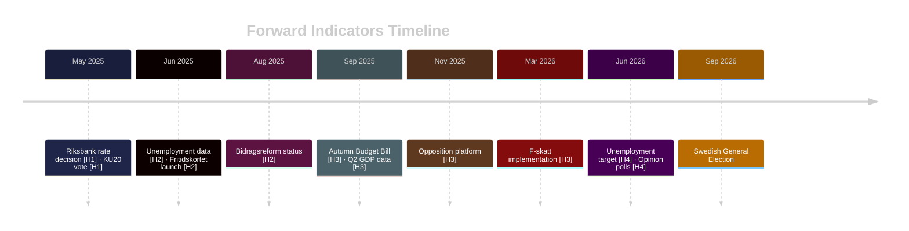

# Forward Indicators — Committee Reports 28 April 2026

**Author**: James Pether Sörling | **Date**: 2026-04-28 | **Confidence**: MEDIUM [C2]

---

## Indicator Registry (≥10 indicators across 4 horizons)

### Horizon 1: Immediate (0-30 days)

| # | Indicator | Source | Trigger level | Implication |
|---|-----------|--------|--------------|-------------|
| 1 | Riksbank rate decision (May 2025) | Riksbanken | Cut ≥25bp | Validates HC01FiU24 "could cut faster" finding; monetary easing signal |
| 2 | HC01KU20 committee vote outcome | Riksdag | KU adverse finding on minister | Government accountability crisis |
| 3 | US tariff status update | White House / WTO | Tariff rate escalation | HC01FiU20 GDP forecast downgrade required |

### Horizon 2: Near-term (1-3 months)

| # | Indicator | Source | Trigger level | Implication |
|---|-----------|--------|--------------|-------------|
| 4 | Unemployment data release (May-Jun 2025) | SCB | > 8.7% | Opposition "told you so" narrative; government credibility damage |
| 5 | Bidragsreform implementation start date announcement | Försäkringskassan | Delay >30 days | Risk D-1 materialisation; opposition attack surface |
| 6 | HC01SoU29 Fritidskortet pilot launch | Government communication | Launch confirmed vs. delayed | Government delivery narrative |
| 7 | SD parliamentary posture signals | SD press releases | Threat to withdraw support | Coalition stability risk; potential government crisis |

### Horizon 3: Medium-term (3-6 months)

| # | Indicator | Source | Trigger level | Implication |
|---|-----------|--------|--------------|-------------|
| 8 | Autumn Budget Bill (Budgetpropositionen 2025) alignment with HC01FiU20 | Finansdepartementet | Material deviation from spring guidelines | Economic guideline credibility collapse |
| 9 | Q2 2025 GDP growth figure | SCB | < 1.5% | Economic scenario C (tariff shock) activation; increased opposition momentum |
| 10 | Opposition bloc formal policy agreement publication | S/V/C/MP joint statement | Formal coalition document | HC01FiU20 reservation formalises into electoral platform |
| 11 | HC01SkU18 F-skatt reform Skatteverket implementation plan | Skatteverket | On-schedule confirmation | Government delivery credibility for small business segment |

### Horizon 4: Long-term (6-18 months, toward September 2026 election)

| # | Indicator | Source | Trigger level | Implication |
|---|-----------|--------|--------------|-------------|
| 12 | June 2026 unemployment rate | SCB | < 8.4% | Government achieves HC01FiU20 target; economic competence narrative restored |
| 13 | June 2026 opinion polls (M vs. S gap) | SVT/SR aggregate | M < 16% or S > 32% | Electoral scenario B (S-led government) becomes high-probability |
| 14 | International credit rating outlook | Moody's/S&P | Negative outlook | Fiscal framework credibility question; government vulnerability |

## Monitoring Protocol

- **Daily**: US tariff news (Reuters/Bloomberg Scandinavia)
- **Weekly**: Riksdag activity (riksdagen.se), SD parliamentary communications
- **Monthly**: SCB unemployment releases, Riksbank minutes
- **Quarterly**: GDP preliminary figures, Budget Bill alignment checks

---

