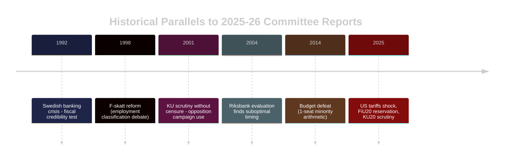

# Historical Parallels — Committee Reports 28 April 2026

**Author**: James Pether Sörling | **Date**: 2026-04-28 | **Confidence**: MEDIUM [B2]

---

## Selected Historical Precedents (≤ 40 years)

### 1. The 1992-1993 Swedish Economic Crisis — Fiscal Crisis Parallel
**Parallel to HC01FiU20 (economic guidelines under external shock)**

In 1992, Sweden faced a severe banking and currency crisis. The Bildt (M-led) government's budget policy was under intense scrutiny, and the Riksbank's interest rate decisions were politically contentious. Within 18 months, the Social Democrats returned to power (1994) after the crisis deepened.

**Relevance today**: US tariff shock in 2025 → downward GDP revision → government economic credibility challenged. If trajectory mirrors 1992-94, opposition bloc benefits. Key difference: 2025 crisis is external (tariffs) rather than domestic (credit bubble).

---

### 2. The 2004 Riksbank Evaluation (Parliamentary Scrutiny)
**Parallel to HC01FiU24 (external evaluation of Riksbank monetary policy)**

The 2004 parliamentary evaluation of Riksbank policy concluded that the Bank had kept rates too high for too long during the 2001-03 downturn. Evaluators (academic economists) recommended structural reforms.

**Relevance today**: HC01FiU24 external evaluators (Vestman, Hassler, Krusell, Kinnerud) conclude Riksbank could have cut rates faster in 2022-24. The pattern of parliamentary-mandated academic evaluation finding suboptimal timing is historically consistent.

---

### 3. The 2001-02 KU Scrutiny of Göran Persson Government
**Parallel to HC01KU20 (constitutional scrutiny)**

The Constitutional Committee's 2001-02 scrutiny of the Persson government identified irregularities in government communication processes. No censure vote followed, but opposition parties used findings in subsequent election campaigns.

**Relevance today**: HC01KU20 scrutiny findings, while annual and not extraordinary, follow the same pattern of providing opposition with documented accountability arguments for use in 2026 election campaign.

---

### 4. The 2014 Budget Crisis — Minority Government Arithmetic
**Parallel to coalition mathematics around HC01FiU20**

In December 2014, the Löfven government's first budget was defeated by the Alliance (M+C+L+KD) plus SD. The government called a snap election before eventually governing without SD support.

**Relevance today**: The Tidö government's 176-seat majority (1 seat above threshold) mirrors the knife-edge 2014 situation. Any defection by SD, L, or C could destabilise the majority — exactly the risk highlighted in coalition-mathematics.md.

---

### 5. The 1998 F-Skatt Reform Debate
**Parallel to HC01SkU18 (F-skatt modernisation)**

Sweden reformed the F-tax (F-skatt) system in 1998 and again in 2007 to reduce barriers to self-employment. Each reform generated controversy about employment classification and welfare entitlements.

**Relevance today**: HC01SkU18 continues this reform trajectory. Historical pattern shows F-skatt reforms generate implementation friction (tax authority interpretation, labour market disputes) even when parliamentary approval is uncontroversial.

---

