# Implementation Feasibility — Committee Reports 28 April 2026

**Author**: James Pether Sörling | **Date**: 2026-04-28 | **Confidence**: MEDIUM [B2]

---

## Feasibility Assessment Matrix

| Document | Policy | Delivery risk | Timeline | Key agency | Risk level |
|----------|--------|--------------|----------|-----------|-----------|
| HC01FiU20 | Economic guidelines 2025 | Parliamentary budget risk | Jan-Dec 2025 | Finansdepartementet | MEDIUM |
| HC01FiU20 | Bidragsreform | Implementation complexity | 2025-26 | Försäkringskassan | HIGH |
| HC01FiU24 | Riksbank framework | Institutional inertia | 2025 review | Riksbanken | LOW |
| HC01SoU29 | Fritidskortet | System design / fraud risk | Q3 2025 launch | SoU / municipalities | MEDIUM |
| HC01SkU18 | F-skatt modernisation | Tax authority capacity | Q1-Q2 2026 | Skatteverket | LOW-MEDIUM |
| HC01KU20 | Constitutional scrutiny | Annual process | Spring 2025 cycle | KU committee | LOW |

## Statskontoret Risk Row (Agency Assessment)

*Note: No Statskontoret cache available in this session (30-day TTL not yet populated for the agencies listed). Risk assessment is based on structural analysis.*

| Agency | Role in implementation | Capacity concern |
|--------|----------------------|-----------------|
| Försäkringskassan | Bidragsreform administration | HIGH — previous reform backlogs noted |
| Skatteverket | F-skatt registration | MEDIUM — digital services capacity improving |
| Municipalities | Fritidskortet distribution | MEDIUM — implementation variation between municipalities |

## Key Delivery Risks

### Risk D-1: Bidragsreform Complexity (HIGH)
- **Nature**: Tighter work requirements require significant IT system changes at Försäkringskassan
- **Timeline risk**: Q2 2025 target may slip to Q4 2025 or Q1 2026
- **Electoral risk**: If implementation fails or causes errors, political liability for government peaks pre-election

### Risk D-2: Economic Guideline Execution (MEDIUM)
- **Nature**: HC01FiU20 assumes specific macro conditions that may not materialise (tariff stability)
- **Timeline risk**: Autumn 2025 Budget Bill (Budgetpropositionen) must align with Spring Bill adjustments
- **Mitigation**: Government has flexibility in spending allocation without parliamentary re-approval

### Risk D-3: Fritidskortet Administration (MEDIUM)
- **Nature**: Municipal variation in implementation; digital platform development timeline
- **Timeline risk**: Q3 2025 launch ambitious given procurement requirements
- **Mitigation**: Phased rollout possible; pilot municipalities already identified

### Risk D-4: F-Skatt Digital Integration (LOW-MEDIUM)
- **Nature**: Skatteverket API changes required for HC01SkU18 reformed categories
- **Timeline risk**: Minor; Skatteverket has delivered comparable reforms on schedule previously

## Dependency Map

```mermaid
%%{init: {'theme': 'dark', 'themeVariables': {'primaryColor': '#1a1e3d', 'primaryTextColor': '#e0e0e0', 'primaryBorderColor': '#00d9ff'}}}%%
flowchart TD
    A[HC01FiU20 Economic Guidelines] --> B[Autumn Budget 2025]
    B --> C[Bidragsreform Implementation]
    C --> D[Försäkringskassan IT]
    A --> E[HC01SoU29 Fritidskortet]
    E --> F[Municipal rollout]
    A --> G[HC01SkU18 F-skatt]
    G --> H[Skatteverket API]
    style A fill:#1a1e3d,stroke:#00d9ff
    style C fill:#1a1e3d,stroke:#ff006e
    style D fill:#0a0e27,stroke:#ff006e
```

