```mermaid
%%{init: {'theme': 'dark', 'themeVariables': {'primaryColor': '#1a1e3d', 'primaryTextColor': '#e0e0e0', 'primaryBorderColor': '#00d9ff'}}}%%
graph TD
    KJ1["KJ-1: US Tariffs<br/>PRIMARY RISK<br/>Confidence: HIGH"] --> EC["Economic Trajectory"]
    KJ2["KJ-2: Riksbank Vindicated<br/>Sub-optimal speed<br/>Confidence: HIGH"] --> MP["Monetary Stability"]
    KJ3["KJ-3: Opposition Unity<br/>2026 formation signal<br/>Confidence: MEDIUM"] --> PO["Political Landscape"]
    KJ4["KJ-4: KU20 Liability<br/>Uncertainty variable<br/>Confidence: MEDIUM"] --> PO
    KJ5["KJ-5: Social Cohesion<br/>Insufficient for stability<br/>Confidence: MED-LOW"] --> EC
    EC --> ELECT["2026 Election Outcome"]
    MP --> ELECT
    PO --> ELECT
    style KJ1 fill:#0a0e27,stroke:#ff006e
    style KJ2 fill:#0a0e27,stroke:#00d9ff
    style KJ3 fill:#1a1e3d,stroke:#ffbe0b
    style KJ4 fill:#1a1e3d,stroke:#ffbe0b
    style KJ5 fill:#1a1e3d,stroke:#00d9ff
    style ELECT fill:#0a0e27,stroke:#ffbe0b
```

# Intelligence Assessment — Committee Reports 28 April 2026

**Author**: James Pether Sörling | **Date**: 2026-04-28 | **Confidence**: HIGH [B2]

---

## Key Judgments

### Key Judgment KJ-1: US Tariff Shock Is the Primary Economic Risk Driver

**Confidence: HIGH** — We judge with HIGH confidence that US tariff escalation is the primary external threat to Sweden's economic trajectory in 2025-2026. HC01FiU20 explicitly attributes GDP forecast downward revision to US tariff imposition ("Sedan den ekonomiska vårpropositionen lämnades har USA infört höjda tullar"). The 1.9% GDP projection for 2025 assumes tariff stabilisation — any escalation beyond current levels creates immediate downside risk. IMF WEO Apr-2026 confirms this external dependency (NGDP_RPCH SWE). [HC01FiU20, A2; IMF WEO Apr-2026]

### Key Judgment KJ-2: Riksbank's 2024 Monetary Policy Was Broadly Successful but Sub-Optimally Calibrated

**Confidence: HIGH** — We assess with HIGH confidence that Riksbank achieved its 2% inflation target (KPIF avg 1.9% in 2024) while maintaining long-term inflation expectation anchoring. However, the independent evaluation (Vestman, Hassler, Krusell, Kinnerud — HC01FiU24) concludes that rate cuts could have been executed more rapidly, suggesting sub-optimal speed in the easing cycle. The exchange rate focus noted by evaluators represents a communication risk. This creates legitimate policy debate without undermining Riksbank's institutional credibility. [HC01FiU24, A1]

### Key Judgment KJ-3: Four-Party Opposition Unity Signals 2026 Alternative Government Formation

**Confidence: MEDIUM** — We assess with MEDIUM confidence that the coordinated reservation filing by S, V, C, and MP against HC01FiU20 economic guidelines represents an early signal of alternative government bloc formation for 2026. This cross-ideological alignment (including liberal C and L-adjacent positioning) is unusual and suggests opposition parties are testing a shared economic narrative. The reservation signal will need sustained legislative coordination to translate into a credible 2026 alternative. [HC01FiU20; Admiralty [B3]]

### Key Judgment KJ-4: Constitutional Scrutiny (HC01KU20) Creates Political Liability Variable

**Confidence: MEDIUM** — The Constitutional Committee's annual review (HC01KU20) introduces a material uncertainty variable into government political stability calculations. We cannot confirm findings without full text access, but historical KU scrutiny patterns indicate a 35% probability of finding warranting some form of criticism of ministerial conduct. If adverse findings are published, this compounds economic credibility challenges facing the Kristersson government entering the election cycle. [HC01KU20, C2]

### Key Judgment KJ-5: Sweden's Social Cohesion Investments Are Insufficient for Electoral Stability

**Confidence: MEDIUM-LOW** — Youth leisure card (HC01SoU29) and 10-year primary school (HC01UbU17) represent modest social investments against a backdrop of rising unemployment and welfare reform restriction. These policies, while positive, are unlikely to neutralise the bidragsreform political liability for the government's 2026 election campaign. [HC01SoU29, HC01UbU17, B3]

---

## Priority Intelligence Requirements (PIRs)

**PIR-1**: What are the specific KU20 (HC01KU20) findings on ministerial conduct — do they reach the threshold for formal censure?
- **Status**: Open — full KU20 findings not yet available in this analysis
- **Next collection opportunity**: KU press conference + plenary debate

**PIR-2**: Will GDP 2025 achieve the 1.9% target per HC01FiU20 amid US tariff uncertainty?
- **Status**: Open — Q3 2025 data is the key decision point
- **Confidence**: MEDIUM

**PIR-3**: Will S+V+C+MP convert FiU20 reservation into a coordinated 2026 fiscal programme?
- **Status**: Open — early signal only
- **Confidence**: MEDIUM-LOW

**PIR-4**: Will Riksbank accelerate rate cuts in H2 2025 beyond the path implied by FiU24?
- **Status**: Open — next Riksbank monetary policy meeting is key trigger
- **Confidence**: MEDIUM

## Key Assumptions Check

- We assume US tariff policy does not escalate beyond June 2025 levels — HIGH assumption dependence
- We assume KU20 scrutiny follows standard parliamentary procedures — MEDIUM confidence
- We assume Tidö coalition remains intact through the 2025-2026 budget cycle — MEDIUM confidence

---

