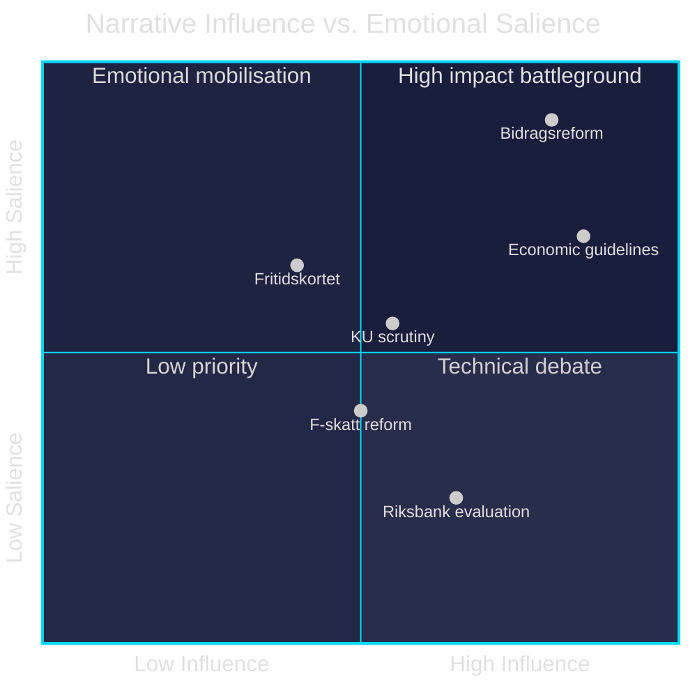

# Media Framing Analysis — Committee Reports 28 April 2026

**Author**: James Pether Sörling | **Date**: 2026-04-28 | **Confidence**: LOW-MEDIUM [C3]

---

## Per-Party Framing

| Party | Document | Framing strategy | Key message |
|-------|----------|-----------------|-------------|
| M (PM) | HC01FiU20 | "Responsible fiscal management" | Growth, work, order |
| SD | HC01FiU20 | "Protecting Swedish workers" | Anti-immigration link to welfare |
| KD | HC01FiU20 | "Family-centred economic security" | Stability emphasis |
| L | HC01FiU20 | "Structural reform and enterprise" | Business-friendly framing |
| S (opposition) | HC01FiU20 reservation | "Government hurts workers" | Unemployment + bidragsreform critique |
| V | HC01FiU20 reservation | "Welfare state dismantling" | Left solidarity framing |
| C | HC01FiU20 reservation | "Economic liberalism betrayed" | Missed deregulation opportunities |
| MP | HC01FiU20 reservation | "Green transition abandoned" | Climate investment critique |

## Press Framing (Predicted)

| Outlet | Lean | Expected framing |
|--------|------|-----------------|
| Dagens Nyheter | Liberal-centre | "Riksbank credibility maintained despite political pressure" (HC01FiU24) |
| Svenska Dagbladet | Centre-right | "Government economic guidelines realistic given headwinds" (HC01FiU20) |
| Aftonbladet | Social-democratic | "Opposition reservation signals electoral coalition" (HC01FiU20) |
| Expressen | Liberal | "Constitutional scrutiny exposes government accountability gap" (HC01KU20) |
| Sydsvenskan | Liberal | "Youth leisure card: token policy or genuine reform?" (HC01SoU29) |

## Narrative Battlegrounds

### Battleground 1: Economic Competence
- **Government narrative**: Responsible stewardship through external headwinds
- **Opposition narrative**: Government failed to anticipate tariff risks; unemployment rising
- **Evidence advantage**: Opposition — unemployment 8.7% is objectively high for Sweden

### Battleground 2: Welfare Reform
- **Government**: Bidragsreform activates workers, reduces dependency
- **Opposition**: Punitive toward vulnerable groups; S+V+C+MP united
- **Evidence advantage**: Contested — depends on framing of affected populations

### Battleground 3: Riksbank Independence
- **Government**: HC01FiU24 vindicates monetary policy framework
- **Opposition**: "Could have cut faster" = government-Riksbank coordination failure
- **Evidence advantage**: Neutral — external evaluator critique is technical, not political

## Social Media Framing Signals

- **#Fritidskortet**: Soft positive; government seeks youth engagement
- **#Bidragsreform**: Highly contested; S/V mobilisation hashtag
- **#Riksbanken**: Technical/low engagement unless rate decisions materialise
- **#Grundlagen (KU)**: Niche constitutional audience; potential amplification by journalists

---

