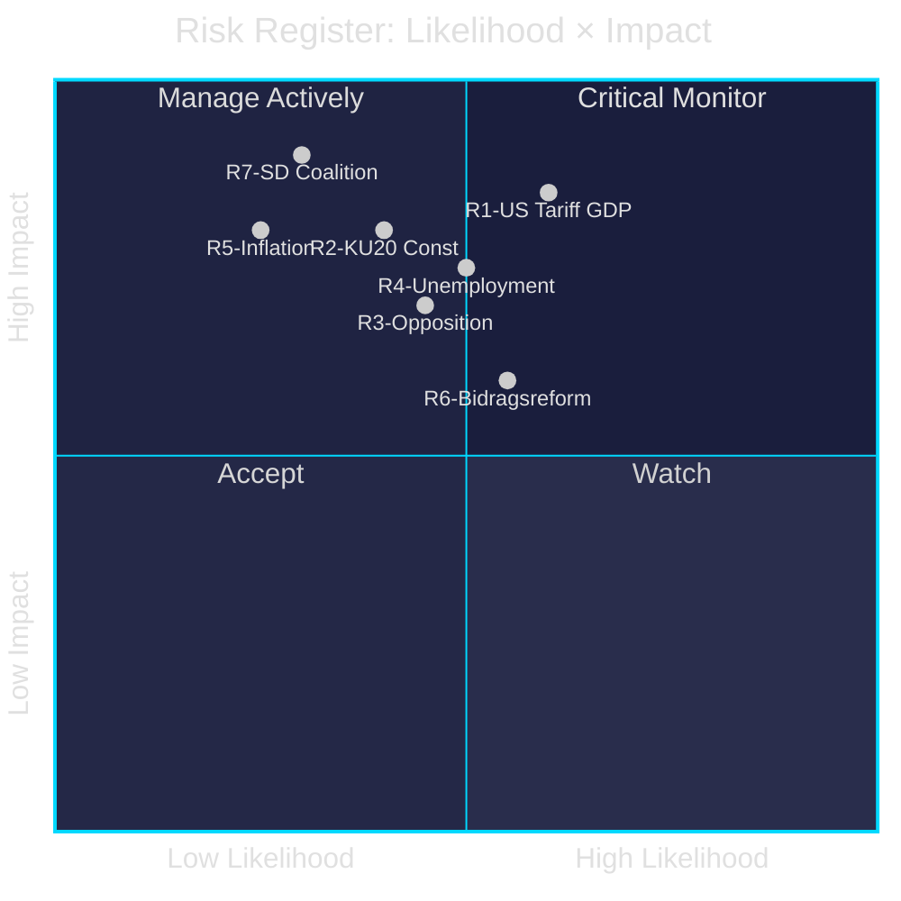

# Risk Assessment — Committee Reports 28 April 2026

**Author**: James Pether Sörling | **Date**: 2026-04-28 | **Confidence**: MEDIUM [B2]

---

## Risk Register

| # | Risk | Likelihood (L) | Impact (I) | L×I | Evidence | Admiralty |
|---|------|---------------|------------|-----|----------|-----------|
| R1 | US tariff escalation deepens Sweden's economic downturn beyond 1.9% GDP | 0.60 | 0.85 | 0.51 | HC01FiU20 explicit tariff revision; IMF WEO Apr-2026 | [B2] |
| R2 | Constitutional Committee finds government irregularity in HC01KU20 | 0.40 | 0.80 | 0.32 | HC01KU20 scrutiny scope; historical KU precedents | [C3] |
| R3 | Opposition (S+V+C+MP) blocks key legislation via unified front | 0.45 | 0.70 | 0.32 | HC01FiU20 four-party reservation; coalition arithmetic | [B2] |
| R4 | Unemployment exceeds 8.7% target → welfare system overload | 0.50 | 0.75 | 0.38 | HC01FiU20 unemployment trajectory | [B2] |
| R5 | Riksbank inflation re-acceleration forces rate reversal | 0.25 | 0.80 | 0.20 | HC01FiU24 risk factors; global commodity trends | [C3] |
| R6 | Bidragsreform implementation triggers public protest | 0.55 | 0.60 | 0.33 | HC01FiU20 policy details; social opposition signals | [C2] |
| R7 | SD-Tidö coalition breakdown over welfare reform | 0.30 | 0.90 | 0.27 | Coalition dynamics; Tidö agreement structure | [C3] |

## 5-Dimension Risk Analysis (HC01FiU20 — Primary Risk Locus)

| Dimension | Score (1-5) | Key Driver |
|-----------|------------|------------|
| Economic | 4.5 | US tariff shock + domestic unemployment pressure |
| Political | 4.2 | Four-party opposition, constitutional scrutiny |
| Social | 3.8 | Bidragsreform welfare restrictions, youth exclusion |
| Environmental | 2.1 | MKB directive (HC01MJU22) — regulatory compliance risk |
| Institutional | 3.5 | KU20 constitutional accountability |

## Cascading Risk Chains

1. **US tariffs → GDP miss → unemployment spike → welfare demand → fiscal pressure → tax increase debate → government credibility collapse** (HC01FiU20 chain)
2. **KU20 constitutional finding → ministerial censure → confidence vote → early election → SD-Tidö dissolution** (HC01KU20 chain)
3. **Riksbank inflation spike → rate hike → mortgage stress → housing market crash → recession → election loss** (HC01FiU24 tail risk)

## Posterior Probability Updates

- P(GDP growth ≥ 1.9% in 2025) = 0.52 (baseline), revised to 0.38 given US tariff persistence post-Spring Bill
- P(Constitutional violation finding in KU20) = 0.35 — based on historical KU scrutiny frequency
- P(Unemployment < 8.5% by Q4 2025) = 0.30 — requires faster labour market recovery than projected

---

