```mermaid
%%{init: {'theme': 'dark', 'themeVariables': {'primaryColor': '#1a1e3d', 'primaryTextColor': '#e0e0e0', 'primaryBorderColor': '#00d9ff'}}}%%
graph LR
    BASE["📊 HC01FiU20 Baseline<br/>GDP 1.9%, UE 8.7%"] --> SA["Scenario A<br/>Measured Recovery<br/>45%"]
    BASE --> SB["Scenario B<br/>Prolonged Stagnation<br/>38%"]
    BASE --> SC["Scenario C<br/>Constitutional Crisis<br/>17%"]
    SA --> ELEC_A["🗳️ 2026: Competitive<br/>election"]
    SB --> ELEC_B["🗳️ 2026: Government<br/>defeat risk"]
    SC --> ELEC_C["🗳️ Early election<br/>possible"]
    style BASE fill:#1a1e3d,stroke:#ffbe0b
    style SA fill:#0a0e27,stroke:#00d9ff
    style SB fill:#0a0e27,stroke:#ffbe0b
    style SC fill:#0a0e27,stroke:#ff006e
    style ELEC_A fill:#1a1e3d,stroke:#00d9ff
    style ELEC_B fill:#1a1e3d,stroke:#ffbe0b
    style ELEC_C fill:#1a1e3d,stroke:#ff006e
```

# Scenario Analysis — Committee Reports 28 April 2026

**Author**: James Pether Sörling | **Date**: 2026-04-28 | **Confidence**: MEDIUM [C2]

---

## Scenario Framework

Based on HC01FiU20, HC01FiU24, and HC01KU20 evidence. Three primary scenarios assessed for Sweden 2025-2026 political-economic trajectory.

---

## Scenario A: Measured Recovery (Most Likely) — Probability 45%

**Trigger**: US tariffs remain but stabilise; Sweden's export sector adjusts; GDP achieves 1.9-2.0% in 2025, 2.3% in 2026 as projected in HC01FiU20.

**Economic path**: 
- Riksbank continues gradual rate cuts through H2 2025 (HC01FiU24 trajectory)
- Unemployment peaks at 8.7% in 2025, declines to 8.4% in 2026 per FiU20 baseline
- KPIF remains at/below 2% — no inflation resurgence

**Political implications**:
- Tidö government claims economic vindication entering 2026 election cycle
- FiU20 approval seen as legitimate governance, despite opposition reservations
- KU20 scrutiny produces findings but no major constitutional crisis
- 2026 election: competitive but government has credible economic record

**Leading indicator**: SEK/EUR exchange rate stability; Q3 2025 GDP flash estimate ≥ 0.5% QoQ.

---

## Scenario B: Prolonged Stagnation (Second Most Likely) — Probability 38%

**Trigger**: US tariffs escalate further (or broaden to EU); Swedish export sector contracts; GDP 2025 misses 1.9% target, unemployment exceeds 9%.

**Economic path**:
- Government forced to revise HC01FiU20 projections downward mid-year
- Riksbank faces dilemma: cut rates faster (SEK weakness risk) vs. hold (prolonging stagnation)
- Business investment falls; consumer confidence weakens
- Bidragsreform implementation faces political resistance with rising unemployment

**Political implications**:
- Opposition S+V bloc gains in polls; S-led alternative government scenario strengthens
- C+L exit from Tidö support possible if welfare reform causes social unrest
- KU20 adverse findings compound government credibility crisis
- 2026 election: high risk of government defeat

**Leading indicator**: SCB Q2 2025 employment statistics; US tariff policy announcements (Riksdag chamber vote HC01FiU20 June 17).

---

## Scenario C: Constitutional Crisis (Least Likely) — Probability 17%

**Trigger**: KU20 scrutiny reveals significant constitutional irregularity; minister(s) face formal censure; no-confidence motion filed.

**Political path**:
- HC01KU20 finding triggers constitutional censure proceedings
- SD withdraws support from specific policy area; Tidö government narrowed majority
- Early election debate intensifies; cross-party investigation demands
- Riksdag speaker convenes extraordinary session

**Economic implications**:
- Political uncertainty spills over to SEK depreciation
- Investment paralysis; business confidence shock
- Riksbank monitors FX volatility; potential emergency communication needed

**Leading indicator**: KU20 press conference language; ministerial resignation signals; opposition no-confidence motion filing.

---

## Probabilities Sum Check: 45% + 38% + 17% = 100% ✅

## Leading Indicators Summary

| Scenario | Key Trigger Date | Observable Signal |
|----------|-----------------|-------------------|
| A: Measured Recovery | Q3 2025 GDP data | GDP QoQ ≥ 0.5%; SEK stable |
| B: Stagnation | US tariff announcement June-September 2025 | New tariff tiers on EU/Nordic goods |
| C: Constitutional Crisis | KU20 press conference | Minister resignation or censure motion |

---

