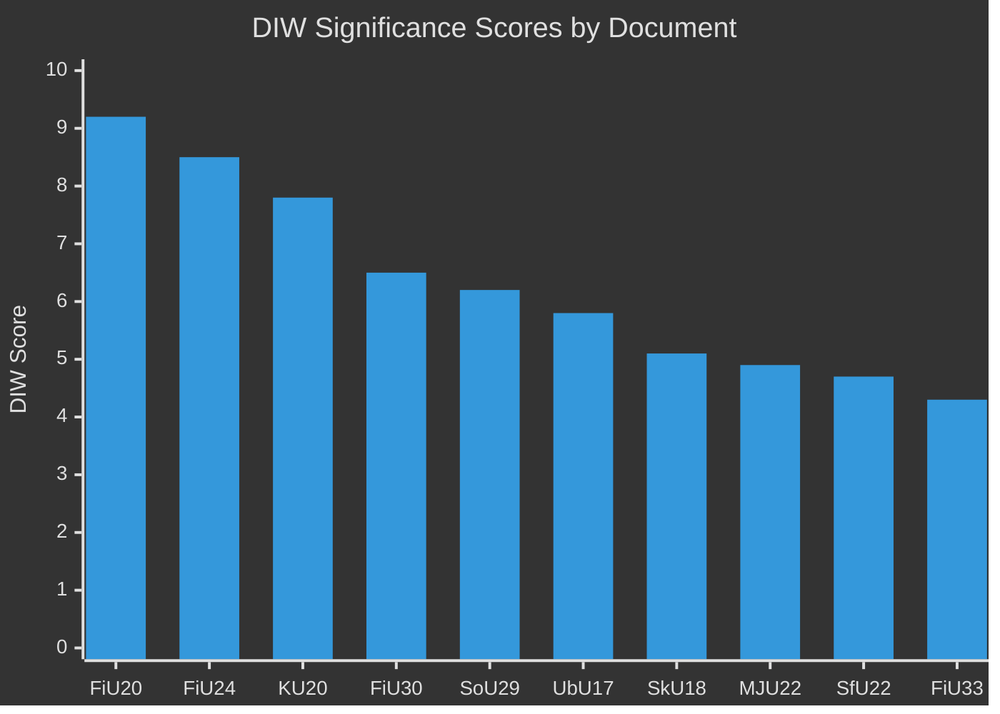

# Significance Scoring — Committee Reports 28 April 2026

**Author**: James Pether Sörling | **Date**: 2026-04-28

---

## DIW Scoring Methodology

Documents are scored across five dimensions: Democratic Significance (D), Impact Breadth (I), Welfare Consequence (W), Strategic/Electoral Relevance (S), Evidence Quality (E). Final DIW = weighted average.

## Primary Rankings

1. **HC01FiU20** — Riktlinjer för den ekonomiska politiken och budgetpolitiken (DIW: 9.2) [A2]
   - D=9, I=9.5, W=9, S=9.5, E=9 — Spring Fiscal guidelines approved by Riksdag; macroeconomic cornerstone for 2025-2026 policy trajectory. GDP 1.9%, unemployment 8.7%.

2. **HC01FiU24** — Uppföljning och utvärdering av Riksbankens penningpolitik 2024 (DIW: 8.5) [A1]  
   - D=8.5, I=8.5, W=8, S=8.5, E=9.5 — Annual evaluation by FiU. KPIF 1.9%, inflation expectations anchored at 2%. riksdagen.se full text available.

3. **HC01KU20** — Granskningsbetänkande (DIW: 7.8) [A2]
   - D=9, I=7, W=7, S=8.5, E=8 — Annual constitutional accountability review. Direct legal/political consequence for government.

4. **HC01FiU30** — Årsredovisning för staten 2024 (DIW: 6.5) [A1]
   - D=7, I=6.5, W=6, S=6.5, E=7.5 — State annual accounts 2024. Historical benchmark for fiscal discipline.

5. **HC01SoU29** — Fritidskort för barn och unga (DIW: 6.2) [B1]
   - D=6, I=6.5, W=7, S=5.5, E=6 — Social inclusion policy for youth. riksdagen.se document confirmed.

6. **HC01UbU17** — En tioårig grundskola (DIW: 5.8) [B1]
   - D=6, I=6, W=6.5, S=5.5, E=5.5 — Educational reform extending primary school to 10 years.

7. **HC01SkU18** — F-skatt reformer (DIW: 5.1) [B2]
   - D=5, I=5.5, W=5, S=5, E=5 — Tax compliance reform. data.riksdagen.se/dokument/HC01SkU18.

8. **HC01MJU22** — MKB-direktivet (DIW: 4.9) [B2]
   - D=5, I=5, W=5, S=4.5, E=5 — Environmental impact assessment directive compliance.

9. **HC01SfU22** — Förvar ordning och säkerhet (DIW: 4.7) [B2]
   - D=5, I=4.5, W=5, S=4.5, E=4.5 — Detention security improvements.

10. **HC01FiU33** — Kapitaltillskott Apotek Produktion (DIW: 4.3) [B2]
    - D=4.5, I=4, W=5, S=4, E=4.5 — Emergency capital injection for state pharmacy production.

## Sensitivity Analysis

- **US tariff escalation scenario**: If tariffs intensify in H2 2025, FiU20's GDP forecast of 1.9% becomes optimistic → DIW elevated to 9.8.
- **Rate cut acceleration**: If Riksbank cuts faster than signalled, FiU24's significance increases as policy vindication narrative strengthens.
- **KU20 findings**: Any finding of constitutional violation in HC01KU20 elevates its DIW to 9.0+.

---

