```mermaid
%%{init: {'theme': 'dark', 'themeVariables': {'primaryColor': '#1a1e3d', 'primaryTextColor': '#e0e0e0', 'primaryBorderColor': '#00d9ff'}}}%%
graph TD
    FIU["💰 Finance Committee FiU<br/>HC01FiU20 / FiU24"]
    GOV["🏛️ Government<br/>M+SD+KD+L"]
    OPP["🗳️ Opposition<br/>S+V+C+MP"]
    RB["🏦 Riksbanken"]
    KU["⚖️ KU20 Scrutiny"]
    INT["🌐 International<br/>US Tariffs / IMF"]
    CS["👥 Civil Society<br/>LO/TCO/Youth"]
    FIU --> GOV
    FIU --> OPP
    FIU --> RB
    KU --> GOV
    INT --> FIU
    CS --> OPP
    style FIU fill:#1a1e3d,stroke:#ffbe0b
    style GOV fill:#0a0e27,stroke:#00d9ff
    style OPP fill:#0a0e27,stroke:#ff006e
    style RB fill:#1a1e3d,stroke:#00d9ff
    style KU fill:#0a0e27,stroke:#ffbe0b
    style INT fill:#1a1e3d,stroke:#ff006e
    style CS fill:#0a0e27,stroke:#00d9ff
```

# Stakeholder Perspectives — Committee Reports 28 April 2026

**Author**: James Pether Sörling | **Date**: 2026-04-28 | **Confidence**: MEDIUM [B2]

---

## 6-Lens Stakeholder Matrix

### 1. Governing Coalition (Tidö: M, SD, KD, L)

| Actor | Role | Position | Influence | Source |
|-------|------|----------|-----------|--------|
| Moderaterna (M) | Prime minister's party | Strongly supports FiU20 guidelines; frames as necessary economic reform | Very High | HC01FiU20 |
| Sverigedemokraterna (SD) | External support | Supports government on economic guidelines; scrutinises social spending | High | Tidö agreement |
| Kristdemokraterna (KD) | Coalition partner | Supports FiU20; emphasises family values in SoU29 | Medium | HC01SoU29 |
| Liberalerna (L) | Coalition partner | Supports FiU20; files separate reservation on education aspects | Medium | HC01UbU17 |

### 2. Parliamentary Opposition

| Actor | Role | Position | Influence | Source |
|-------|------|----------|-----------|--------|
| Socialdemokraterna (S) | Largest opposition | Reservations on HC01FiU20 — critique of austerity tilt; supports youth card | High | HC01FiU20 reservations |
| Vänsterpartiet (V) | Left opposition | Strong reservation on bidragsreform; criticises monetary policy vindication | Medium | HC01FiU20, HC01FiU24 |
| Centerpartiet (C) | Liberal opposition | Reservation on FiU20; concerns about growth strategy | Medium | HC01FiU20 |
| Miljöpartiet (MP) | Green opposition | Reservation on FiU20; critique of insufficient green transition investment | Medium | HC01FiU20 |

### 3. Independent Institutions

| Actor | Role | Position | Influence | Source |
|-------|------|----------|-----------|--------|
| Riksbanken | Central bank | Monetary policy vindicated by FiU24; independent from government | Very High | HC01FiU24 |
| Riksrevisionen | National Audit Office | Annual state accounts reviewed; FiU30 accountability | High | HC01FiU30 |
| KU (Konstitutionsutskottet) | Constitutional oversight | Conducts annual scrutiny (HC01KU20) — non-partisan formal role | Very High | HC01KU20 |
| Ekonomistyrningsverket (ESV) | Budget oversight | Involved in fiscal framework assessment | Medium | HC01FiU20 |

### 4. Civil Society & Affected Groups

| Actor | Concern | Position | Source |
|-------|---------|----------|--------|
| LO (labour union) | Bidragsreform activation requirements | Strongly opposed | HC01FiU20 |
| TCO | Welfare cap (bidragstak) | Concerned | HC01FiU20 |
| Youth organisations | Fritidskort (HC01SoU29) | Supportive | HC01SoU29 |
| Self-employed (egenanställda) | F-tax reforms (HC01SkU18) | Concerned about stricter rules | HC01SkU18 |
| Environmental NGOs | MKB directive (HC01MJU22) | Mixed — improved process but concerns about speed | HC01MJU22 |

### 5. Riksbank External Evaluators (FiU24)

Professor Roine Vestman (Stockholm University), John Hassler (IIES), Per Krusell (IIES), and Karin Kinnerud authored the evaluation cited in HC01FiU24. Their finding that "Riksbanken fäste stor vikt vid räntans effekt på växelkursen, något som de menar har svag evidens" creates academic pressure on future Riksbank communication strategy.

### 6. International Economic Actors

| Actor | Relevance | Impact |
|-------|-----------|--------|
| US trade policy (Trump administration) | Direct cause of GDP revision per HC01FiU20 | External constraint on Swedish fiscal space |
| EU Commission | MKB/EIA directive compliance (HC01MJU22) | Regulatory compliance driver |
| IMF | WEO projections (SWE GDP 1.9%) | External validation of government forecasts |
| Nordic peers (DNK, NOR, FIN) | Comparative context | Benchmark for policy effectiveness |

## Influence Network Summary

The FiU20 decision creates a hub-and-spoke influence structure: **Finance Committee** (FiU) at the centre, with spokes to government (M+SD+KD+L), opposition bloc (S+V+C+MP), Riksbank, external evaluators, and international economic actors. KU20 creates a separate accountability spoke directed at the executive branch.

---

