```mermaid
%%{init: {'theme': 'dark', 'themeVariables': {'primaryColor': '#1a1e3d', 'primaryTextColor': '#e0e0e0', 'primaryBorderColor': '#00d9ff', 'lineColor': '#ff006e'}}}%%
graph LR
    S1["✅ Inflation anchored<br/>[HC01FiU24]"] --> GO["📈 Growth 2.3%<br/>2026 opportunity"]
    S2["✅ 3-pillar programme<br/>[HC01FiU20]"] --> GO
    W1["❌ US tariffs hit<br/>GDP to 1.9%<br/>[HC01FiU20]"] --> TH["⚠️ Prolonged<br/>downturn risk"]
    W2["❌ Unemployment<br/>8.7% 2025"] --> TH
    TH --> EL["🗳️ 2026 Election<br/>Political liability"]
    GO --> EL
    style S1 fill:#1a1e3d,stroke:#00d9ff
    style S2 fill:#1a1e3d,stroke:#00d9ff
    style W1 fill:#1a1e3d,stroke:#ff006e
    style W2 fill:#1a1e3d,stroke:#ff006e
    style GO fill:#0a0e27,stroke:#ffbe0b
    style TH fill:#0a0e27,stroke:#ff006e
    style EL fill:#0a0e27,stroke:#ffbe0b
```

# SWOT Analysis — Committee Reports 28 April 2026

**Author**: James Pether Sörling | **Date**: 2026-04-28 | **Confidence**: MEDIUM-HIGH [B2]

---

### Strengths

Evidence from HC01FiU20 and HC01FiU24 (data.riksdagen.se):

- **Inflation stabilisation**: KPIF reached 1.9% avg 2024, firmly within Riksbank's 2% target corridor — credibility of monetary framework maintained [HC01FiU24, A1]. Long-term inflation expectations anchored at 2% despite prior volatility.
- **Three-pillar economic programme coherent**: Government's 2025 economic strategy (household support, labour market reform, growth investment) demonstrates programmatic coherence and offers a clear electoral narrative [HC01FiU20, A2].
- **F-tax system integrity**: HC01SkU18 tightens F-tax abuse — strengthening the formal employment structure and reducing grey economy risks.
- **Youth social inclusion investment**: HC01SoU29 (fritidskort) signals awareness of social cohesion risks among youth — pre-emptive social policy.
- **State finances sustainable**: FiU30 (Annual State Report 2024) provides transparent fiscal baseline for democratic accountability [HC01FiU30, A1].

### Weaknesses

- **US tariff vulnerability exposed**: HC01FiU20 explicitly states GDP revised downward following US tariff escalation — Sweden's export-heavy economy is structurally exposed (data.riksdagen.se/dokument/HC01FiU20). GDP forecast cut to 1.9% from higher projections.
- **Unemployment trajectory worsening**: 8.7% projected unemployment 2025 (HC01FiU20) — rising joblessness undermines government credibility on economic management.
- **Riksbank could have cut faster**: External evaluators (Vestman, Hassler, Krusell, Kinnerud) in HC01FiU24 conclude rate cuts could have been more aggressive — sub-optimal monetary-fiscal coordination cost.
- **Opposition bloc unified against fiscal priorities**: Four-party reservation coalition (S, V, C, MP) in FiU20 reduces cross-party legitimacy of government's economic programme.
- **Bidragsreform politically toxic**: Three-part welfare reform (bidragstak, qualificering, aktivitetskrav) faces strong social opposition — risk of electoral backlash among welfare recipients.

### Opportunities

- **Growth recovery 2026**: HC01FiU20 projects 2.3% GDP growth for 2026 — if achieved, government claims economic competence ahead of September 2026 elections (data.riksdagen.se/dokument/HC01FiU20).
- **Rate cut dividend**: Riksbank's successful inflation management creates space for further rate cuts in 2025 → mortgage relief for households [HC01FiU24, A1].
- **Educational investment narrative**: UbU17 (tioårig grundskola) positions long-term human capital investment as 2026 electoral appeal.
- **MKB/EIA compliance dividend**: HC01MJU22 improves permit processes — could unlock green infrastructure investment.
- **Cross-party consensus on youth policy**: SoU29 fritidskort has broader support — potential for centrist coalition-building.

### Threats

- **Prolonged US trade war**: If Trump tariffs persist/escalate through 2025-2026, Sweden's 1.9% GDP projection becomes optimistic [HC01FiU20, external] — risk of recession scenario re-emerging.
- **Constitutional accountability explosion**: KU20 scrutiny could reveal government irregularities — if Constitutional Committee finds violations, PM Kristersson faces political crisis [HC01KU20, A2].
- **SD coalition tensions**: Tidö agreement dependency on SD (Sverigedemokraterna) support creates constant political instability risk.
- **Inflation re-acceleration**: Global commodity shocks or SEK depreciation could reverse KPIF trajectory [HC01FiU24 risk factor].
- **Welfare reform protest**: Strong union/civil society opposition to bidragsreform could galvanise S/V electoral coalition.

---

## TOWS Matrix

| | Strengths | Weaknesses |
|--|-----------|------------|
| **Opportunities** | Rate cut dividend + growth recovery 2026 → government claims economic competence (S-O) | Growth 2026 partially offsets unemployment rise; but requires credible labour market reform delivery (W-O) |
| **Threats** | Inflation anchor + fiscal programme provide buffer against trade war disruption (S-T) | US tariff + unemployment + constitutional risk = triple vulnerability ahead of 2026 elections (W-T) |

## Cross-SWOT Signal

The intersection of fiscal policy weakness (HC01FiU20 downward revision), constitutional scrutiny (HC01KU20), and opposition unity creates a **compound threat** for the Tidö government — requiring rapid economic recovery narrative rebuilding for 2026.

---

