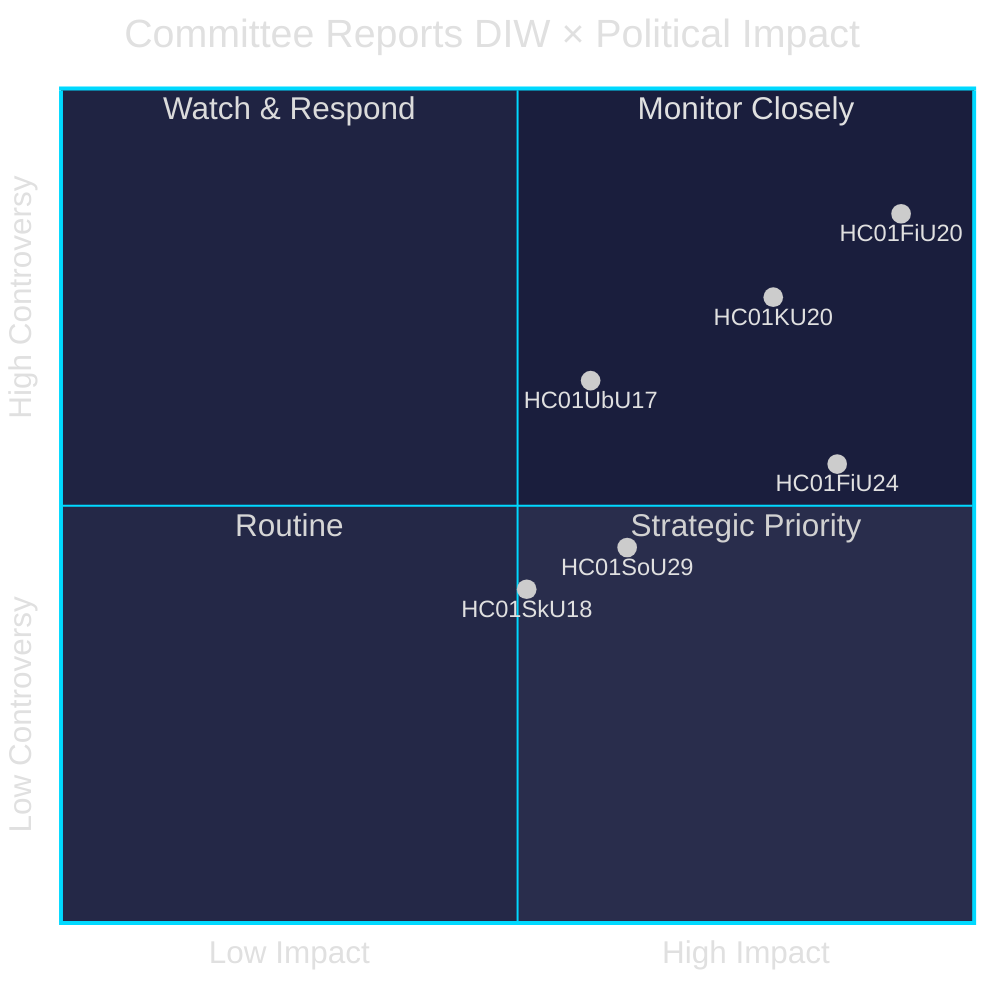

# Synthesis Summary — Committee Reports 28 April 2026

**Author**: James Pether Sörling | **Date**: 2026-04-28 | **Confidence**: HIGH [B2]

---

## Lead Story Decision

The Finance Committee's (FiU) approval of the Spring Fiscal Bill guidelines (HC01FiU20) is the dominant intelligence item: Sweden faces a prolonged downturn exacerbated by US tariff shock, forcing the Tidö government to revise GDP forecasts downward to 1.9% (2025) and project unemployment at 8.7%. The government's three-pillar economic strategy — household support, labour market reform, and growth investments — was contested by four parties (S, V, C, MP). This is the critical economic-political battleground entering the 2026 election year.

## DIW-Weighted Ranking

| Rank | dok_id | Title | DIW Weight | Tier |
|------|--------|-------|------------|------|
| 1 | HC01FiU20 | Economic Policy Guidelines (Spring Bill) | 9.2 | L3 Intelligence-grade |
| 2 | HC01FiU24 | Riksbank Monetary Policy Evaluation 2024 | 8.5 | L3 Intelligence-grade |
| 3 | HC01KU20 | Constitutional Committee Scrutiny Report | 7.8 | L2+ Priority |
| 4 | HC01SoU29 | Youth Leisure Card | 6.2 | L2 Strategic |
| 5 | HC01UbU17 | Ten-Year Primary School Reform | 5.8 | L2 Strategic |
| 6 | HC01SkU18 | F-Tax Approval Reforms | 5.1 | L2 Strategic |
| 7 | HC01MJU22 | EIA Directive Implementation | 4.9 | L1 Surface |
| 8 | HC01SfU22 | Detention Security Improvements | 4.7 | L1 Surface |
| 9 | HC01FiU33 | Supplementary Budget — Apotek | 4.3 | L1 Surface |
| 10 | HC01FiU30 | State Annual Report 2024 | 6.5 | L2 Strategic |

## Integrated Intelligence Picture

The 2024/25 session's final cluster of committee reports reveals three simultaneous pressures on the Tidö government:

**1. External economic shock**: US tariff escalation post-Spring Bill has forced downward GDP revision. The FiU20 committee text explicitly states: "Sedan den ekonomiska vårpropositionen lämnades har USA infört höjda tullar. Det har medfört att regeringen reviderat ned prognosen för BNP." This external variable weakens government claims of economic stewardship competence ahead of 2026.

**2. Monetary policy vindication with asterisk**: FiU24 endorses Riksbank's 2024 performance — KPIF fell from above-target to 1.9% — but external evaluators (Vestman, Hassler, Krusell, Kinnerud) found Riksbank could have cut rates faster. This nuance creates opposition ammunition about suboptimal monetary-fiscal coordination.

**3. Constitutional accountability pressures**: KU20's annual scrutiny puts government decision-making under formal legal and constitutional review. The outcomes determine which ministerial decisions generate political liability.

## Key Analytical Observations

- **Opposition coordination**: S, V, C, and MP filed joint reservations in FiU20 — rare cross-ideological convergence suggesting a broad alternative fiscal coalition for 2026.
- **Bidragsreform three-part**: The welfare benefit reform (bidragstak, successiv kvalificering, aktivitetskrav) is the most controversial single policy item — directly affecting vulnerable populations.
- **F-tax reforms** (HC01SkU18) represent a supply-side tightening targeting abuse of self-employment tax status — fiscally prudent but potentially chilling for gig economy.
- **Youth Leisure Card** (HC01SoU29): Social inclusion investment — signals government recognition of youth social exclusion risk but has fiscal cost implications.

---

