```mermaid
%%{init: {'theme': 'dark', 'themeVariables': {'primaryColor': '#1a1e3d', 'primaryTextColor': '#e0e0e0', 'primaryBorderColor': '#ff006e'}}}%%
graph TD
    EXT["🌍 External: US Tariffs<br/>[HC01FiU20]"] --> GDP["📉 GDP revised to 1.9%"]
    GDP --> UE["📊 Unemployment 8.7%"]
    KU["⚖️ KU20 Scrutiny<br/>[HC01KU20]"] --> CON["⚠️ Constitutional liability"]
    OPP["🗳️ 4-Party Opposition<br/>[HC01FiU20]"] --> BLOC["🚧 Legislative blockade risk"]
    UE --> CRED["📉 Government credibility risk"]
    CON --> CRED
    BLOC --> CRED
    CRED --> ELECT["🗳️ 2026 Election exposure"]
    style EXT fill:#0a0e27,stroke:#ff006e
    style GDP fill:#1a1e3d,stroke:#ff006e
    style UE fill:#1a1e3d,stroke:#ff006e
    style KU fill:#0a0e27,stroke:#ffbe0b
    style CON fill:#1a1e3d,stroke:#ffbe0b
    style OPP fill:#0a0e27,stroke:#00d9ff
    style BLOC fill:#1a1e3d,stroke:#00d9ff
    style CRED fill:#0a0e27,stroke:#ff006e
    style ELECT fill:#1a1e3d,stroke:#ff006e
```

# Threat Analysis — Committee Reports 28 April 2026

**Author**: James Pether Sörling | **Date**: 2026-04-28 | **Confidence**: MEDIUM [C2]

---

## Political Threat Taxonomy

### Tier 1 — Institutional/Democratic Threats

**T1.1 Constitutional Accountability Crisis (HC01KU20)**
- **Nature**: Annual scrutiny by KU (Konstitutionsutskottet) into government decision-making
- **Attack Vector**: Legal/constitutional review of ministerial conduct
- **TTP Mapping**: Institutional — Parliamentary oversight; formal accountability mechanism
- **Severity**: HIGH — findings can result in censure motions, political resignations
- **Current Status**: Report published 2025-06-10; outcomes create political liability for Kristersson government [HC01KU20, A2]

**T1.2 Unified Opposition Legislative Blockade**
- **Nature**: S, V, C, MP jointly contest HC01FiU20 economic guidelines
- **Attack Vector**: Reservation filings, future no-confidence motions
- **TTP Mapping**: Parliamentary — coordinated opposition strategy
- **Severity**: MEDIUM-HIGH — 4-party alignment unusual, signals 2026 alternative-bloc formation [HC01FiU20]

### Tier 2 — Economic/Social Threats

**T2.1 US Tariff Economic Shock Amplification**
- **Nature**: External trade policy shock forcing domestic fiscal adjustment [HC01FiU20]
- **Kill Chain**: US tariffs → Swedish export revenue fall → corporate earnings pressure → unemployment rise → consumption fall → GDP underperformance
- **Mitigation**: Government claims three-pillar strategy suffices; evidence mixed
- **Severity**: HIGH [B2]

**T2.2 Welfare Reform Social Opposition**
- **Nature**: Bidragsreform (bidragstak + successiv kvalificering + aktivitetskrav) targets welfare dependency
- **Attack Vector**: Civil society, union mobilisation, vulnerable population impacts
- **Severity**: MEDIUM-HIGH — directly affects large voter segment

### Tier 3 — Coalition Stability Threats

**T3.1 Tidö-SD Governance Friction**
- **Nature**: SD as external support party creates leverage risk on contentious legislation
- **Attack Vector**: SD threatens withdrawal of support on social/migration policy
- **Severity**: MEDIUM — structural constraint throughout parliamentary term

---

## Attack Tree (HC01FiU20 Economic Guidelines)

```
Economic Policy Legitimacy [HC01FiU20]
├── External: US Tariff Shock → GDP revision
│   ├── Export sector stress
│   └── Growth forecast miss
├── Internal: Unemployment 8.7%
│   ├── Welfare demand increase  
│   └── Labour market inefficiency
└── Political: 4-party opposition
    ├── Reserved seats in committee
    └── Future plenary vote risk
```

## MITRE-Style TTP Mapping (Political Threat Framework)

| TTP ID | Tactic | Technique | Procedure | Source |
|--------|--------|-----------|-----------|--------|
| PT-01 | Legislative Opposition | Multi-party reservation filing | S+V+C+MP joint reservation in HC01FiU20 | riksdagen.se |
| PT-02 | Constitutional Accountability | KU annual scrutiny | HC01KU20 review of ministerial conduct | riksdagen.se |
| PT-03 | Economic Narrative Attack | GDP revision exploitation | Opposition uses FiU20 tariff revision against government | HC01FiU20 |
| PT-04 | Social Welfare Mobilisation | Bidragsreform framing | Welfare advocacy groups mobilise against activation requirements | HC01FiU20 |

---


