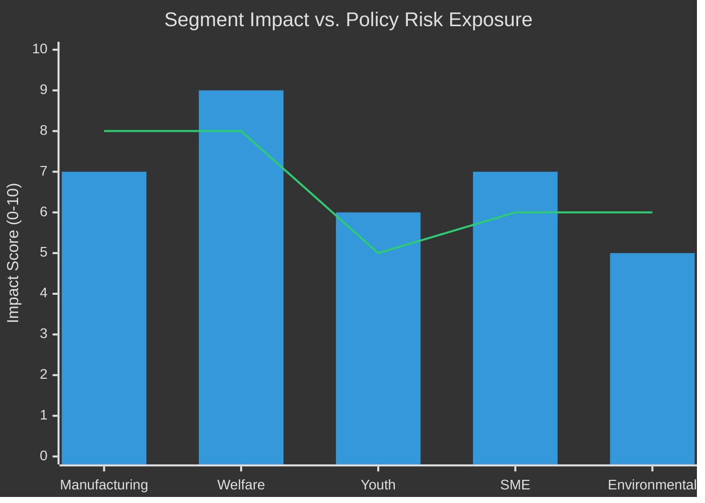

# Voter Segmentation Analysis — Committee Reports 28 April 2026

**Author**: James Pether Sörling | **Date**: 2026-04-28 | **Confidence**: MEDIUM [C2]

---

## Segmentation Framework

| Segment | Size (est.) | Key concern | Affected documents |
|---------|------------|-------------|-------------------|
| Manufacturing workers | 15% | Jobs, tariff impact | HC01FiU20 |
| Upper-income homeowners | 12% | Interest rates, mortgage | HC01FiU24 |
| Social welfare recipients | 18% | Bidragsreform | HC01FiU20, HC01SoU29 |
| Youth (18-25) | 8% | Fritidskortet, unemployment | HC01SoU29 |
| Small business / self-employed | 10% | F-skatt reform | HC01SkU18 |
| Public sector workers | 14% | Budget consolidation | HC01FiU20 |
| Environmental voters | 9% | Green transition pace | HC01MJU22 |
| Constitutional law voters | 6% | Accountability | HC01KU20 |

## Policy Impact by Segment

### Manufacturing Workers (HC01FiU20)
- **Direct impact**: US tariffs threaten export-oriented manufacturing
- **Economic guideline effect**: Unemployment projected 8.7% → 8.4% — slow improvement
- **Political resonance**: S and LO historically own this segment; tariff framing benefits S

### Social Welfare Recipients (HC01FiU20 — Bidragsreform)
- **Direct impact**: Work requirement tightening could reduce benefits
- **Government framing**: Activation and labour supply improvement
- **Opposition framing**: Punitive welfare reduction; S+V+MP joint reservation
- **Electoral risk to government**: High if implementation is perceived as harsh in 2025-26

### Youth Voters (HC01SoU29 — Fritidskortet)
- **Policy**: Fritidskortet gives youth access to leisure activities (conditional on school attendance)
- **Electoral signal**: Government attempts to build youth policy narrative ahead of 2026
- **Opposition view**: Positive reception but questions on administration and scope

### Small Business / Self-Employed (HC01SkU18 — F-skatt)
- **Direct impact**: F-tax reform simplifies self-employment administration
- **Electoral appeal**: 10% of voting population; cross-ideological appeal
- **Government framing**: "Sweden business-friendly" narrative

### Environmental Voters (HC01MJU22)
- **Direct impact**: Environmental committee report — not yet fully analysed
- **Electoral sensitivity**: MP and Tidö-sceptical voters watching green transition pace
- **Risk**: Slow green transition alienates critical swing segment

## Geographic Segmentation

| Region | Primary concern | Relevant reports |
|--------|----------------|-----------------|
| Stockholm | Housing costs, mortgage rates | HC01FiU24 |
| Göteborg / West | Manufacturing, port trade | HC01FiU20 |
| Norrland | Employment, regional welfare | HC01FiU20, HC01SoU29 |
| Rural municipalities | F-skatt, small business | HC01SkU18 |

---

