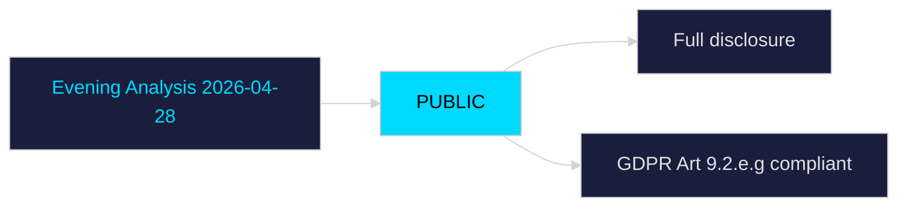

# Classification Results — Evening Analysis 2026-04-28

**Author**: James Pether Sörling  
**Date**: 2026-04-28

---

## 7-Dimension Classification

### Documents Classified

| dok_id | Document | Policy Area | Party Alignment | Urgency | Impact Scale | Controversy | Governance | Data Sensitivity |
|--------|----------|-------------|----------------|---------|--------------|------------|------------|-----------------|
| HC01FiU20 | Spring Fiscal Bill | Economic/Fiscal | Tidö coalition | HIGH | National | HIGH (4-party opposition) | FiU committee | LOW — public data |
| HC01FiU24 | Riksbank Monetary Policy | Monetary | Technocratic | MEDIUM | National | MEDIUM | FiU committee | LOW |
| HD03253 | EU Banking Package | Financial Regulation | EU/Tidö | HIGH | National/EU | MEDIUM | FiU | LOW |
| HD01SfU28 | Citizenship Tightening | Immigration/Identity | SD-driven Tidö | HIGH | National | VERY HIGH | SfU | HIGH — Art 9(2)(e) |
| HD01FöU20 | CER Critical Infrastructure | Defence/Security | Cross-party | HIGH | National | LOW | FöU | MEDIUM |
| HD01FöU14 | Military Cooperation | Defence | NATO/Tidö | HIGH | National | LOW | FöU | MEDIUM |
| HD024099 | S Anti-Corruption Motion | Criminal Justice | S opposition | MEDIUM | National | HIGH | JuU | LOW |
| HC01KU20 | Constitutional Scrutiny | Accountability | Cross-party | MEDIUM | National | MEDIUM | KU | LOW |
| HD10449 | Railway Interpellation | Infrastructure | S | LOW | Regional | LOW | TU | LOW |
| HD10450 | Sickness Insurance | Welfare | S | MEDIUM | National | MEDIUM | SfU | MEDIUM |
| HD10451 | Corporate Crime | Criminal Justice | S | MEDIUM | National | MEDIUM | JuU | LOW |

## Priority Tiers

**Tier 1 — Immediate Action (PIR)**: HC01FiU20 (Spring Fiscal), HD01SfU28 (Citizenship), HD03253 (Banking)  
**Tier 2 — Strategic Monitor**: HD024099 (Anti-Corruption), HD01FöU20/FöU14 (Security), HC01FiU24 (Riksbank)  
**Tier 3 — Watch**: HC01KU20 (Constitutional), HD10449-HD10451 (Interpellations)

## Data Retention

- All documents are PUBLIC under Offentlighetsprincipen (2 kap. TF)
- Political opinion data classified as GDPR Art. 9(2)(e) — publicly made political statements
- No private personal data processed; analysis covers public political actors in their public roles
- GDPR Art. 9(2)(g) — substantial public interest in democratic accountability
- Retention: analysis retained per Riksdagsmonitor data lifecycle policy; underlying source documents permanent public record

## Access Classification

