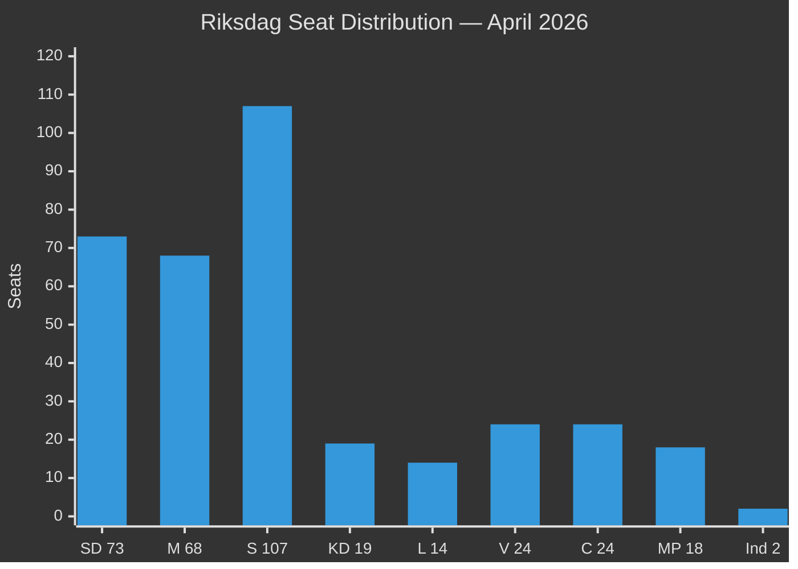

# Coalition Mathematics — Evening Analysis 2026-04-28

**Author**: James Pether Sörling  
**Date**: 2026-04-28

---

## Current Seat Distribution (349 seats, majority = 175)

| Party | Seats | Röstning: Ja | Röstning: Nej | Röstning: Avstår |
|-------|-------|-------------|--------------|-----------------|
| M (Moderaterna) | 68 | Coalition bills | Opposition motions | abstains where directed |
| SD (Sverigedemokraterna) | 73 | Tidö framework | Core Tidö | selective abstentions |
| KD (Kristdemokraterna) | 19 | Coalition | Coalition | rare independent |
| L (Liberalerna) | 14 | Coalition (mostly) | Coalition | SfU28 risk: may abstain |
| **Tidö block Ja-votes** | **174** | | | |
| S (Socialdemokraterna) | 107 | Conf. vote (rare) | Government bills | procedural |
| V (Vänsterpartiet) | 24 | Opp. counter | Govt bills | rare |
| C (Centerpartiet) | 24 | Some cross-votes | Govt economic (mostly) | spring fiscal risk |
| MP (Miljöpartiet) | 18 | Opposition | Govt bills | |
| **Opposition block** | **173** | | | |
| Independent (2) | 2 | Varies | Varies | |

## Critical Votes — Week of 2026-04-28

### HC01FiU20 — Spring Fiscal Bill

| Scenario | Ja | Nej | Avstår | Result |
|----------|-----|-----|--------|--------|
| Coalition unified | 174 | 173 | 2 | PASSES (174>173) |
| L abstains (SfU28 protest) | 160 | 173 | 16 | FAILS — government crisis |
| C splits (infrastructure): +3 to Ja | 177 | 170 | 2 | PASSES comfortably |

**Assessment**: Passes if L stays (MODERATE-HIGH confidence). The 1-seat margin (174/173) is the smallest possible majority. Any defection creates a constitutional crisis.

### HD01SfU28 — Citizenship Tightening

| Scenario | Ja | Nej | Avstår | Result |
|----------|-----|-----|--------|--------|
| Coalition + no L defection | 174 | 173 | 2 | PASSES (1 vote) |
| L files amendment accepted | 174 | 173 | 2 | PASSES (amended) |
| L abstains on final vote | 160 | 173 | 16 | FAILS |
| SD+KD+M only (no L) | 160 | 173+14=187 | 2 | FAILS |

**Assessment**: L's position is decisive. If L abstains or votes Nej, the bill fails. L has strong incentive to pass amended version rather than trigger crisis.

### HD01FöU20 + HD01FöU14 — Security Package

| Scenario | Ja | Nej | Avstår | Result |
|----------|-----|-----|--------|--------|
| Cross-party security consensus | 200+ | <100 | <50 | PASSES (wide majority) |
| S opposes military cooperation | 174 | 173+24=197 | 2 | FAILS |

**Assessment**: S traditionally supports EU security legislation. FöU20 (CER) and FöU14 (military cooperation) likely pass with broader support than the fiscal bills. S may vote Nej on specific clauses but Ja on overall legislation.

## Coalition Arithmetic Summary

```
Tidö: M(68) + SD(73) + KD(19) + L(14) = 174
Opposition: S(107) + V(24) + C(24) + MP(18) = 173
Majority line: 175

Gap: 174 < 175 — MINORITY GOVERNMENT
Required: either one opponent to abstain OR one independent to vote Ja
```

## Historical Context

**2022-2026 Government Formation**: Tidö agreement (Oct 2022) created formal written cooperation between M, SD, KD, L — but SD is NOT a formal coalition member. SD supports from outside on budget and confidence votes.

**Similar configurations**:
- Löfven II (S+MP) 2021: 117 seats, governed via C+L abstentions — much smaller base
- Bildt II (M+FP+C+KD) 1991: 170 seats — also minority, survived with opposition abstentions

**Key difference 2026**: The 2026 configuration has SD at 73 seats — the largest single party in the bloc. This has never occurred before in Swedish politics. SD's dominance within Tidö creates internal power dynamics that differ from classic centre-right coalitions.

## Mermaid Seat Diagram


