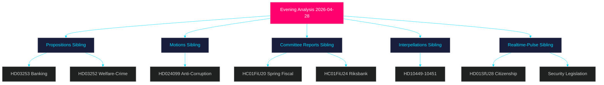

# Cross-Reference Map — Evening Analysis 2026-04-28

**Author**: James Pether Sörling  
**Date**: 2026-04-28

---

## Policy Clusters

### Cluster 1: Economic-Financial Governance

- **HC01FiU20** (Spring Fiscal Bill) ← anchors fiscal framework
- **HC01FiU24** (Riksbank 2024) ← monetary credibility
- **HD03253** (EU Banking Package) ← systemic financial regulation
- **HD03104** (Debt management) ← debt anchor
- **HD024100** (S Spring Budget counter-motion) ← opposition fiscal alternative

### Cluster 2: Security and Defence

- **HD01FöU20** (CER Critical Infrastructure) ← EU compliance + domestic resilience
- **HD01FöU14** (Military Cooperation) ← NATO operational integration
- **HD01SfU28** (Citizenship tightening) ← identity-security nexus

### Cluster 3: Criminal Justice and Rule of Law

- **HD024099** (S anti-corruption motion) ← challenges prop. 2025/26:217
- **HD10451** (Corporate crime interpellation) ← enforcement gap
- **HC01KU20** (Constitutional scrutiny) ← accountability framework
- **HC01SkU18** (F-tax reform) ← tax crime adjacent

### Cluster 4: Social Policy and Welfare

- **HD03252** (Welfare-crime restrictions) ← SD social policy
- **HD10450** (Sickness insurance day-180) ← welfare protection
- **HC01SoU29** (Fritidskort) ← inclusion policy

### Cluster 5: Infrastructure

- **HD10449** (Railway interpellation Trafikverket) ← regional infrastructure
- **HD03259** (Transport plan 2026-2037) ← national infrastructure

## Legislative Chains

**Chain A — Anti-Corruption**:  
Prop. 2025/26:217 (government) → HD024099 (S counter-motion) → JuU processing → plenary vote (May/June 2026)

**Chain B — Financial Regulation**:  
EU CRR3/CRD6 directive → HD03253 (government implementation) → FiU processing → transposition deadline

**Chain C — Security**:  
EU CER Directive → HD01FöU20 (government implementation) → NATO agreement → HD01FöU14 → FöU processing → June 2026 plenary

**Chain D — Fiscal**:  
Prop. 2025/26:99/100 (Spring Bill) → HC01FiU20 (committee endorsement) → HD024100 (S counter) → June 2026 plenary vote

## Sibling Folders (Tier-C Cross-Reference)

| Folder | Date | Key Finding | Cited In |
|--------|------|-------------|---------|
| `analysis/daily/2026-04-28/propositions/` | 2026-04-28 | EU Banking Package + welfare-crime restrictions | cross-reference-map.md, synthesis-summary.md, significance-scoring.md |
| `analysis/daily/2026-04-28/motions/` | 2026-04-28 | S anti-corruption challenge HD024099 | synthesis-summary.md, swot-analysis.md |
| `analysis/daily/2026-04-28/committeeReports/` | 2026-04-28 | Spring Fiscal Bill, Riksbank endorsement, KU20 | synthesis-summary.md, risk-assessment.md, economic context |
| `analysis/daily/2026-04-28/interpellations/` | 2026-04-28 | Railway, sickness insurance, corporate crime | stakeholder-perspectives.md, forward-indicators.md |
| `analysis/daily/2026-04-28/realtime-pulse/` | 2026-04-28 | Full legislative calendar synthesis | synthesis-summary.md, coalition-mathematics.md |

## Coordinated Activity Patterns

**Pattern: S's Five-Front Challenge**  
Teresa Carvalho + S parliamentary team simultaneously filed HD024099 (anti-corruption), HD024100 (Spring Budget), HD10449 (railway), HD10450 (sickness insurance), HD10451 (corporate crime) on 2026-04-27/28. This coordinated burst suggests a campaign-ready opposition entering election-mode attack pattern. [A2]

**Pattern: Tidö Security Bundling**  
HD01FöU20 (CER), HD01FöU14 (military cooperation), HD01SfU28 (citizenship) advanced simultaneously — classic pre-election securitisation bundling to prevent L/C from separating individual issues. [B2]

## Mermaid Cross-Reference Network

