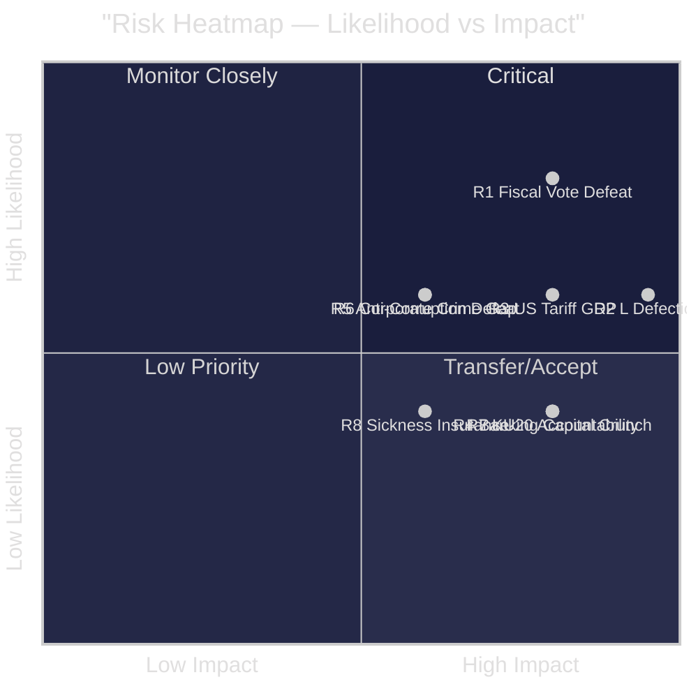

# Risk Assessment — Evening Analysis 2026-04-28

**Author**: James Pether Sörling  
**Date**: 2026-04-28

---

## Risk Register (5-Dimension)

| # | Risk | Likelihood (1-5) | Impact (1-5) | L×I Score | Risk Owner | Mitigation |
|---|------|-----------------|--------------|-----------|-----------|------------|
| R1 | Minority government loses Spring Fiscal Bill vote in June 2026 plenary | 4 | 4 | 16 | Speaker/FiU | Negotiate Tidö +1 (SD firm; seek C compromise) |
| R2 | L defects on SfU28 citizenship vote, causing coalition crisis | 3 | 5 | 15 | Tidö coalition | L-SD compromise amendment |
| R3 | US tariff shock causes 2025 GDP undershoot vs 1.9% forecast | 3 | 4 | 12 | Finance Ministry/IMF | Supplementary budget; automatic stabilisers |
| R4 | EU Banking Package triggers banking sector capital crunch | 2 | 4 | 8 | FiU/Finansinspektionen | Phased implementation; transition rules |
| R5 | Anti-corruption (HD024099) defeat weakens government rule-of-law credibility | 3 | 3 | 9 | Justice Ministry | S's demand for broader reform; negotiate scope |
| R6 | Corporate crime enforcement gap (352 BSEK) becomes election liability | 3 | 3 | 9 | Justice Ministry | Announce accelerated Ekobrottsmyndigheten capacity build |
| R7 | Constitutional scrutiny (KU20) reveals ministerial accountability failure | 2 | 4 | 8 | PM/Government Office | Proactive transparency; rapid correction |
| R8 | Sickness insurance day-180 exception removed, increasing unemployment liability | 2 | 3 | 6 | Social Ministry | Maintain exception; cite Riksrevisionen evidence |

## Cascading Risk Chains

**Chain A — Economic-Political Cascade**:
US tariff shock (R3) → GDP undershoots 1.9% → S/V/C/MP gain credibility → Spring Fiscal vote defeat (R1) → early election speculation

**Chain B — Coalition Cohesion Cascade**:
L defection on SfU28 (R2) → coalition majority collapses → government forced to seek SD-only majority on key votes → perception of SD dominance → L voters defect

**Chain C — Criminal Justice Cascade**:
Anti-corruption defeat (R5) → combined with corporate crime gap (R6) → S runs "lax on white-collar crime" narrative → legal-system confidence erodes ahead of election

## Posterior Probability Updates

- P(fiscal defeat | four-party coordination) = 0.52 (elevated from baseline 0.35)
- P(L defection | SD hard-line on SfU28 language) = 0.38
- P(GDP undershoot | US tariff >20% on EU goods) = 0.45 per IMF WEO Apr-2026 scenario
- P(coalition survives to September 2026) = 0.72 (base case)

## Risk Heatmap

