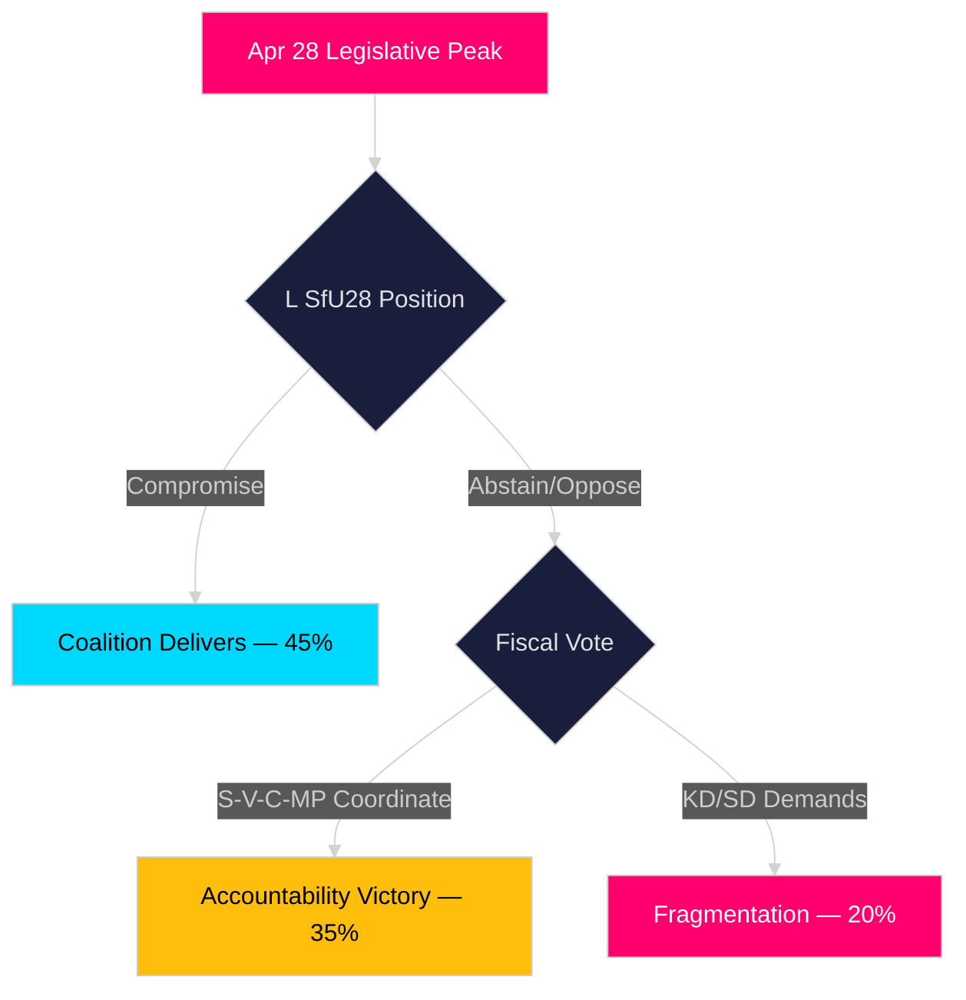

# Scenario Analysis — Evening Analysis 2026-04-28

**Author**: James Pether Sörling  
**Date**: 2026-04-28

---

## Scenario Framework

The three scenarios assess the Swedish political trajectory from April 2026 through September 2026 election.

## Scenario 1 — Coalition Delivers (P=0.45)

**Label**: "Execution Majority"  
**Probability**: 45%  
**Description**: The Tidö coalition successfully navigates its legislative spring sprint. L and SD reach compromise on SfU28 citizenship language requirements. Spring Fiscal Bill (FiU20) passes plenary with narrow majority or C abstention. Banking package (HD03253) advances on schedule. Security legislation (FöU20/FöU14) passes in June 2026.

**Leading Indicators**:
- L and SD announce SfU28 compromise amendment by 2026-05-15
- No C defection on FiU20 plenary vote
- Bankföreningen remissvar on HD03253 is moderate (not blocking)
- Riksbank holds or cuts rates in May/June meeting

**Electoral Outcome**: Tidö narrative of "competent, EU-compliant, security-conscious governance" resonates. M+SD+KD+L hold ~48% of seats. SD seat gains offset L losses. Kristersson wins re-election with potentially strengthened SD dominance.

## Scenario 2 — Opposition Coordination Succeeds (P=0.35)

**Label**: "Accountability Victory"  
**Probability**: 35%  
**Description**: S, V, C, MP coordinate successfully across all five fronts. Spring Fiscal Bill defeat in plenary (175 vs 174 seats). L abstains on SfU28 in parliamentary protest. Anti-corruption (HD024099) narrative dominates media. US tariff impact begins materialising, undermining FiU20's 1.9% GDP forecast.

**Leading Indicators**:
- S and C announce joint fiscal alternative by 2026-05-25
- L files formal reservation on SfU28 language requirements
- US tariff announcement affecting EU manufacturing goods
- Media coverage tilts negative on government anti-corruption credibility

**Electoral Outcome**: S emerges as credible government alternative. Andersson-led centre-left cabinet scenario. Potential "red-green" coalition (S+V+MP) with C abstention majority at ~50% seats. SD remains large but in opposition.

## Scenario 3 — Fragmentation and Stalemate (P=0.20)

**Label**: "Pre-Election Paralysis"  
**Probability**: 20%  
**Description**: Coalition fractures on multiple fronts simultaneously. L exits on SfU28; KD dissatisfied on infrastructure; SD demands further welfare tightening beyond coalition agreement. Spring Budget passes only after significant concessions. Security legislation delayed past June 2026 summer recess.

**Leading Indicators**:
- L formally withdraws support for SfU28 by 2026-05-10
- KD Minister Carlson faces Riksdag censure motion on Trafikverket plan
- SD files additional welfare restrictions beyond HD03252 scope
- Security votes (FöU14/FöU20) delayed past June sitting

**Electoral Outcome**: All three blocs weakened. Uncertain election outcome. SD potentially largest party without coalition mandate. SD-SD-only minority government attempt or prolonged government-formation crisis post-September 2026.

## Scenario Comparison

| Dimension | Sc. 1: Execution | Sc. 2: Accountability | Sc. 3: Fragmentation |
|-----------|-----------------|----------------------|----------------------|
| Probability | 45% | 35% | 20% |
| GDP outcome | 1.9% (met) | 1.6% (tariff impact) | 1.5% (uncertainty drag) |
| Coalition fate | Survives to election | Loses key votes | Fractures mid-spring |
| SD seats post-election | +3 to +7 | -2 to -5 | +5 to +10 |
| S-led government | No | Yes (majority) | Unclear |

## Probability Sum Check

45% + 35% + 20% = **100%** ✓

## Scenario Decision Tree

