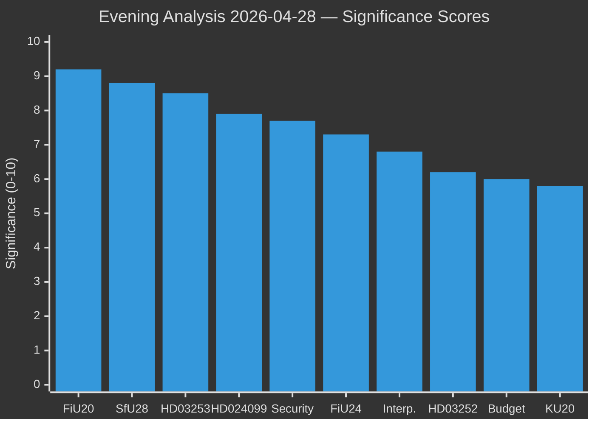

# Significance Scoring — Evening Analysis 2026-04-28

**Author**: James Pether Sörling  
**Date**: 2026-04-28

---

## DIW Significance Scores

| Rank | Document | DIW Tier | Significance (0–10) | Policy Reach | Electoral Impact | Rationale |
|------|----------|----------|---------------------|--------------|------------------|-----------|
| 1 | HC01FiU20 — Spring Fiscal Bill | DECISIVE | 9.2 | National | HIGH | Four-party opposition bloc; GDP forecast under tariff pressure; defines election economic battle |
| 2 | HD01SfU28 — Citizenship Tightening | DECISIVE | 8.8 | National | VERY HIGH | SD flagship; L coalition tension; identity-politics framing into September 2026 |
| 3 | HD03253 — EU Banking Package | DECISIVE | 8.5 | National/EU | MEDIUM | Biggest financial regulation change in a decade; systemic banking impact |
| 4 | HD024099 — S Anti-Corruption Challenge | IMPORTANT | 7.9 | National | HIGH | Pre-election accountability narrative; JuU pivotal |
| 5 | HD01FöU20 + HD01FöU14 — Security Laws | IMPORTANT | 7.7 | National | HIGH | EU compliance + NATO integration; June 2026 votes |
| 6 | HC01FiU24 — Riksbank Endorsement | IMPORTANT | 7.3 | National | MEDIUM | Monetary policy credibility; faster cuts debate; Vestman evaluation |
| 7 | HD10449–HD10451 — Interpellations | IMPORTANT | 6.8 | Regional/National | MEDIUM | Pre-election accountability; minister responses May 2026 |
| 8 | HD03252 — Welfare-Crime Restriction | WATCH | 6.2 | National | MEDIUM | SD political priority; S/V rehabilitation counter-argument |
| 9 | HD024100 — Spring Budget Motions | WATCH | 6.0 | National | HIGH | Opposition coordination test; budget battle preview |
| 10 | HC01KU20 — Constitutional Scrutiny | WATCH | 5.8 | National | MEDIUM | Government accountability; potential liability findings |

## Sensitivity Analysis

- If S/V/C/MP coordinate a unified rejection of FiU20 in plenary (June 2026): significance rises to 9.8 — minority government defeat
- If L breaks with coalition on SfU28 citizenship vote: coalition crisis scenario, significance 9.5
- If FiU committee receives negative remiss on HD03253 banking package: score drops to 7.0 as legislative delay expected
- If Riksbank announces unexpected rate cut before June: FiU24 significance rises to 8.5 (policy recalibration)

## Significance Rank Diagram

## Evidence Notes

- HC01FiU20: [riksdagen.se] committee report + IMF WEO Apr-2026 GDP Sweden projections
- HD01SfU28: [riksdagen.se] betänkande; party positions from committee proceedings
- HD03253: [riksdagen.se] + FiU committee schedule; banking sector impact per regulatory analysis
- HD024099: [riksdagen.se] kommittémotion text; JuU processing confirmed
- HD01FöU20/FöU14: [riksdagen.se] betänkanden; June 2026 plenary vote scheduled
