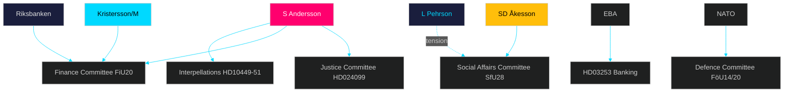

# Stakeholder Perspectives — Evening Analysis 2026-04-28

**Author**: James Pether Sörling  
**Date**: 2026-04-28

---

## 6-Lens Stakeholder Matrix

### Lens 1: Government Parties (Tidö Coalition)

| Actor | Position | Interest | Power | Evidence |
|-------|----------|----------|-------|----------|
| Ulf Kristersson (M, PM) | Drive full legislative package to completion by June 2026 | Electoral survival; EU banking + security = legacy | VERY HIGH | Prop. 2025/26 series; PM statements |
| SD (Jimmie Åkesson) | Maximise SfU28 citizenship tightening; welfare-crime restrictions | Identity politics mandate | HIGH | SfU28; HD03252 priorities |
| KD (Ebba Busch) | Infrastructure (interpellation Carlson); security legislation | Regional credibility; NATO alignment | MEDIUM | HD10449; FöU14/FöU20 |
| L (Johan Pehrson) | Manage L-SD tension on SfU28; banking regulation | Urban liberal base; business-friendly image | MEDIUM | SfU28 internal debate |

### Lens 2: Opposition Parties

| Actor | Position | Interest | Power | Evidence |
|-------|----------|----------|-------|----------|
| S (Magdalena Andersson) | Anti-corruption challenge + Spring Budget counter + interpellations | Election 2026 accountability narrative | HIGH | HD024099; HD024100; HD10449-10451 |
| V (Nooshi Dadgostar) | Fiscal + welfare opposition | Welfare state protection | MEDIUM | FiU20 reservations; FöU14 potential opposition |
| C (Annie Lööf) | Fiscal conservatism; market-oriented alternatives | Centre-right space post-coalition | MEDIUM | FiU20 reservations |
| MP (Per Bolund) | Environmental + social opposition | Green-progressive niche | LOW-MEDIUM | FiU20 reservations; transport plan opposition |

### Lens 3: Key Institutions

| Institution | Role | Position | Evidence |
|------------|------|----------|----------|
| Riksbanken | Monetary policy; CPI targeting | 2024 policy endorsed; faster cuts debated | HC01FiU24 [riksdagen.se] |
| Riksgälden | Debt management | Debt-anchor targets met 2021-2025; debt 19% GDP | HC01FiU20/HD03104 |
| Finansinspektionen | Banking regulation | CRR3 implementation oversight; capital requirements | HD03253 |
| Statskontoret | Public management oversight | Agency capacity for CER implementation | [statskontoret.se; no directly relevant source found] |

### Lens 4: Affected Sectors

| Sector | Primary Impact | Position | Evidence |
|--------|---------------|----------|----------|
| Swedish banking sector (Nordea, SEB, Handelsbanken, Swedbank) | CRR3/Basel III capital floors | Lobbying against strict IRB output floor | HD03253; Bankföreningen |
| Railway/transport sector | Trafikverket plan removes Södra stambanan investments | Negative — infrastructure gap | HD10449 [riksdagen.se] |
| Criminal justice system | New "missbruk av offentlig ställning" offence | Prosecutors: cautious welcome; defence bar: concerns | HD024099 |
| Corporate sector | F-tax reform; VAT fraud countermeasures | Mixed — compliance burden vs level playing field | HC01SkU18; SkU21/22 |

### Lens 5: Civil Society

| Actor | Position | Evidence |
|-------|----------|----------|
| Bankföreningen | Oppose strict risk-weight floors for mortgages | HD03253 remiss process |
| Fackföreningsrörelsen (LO/TCO) | Support day-180 sickness insurance exception | HD10450 interpellation |
| Transport sector unions | Support Södra stambanan investment | HD10449 |
| Anti-corruption advocates | Mixed on HD024099 — support intent, question method | Academic commentary on prop. 2025/26:217 |

### Lens 6: International/EU

| Actor | Role | Position | Evidence |
|-------|------|----------|----------|
| European Banking Authority (EBA) | CRR3 standard setter | Supportive; Sweden as compliant member state | HD03253 |
| NATO | Military cooperation | Positive — FöU14 deepens interoperability | HD01FöU14 |
| EU Commission | CER Directive | Compliance expected; June 2026 deadline | HD01FöU20 |
| IMF | Economic assessment | 1.9% GDP; tariff risk noted in WEO Apr-2026 | HC01FiU20 context |

## Influence Network

