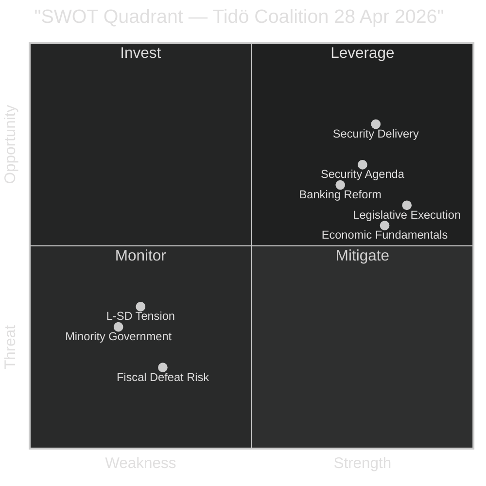

# SWOT Analysis — Evening Analysis 2026-04-28

**Author**: James Pether Sörling  
**Date**: 2026-04-28

---

## Strategic Context

Subject: Tidö Coalition's pre-election legislative programme as executed on 2026-04-28, assessed against the 2026 Riksdag election (September).

## Strengths

| Strength | Evidence | Admiralty |
|----------|----------|-----------|
| Legislative execution capacity: government advances 7+ legislative files simultaneously | HC01FiU20, HD03253, HD01SfU28, HD01FöU20, HD01FöU14 all tabled same day [riksdagen.se] | [A2] |
| Economic fundamentals: GDP 1.9%, debt-to-GDP fell from 24% to 19% | HC01FiU20 committee report; Riksgälden evaluation | [A1] |
| Security agenda resonates with voter base: CER + NATO = post-2022 defence consensus | HD01FöU20/FöU14 advancing without S-bloc veto | [B2] |
| SD electoral alignment: citizenship tightening (SfU28) directly activates SD core voters | HD01SfU28 betänkande [riksdagen.se]; SD priority since 2022 | [A2] |
| Riksbank monetary credibility: KPIF 1.9% endorsed; inflation anchored at 2% | HC01FiU24 FiU committee report | [A1] |

## Weaknesses

| Weakness | Evidence | Admiralty |
|----------|----------|-----------|
| Minority government: zero buffer against coordinated S/V/C/MP opposition | Four-party bloc filed reservations on FiU20; counter-motions on Spring Budget | [A2] |
| L-SD coalition tension on citizenship: L's urban base resists identity-politics framing | SfU28 creates internal friction; L previously opposed similar measures | [B2] |
| EU Banking Package implementation risk: 10–15 bps capital cost increase for banks | HD03253 FiU processing; bank lobby pressure expected | [B3] |
| Anti-corruption credibility gap: S argues "missbruk av offentlig ställning" misses target | HD024099 [riksdagen.se]; independent legal academics have raised concerns | [B2] |
| US tariff risk unquantified in Spring Fiscal scenario | FiU20 does not publish downside tariff scenario; IMF WEO Apr-2026 projects 1.9% base | [B2] |

## Opportunities

| Opportunity | Evidence | Admiralty |
|-------------|----------|-----------|
| Security legislation pre-election dividend: NATO/CER completion cements defence credibility | FöU20/FöU14 June 2026 votes offer visible delivery milestone | [B2] |
| Banking reform as EU alignment signal: transposing Basel III positions Sweden as reliable EU partner | HD03253; European Banking Authority alignment | [A2] |
| Welfare-crime nexus (HD03252) energises right-of-centre coalition narrative | SD, M, KD policy alignment on sanctions for incarcerated offenders | [B2] |
| Opposition coordination risk: if C breaks from S bloc on any file, coalition isolation narrative breaks | C's fiscal conservatism may diverge from S/V on budget | [C2] |

## Threats

| Threat | Evidence | Admiralty |
|--------|----------|-----------|
| Spring Fiscal Bill defeat in plenary: S+V+C+MP = 175 seats vs coalition 174 | FiU20 four-party reservations; June 2026 plenary vote [riksdagen.se] | [A2] |
| Citizenship vote L defection: L exits or abstains on SfU28 = coalition arithmetic collapse | L's liberal urban base; Lotta Johnsson Fornarve's framing of debate | [B2] |
| US tariff shock: if tariffs materialise at scale, 1.9% GDP forecast fails, giving S economic critique | IMF WEO Apr-2026 downside scenario; global trade uncertainty | [B2] |
| Anti-corruption scandal: if any Tidö minister becomes subject of KU referral post-KU20 | HC01KU20 Constitutional scrutiny report; government accountability gaps noted | [C2] |
| Corporate crime enforcement gap: ESO estimate 352 BSEK criminal economy; inadequate response claim | HD10451 interpellation; Brå 2025 study; ESO report | [B2] |

## TOWS Matrix

| | **Threats** | **Opportunities** |
|---|---|---|
| **Strengths** | Execution capacity + security delivery can survive fiscal defeat if security votes land (T1×S3) | Combine banking reform + NATO delivery for EU-aligned Sweden narrative (O2×S3) |
| **Weaknesses** | L defection risk is highest when Tidö attempts simultaneous identity-politics + business-risk moves (W2×T2) | If US tariff risk materialises, shift to export-resilience framing — use Riksbank credibility (W5×O1) |

## Mermaid SWOT Visual

